# gosmo architecture

The whole API surface of gosmo, as class diagrams and as a feature map, plus
the pieces a caller has to understand to use it: how versions are gated, what
the errors mean, how every authentication method is configured, and how a
`Database`-scoped call reaches the server.

[`README.md`](README.md) is the short version — what the library is and how to
start. This document is the reference. `RELEASE.md` carries the current
release and `CHANGELOG.md` the history.

**Contents**

- [Version gating](#version-gating) — how a column or statement newer than the
  floor is handled, and how each gate is pinned.
- [Architecture](#architecture) — the master map, and the twenty Mermaid
  class diagrams in [`diagram/`](diagram/) that cover every type gosmo
  exports.
- [Feature map](#feature-map) — SMO's names against gosmo's, family by family,
  with the usage notes for each.
- [Errors](#errors) — the sentinel errors and what they distinguish.
- [Authentication](#authentication) — every `AuthMethod`, Entra credential
  caching, Kerberos, and the connection-string surface.
- [Connection helpers](#connection-helpers-internal) — why a `Database` call
  pins a connection and a `Server` call does not.
- [Security](#security) — what is escaped, what is allowlisted, and what owns
  a connection.
- [Maintaining this document](#maintaining-this-document) — the rules the
  class map has to be edited under.

---

## Version gating

gosmo supports **SQL Server 2016 SP1 (13.0.4001) and later** — see
[`README.md`](README.md#supported-sql-server-versions) for why the floor is
SP1 rather than RTM, and for how Azure SQL Managed Instance is placed.

Columns and syntax added after the floor are gated rather than assumed —
`colSince` substitutes a typed literal for a column the instance lacks, so
a caller gets a zero value instead of a failed read, and a statement an
older parser rejects is refused before it is sent (see
`Database.EnclaveComputationsSupported`, `Database.QueryStoreWaitStatsSupported`),
wrapping `ErrUnsupportedVersion`. An instance whose version was never read
is treated as newest.

Every gate is pinned three ways, because a wrong one is invisible on the
instance it was written against: `testdata/version_gates/*.sql` holds each
gated `SELECT` list rendered at majors 13 through 17 (regenerate with
`go test -run TestGatedQueries -updategolden`, then read the diff — regenerating is
not review), a hand-written inventory is kept in step with the call sites,
and the live-instance sweep asks a real server whether each gate decided
correctly for its own major.

---

## Architecture

The class map is **twenty-one Mermaid diagrams in [`diagram/`](diagram/)** — the
master map below, and twenty class diagrams, one per group of types. It is
one map, not twenty-one: an edge that crosses files is drawn in the file that
defines the class it points *into*, where the other end shows up as a bare
box (`Server --> AvailabilityGroup` lives in
[`16-availability-groups.mmd`](diagram/16-availability-groups.mmd)).

Only the master map is inlined here. A Markdown preview renders a fenced
diagram and not a linked file, so open a `.mmd` in a Mermaid-aware editor, or
paste it into [mermaid.live](https://mermaid.live), to see it drawn. Each
file is a standalone `classDiagram` and renders on its own.

### The map at a glance

Which diagram holds what, and the links that cross between them. Every arrow
stands for edges drawn in the diagram it points at. Each node is one file in
[`diagram/`](diagram/), numbered the same way, and clicking it opens that
file where the renderer allows it.

```mermaid
flowchart TB
    subgraph A0["Connecting and the Server object"]
        direction TB
        N01["01 · Connection options"]
        N02["02 · The Server object"]
        N03["03 · Server info and authentication"]
    end
    subgraph A1["Server security, credentials, and logins"]
        direction TB
        N04["04 · Server security, credentials, and logins"]
    end
    subgraph A2["The Database handle"]
        direction TB
        N05["05 · The Database handle"]
        N06["06 · Database snapshots"]
    end
    subgraph A3["Connection internals, errors, and capabilities"]
        direction TB
        N07["07 · Connection internals, errors, and capabilities"]
    end
    subgraph A4["A database: files, options, catalog, and permissions"]
        direction TB
        N08["08 · Files, options, catalog, and Query Store"]
        N09["09 · Filters, permissions, and execution"]
    end
    subgraph A5["Tables, their children, and the object families"]
        direction TB
        N10["10 · Tables, columns, and indexes"]
        N11["11 · Keys, statistics, table kinds, and types"]
        N12["12 · Programmability, external resources, and the scripters"]
        N13["13 · Script options and the database object families"]
        N20["20 · Service Broker"]
    end
    subgraph A6["Backup, restore, and SQL Server Agent"]
        direction TB
        N14["14 · Backup, restore, and Agent jobs"]
        N15["15 · Agent alerts, operators, and schedules"]
    end
    subgraph A7["High availability and instance-level services"]
        direction TB
        N16["16 · Always On availability groups"]
        N17["17 · Endpoints, audits, and audit specifications"]
        N18["18 · Database triggers, keys, certificates, and the error log"]
    end
    subgraph A8["Azure instance resources"]
        direction TB
        N19["19 · Azure instance resources"]
    end

    N02 -- "owns logins, credentials, security info" --> N04
    N02 -- "owns databases and snapshots" --> N05
    N02 -- "reads through ServerQuery and withRetry" --> N07
    N02 -- "owns backup devices and Agent jobs" --> N14
    N02 -- "owns availability groups" --> N16
    N02 -- "owns endpoints and server audits" --> N17
    N02 -- "exposes the Azure instance views" --> N19
    N05 -- "writes through withConn, captured by ScriptCollector" --> N07
    N05 -- "has files, options, catalog, Query Store" --> N08
    N05 -- "filters listings and answers permissions" --> N09
    N05 -- "contains tables and indexes" --> N10
    N05 -- "contains the object families" --> N13
    N05 -- "owns the Service Broker families" --> N20
    N05 -- "owns database audit specifications" --> N17
    N05 -- "exposes its own Azure resource views" --> N19
    click N01 href "diagram/01-connection-options.mmd"
    click N02 href "diagram/02-server.mmd"
    click N03 href "diagram/03-server-info-and-authentication.mmd"
    click N04 href "diagram/04-server-security-and-logins.mmd"
    click N05 href "diagram/05-database-handle.mmd"
    click N06 href "diagram/06-database-snapshots.mmd"
    click N07 href "diagram/07-connection-internals.mmd"
    click N08 href "diagram/08-database-files-and-catalog.mmd"
    click N09 href "diagram/09-database-filters-and-permissions.mmd"
    click N10 href "diagram/10-tables-and-indexes.mmd"
    click N11 href "diagram/11-statistics-and-table-kinds.mmd"
    click N12 href "diagram/12-programmability-and-external.mmd"
    click N13 href "diagram/13-script-options-and-objects.mmd"
    click N14 href "diagram/14-backup-restore-and-jobs.mmd"
    click N15 href "diagram/15-agent-alerts-and-schedules.mmd"
    click N16 href "diagram/16-availability-groups.mmd"
    click N17 href "diagram/17-endpoints-and-audits.mmd"
    click N18 href "diagram/18-triggers-keys-and-error-log.mmd"
    click N19 href "diagram/19-azure-instance-resources.mmd"
    click N20 href "diagram/20-service-broker.mmd"
```



### Connecting and the `Server` object

The entry point, `ConnectionOptions`, the `Server` object itself and every
authentication method it can connect with.

| Diagram | Holds |
| --- | --- |
| [`01-connection-options.mmd`](diagram/01-connection-options.mmd) | `ConnectionOptions` — every field the entry point accepts. |
| [`02-server.mmd`](diagram/02-server.mmd) | `Server` — every method the instance-level handle exposes. |
| [`03-server-info-and-authentication.mmd`](diagram/03-server-info-and-authentication.mmd) | `ServerInfo`, `EngineEdition`, and every `AuthMethod` with its Entra, device-code and Kerberos options. |

### Server security, credentials, and logins

Server-level security and permissions, credentials and cryptographic
providers, the machine-level views `Server` exposes, and the `Login` object.

| Diagram | Holds |
| --- | --- |
| [`04-server-security-and-logins.mmd`](diagram/04-server-security-and-logins.mmd) | Server permissions and security info, credentials (server and database scoped), cryptographic providers, the machine-level views, and `Login`. |

### The `Database` handle

`Database` itself — the handle every database-scoped call goes through — and
database snapshots. What a database *contains* is the next four diagrams.

| Diagram | Holds |
| --- | --- |
| [`05-database-handle.mmd`](diagram/05-database-handle.mmd) | `Database` — the handle every database-scoped call goes through. One class, and the largest diagram of the set. |
| [`06-database-snapshots.mmd`](diagram/06-database-snapshots.mmd) | `DatabaseSnapshot` and the request types that create one. |

### Connection internals, errors, and capabilities

The internal connection helpers every read and write goes through, shared
quoting, the sentinel errors, what the connected login may do, and the
`WithScript` collector that can capture a write instead of running it.

| Diagram | Holds |
| --- | --- |
| [`07-connection-internals.mmd`](diagram/07-connection-internals.mmd) | `withConn`, `dbRows`, `withRetry` and the other internal helpers, shared quoting, the sentinel errors, `Capabilities`, and the `WithScript` collector. |

### A database: files, options, catalog, and permissions

What `Database` exposes about itself — its files and filegroups, its
`ALTER DATABASE` options, change tracking, the bulk catalog snapshot, Query
Store, dependencies and search, and the whole permissions surface, including
column-level and effective permissions.

| Diagram | Holds |
| --- | --- |
| [`08-database-files-and-catalog.mmd`](diagram/08-database-files-and-catalog.mmd) | Files and filegroups, `ALTER DATABASE` options, change tracking, the bulk catalog snapshot, Query Store, detach/attach, scoped configuration, dependencies and search. |
| [`09-database-filters-and-permissions.mmd`](diagram/09-database-filters-and-permissions.mmd) | `ObjectFilter` and its criteria, database capabilities, disk usage, execution plans, the whole permissions surface, bulk copy, and stored-procedure execution. |

### Tables, their children, and the object families

`Table` and everything hanging off it (columns, indexes, foreign keys,
constraints, statistics, partitions), the other object families a database
contains, and the `Scripter` that generates CREATE DDL for any of them.

| Diagram | Holds |
| --- | --- |
| [`10-tables-and-indexes.mmd`](diagram/10-tables-and-indexes.mmd) | `Table`, `Column`, `Index` and everything an index reports — storage, allocation, fragmentation, XML and spatial variants. |
| [`11-statistics-and-table-kinds.mmd`](diagram/11-statistics-and-table-kinds.mmd) | Spatial tessellation, data spaces, foreign keys and check constraints, statistics and their histograms, table details and kinds, and the user-defined types. |
| [`12-programmability-and-external.mmd`](diagram/12-programmability-and-external.mmd) | Rules and defaults, assemblies, plan guides, PolyBase and elastic-query resources, `Scripter` and `ServerScripter`. |
| [`13-script-options-and-objects.mmd`](diagram/13-script-options-and-objects.mmd) | `ScriptVerb`/`ScriptOptions`, and schemas, views, procedures, functions, users, roles, filegroups, triggers, server roles and linked servers. |
| [`20-service-broker.mmd`](diagram/20-service-broker.mmd) | Message types and their validation, contracts and their messages, services, queues and queue monitors, routes, remote service bindings and conversation priorities. |

### Backup, restore, and SQL Server Agent

Backup and restore options and the metadata read back off a device, and
the whole Agent node — jobs and their steps and history, alerts, operators,
shared schedules, and categories.

| Diagram | Holds |
| --- | --- |
| [`14-backup-restore-and-jobs.mmd`](diagram/14-backup-restore-and-jobs.mmd) | Backup and restore options, backup headers, files, targets and devices, Agent status, `Job`, `JobStep` and job history. |
| [`15-agent-alerts-and-schedules.mmd`](diagram/15-agent-alerts-and-schedules.mmd) | Alerts and their notifications, operators, schedules and frequencies, job categories and the Agent enumerations. |

### High availability and instance-level services

Always On availability groups with their replicas, databases and listeners;
the database mirroring endpoint they ship log through; the certificates that
authenticate it; and the two host-facing reads — the error log and the
server's own filesystem.

| Diagram | Holds |
| --- | --- |
| [`16-availability-groups.mmd`](diagram/16-availability-groups.mmd) | `AvailabilityGroup`, its replicas, databases and listeners, and the request types that create one. |
| [`17-endpoints-and-audits.mmd`](diagram/17-endpoints-and-audits.mmd) | The mirroring endpoint and the other endpoints, server and database audits and their specifications, and server triggers. |
| [`18-triggers-keys-and-error-log.mmd`](diagram/18-triggers-keys-and-error-log.mmd) | Database DDL triggers, asymmetric keys and certificates, the error log surface, and the server filesystem views. |

### Azure instance resources

The views an Azure SQL Managed Instance exposes and an on-premises instance
has no analogue for: its own 15-second resource history, the resource
governor's fixed limits, and the Windows job object the engine process runs
inside — and, per database, the same two in miniature. Every one of them
refuses with `ErrUnsupportedVersion` on a non-Azure engine edition — see
`azure_resources.go`.

The instance and database halves pair up: `ServerResourceStat` and
`DatabaseResourceStat` are histories to plot, `InstanceResourceGovernance` and
`UserDBResourceGovernance` the ceilings those percentages are percentages
*of*.

| Diagram | Holds |
| --- | --- |
| [`19-azure-instance-resources.mmd`](diagram/19-azure-instance-resources.mmd) | The Managed Instance resource history and governance views, instance and per-database. |

---

## Feature map

### Server

| SMO equivalent          | gosmo                                      |
| ----------------------- | ------------------------------------------ |
| `Server.Databases`      | `srv.Databases()` / `srv.DatabaseRef(name)` (no-I/O handle) |
| Current database         | `srv.CurrentDatabase()`                    |
| Current login (`SUSER_NAME()`) | `srv.CurrentLogin()`                 |
| `Server.Logins`         | `srv.Logins()` / `srv.LoginByName(name)` / `srv.LoginRef(name)` (no-I/O handle) |
| `Server.Roles`          | `srv.ServerRoles()` / `srv.ServerRoleByName(name)` / `srv.ServerRoleRef(name)` (no-I/O handle) / `srv.ServerRoleMembers(role)` |
| Server role administration | `role.Rename(newName)` / `role.ChangeOwner(owner)` / `srv.Add\|RemoveServerRoleMember(role, member)` |
| Drop a server role      | `srv.DropServerRole(name)` / `role.Drop()`  |
| Rename a database       | `srv.RenameDatabase(old, new, force)` — `force` puts it in single-user mode first |
| Detach a database       | `srv.DetachDatabase(name, gosmo.DetachOptions{...})` — leaves the files on disk; a detach that fails after `DropConnections` is put back to MULTI_USER |
| Attach a database       | `srv.AttachDatabase(gosmo.AttachSpec{Name, Files, Owner, RebuildLog})` — the name need not be the one it was detached under |
| Read a detached file    | `srv.DetachedDatabaseInfo(primaryFilePath)` → `*DetachedDatabase` (`.Name`, `.Files`, `.DataFiles()`, `.LogFiles()`) — the only way to learn a detached database's other files |
| Database snapshots      | `srv.DatabaseSnapshots()` / `srv.DatabaseSnapshotByName(name)` / `srv.DatabaseSnapshotRef(name)` (no-I/O handle) / `srv.SnapshotsOf(database)` / `srv.CreateDatabaseSnapshot(req)` / `srv.RestoreFromSnapshot(database, snapshot)` — see [Database snapshots](#database-snapshots) |
| `Server.LinkedServers`  | `srv.LinkedServers()`                      |
| `Server.Configuration`  | `srv.Configurations()` / `srv.ConfigurationByName(name)` / `srv.ConfigurationRef(name)` (no-I/O handle) |
| `Server.JobServer` (Agent) | see [SQL Server Agent](#sql-server-agent) below |
| Active sessions         | `srv.ActiveSessions(includeSystem)`        |
| Kill session            | `srv.KillSession(id)`                      |
| Error log               | `srv.ReadLog(logType, n)` / `srv.ReadLogFiltered(logType, n, search)` / `srv.EnumErrorLogs(logType)` / `srv.CycleLog(logType)` — see [Error log](#error-log) |
| Database Mail           | `srv.MailProfiles()` / `srv.SendMail(...)` |
| Create login (safe)     | `srv.CreateLogin(name, password, opts)` — SQL, Windows, external provider, certificate or asymmetric key |
| Authentication mode     | `srv.SecurityInfo()`                       |
| Server-level permissions | `srv.ServerPermissions()` / `srv.Grant\|Deny\|RevokeServerPermission(...)` / `srv.ServerPermissionNames()` |
| Server permissions with modifiers | `srv.Grant\|Deny\|RevokeServerPermissionWithOptions(perm, principal, opts)` — `WITH GRANT OPTION`, `CASCADE`, `GRANT OPTION FOR` |
| Effective server permissions | `srv.EffectiveServerPermissions(login)` (`EXECUTE AS LOGIN` + `fn_my_permissions`) |
| Credentials              | `srv.Credentials()` / `srv.CredentialByName(name)` / `srv.CredentialRef(name)` (no-I/O handle) / `srv.CreateCredential(spec)` / `cred.Alter(identity, secret)` / `cred.Drop()` — see [Credentials](#credentials) |
| Cryptographic providers  | `srv.CryptographicProviders()`             |
| Server audits            | `srv.ServerAudits()` / `srv.ServerAuditByName(name)` / `srv.ServerAuditRef(name)` (no-I/O handle) / `srv.CreateServerAudit(spec)` — see [Audits](#audits-and-audit-specifications) |
| Server audit specifications | `srv.ServerAuditSpecifications()` / `...ByName(name)` / `srv.ServerAuditSpecificationRef(name)` (no-I/O handle) / `srv.CreateServerAuditSpecification(spec)` |
| Audit action groups      | `srv.AuditActionGroups()` / `srv.DatabaseAuditActionGroups()` / `srv.DatabaseAuditActions()` |
| Backup devices           | `srv.BackupDevices()` / `srv.BackupDeviceByName(name)` / `srv.BackupDeviceRef(name)` (no-I/O handle) / `srv.CreateBackupDevice(name, type, physicalName)` / `dev.Drop(deleteFile)` / `dev.Headers()` |
| Endpoints (all protocols) | `srv.Endpoints()` / `srv.EndpointByName(name)` / `ep.SetState(state)` / `ep.Drop()` / `ep.MirroringDetail()` / `ep.ServiceBrokerDetail()` — see [Endpoints](#endpoints) |
| Server DDL / logon triggers | `srv.ServerTriggers()` / `srv.ServerTriggerByName(name)` / `srv.ServerTriggerRef(name)` (no-I/O handle) / `tr.Enable()` / `tr.Disable()` / `tr.Drop()` |
| Azure engine edition             | `srv.Info().IsAzure()` — the test every version gate asks before it believes `VersionMajor`, which Azure freezes |
| Azure resource history           | `srv.ServerResourceStats(max)` / `srv.LatestServerResourceStats()` — `sys.server_resource_stats`, one row per 15-second window |
| Azure resource limits            | `srv.InstanceResourceGovernance()` / `srv.OSJobObject()` — see [Azure instance resources](#azure-instance-resources) |
| Azure per-database limits        | `srv.UserDBResourceGovernance()` — one row per database on the instance, from wherever the connection is |
| Files of one database, in any state | `srv.DatabaseFiles(name)` — reads `sys.master_files`, so it answers for an OFFLINE / RECOVERY_PENDING / SUSPECT database that `db.Files()` cannot `USE` |
| Live memory stats        | `srv.MemoryStats()`                        |
| Languages                | `srv.Languages()`                          |
| Processors / NUMA topology | `srv.ProcessorInfo()`                    |
| Disk volumes              | `srv.DiskVolumes()`                        |
| `Server.EnumDirectories` / `EnumFiles` | `srv.EnumFileSystem(path)` / `srv.FixedDrives()` / `srv.FileSystemExists(path)` — see [Server filesystem](#server-filesystem) |
| Host OS family            | `srv.Info().Platform` (`"Windows"` / `"Linux"`, from `@@VERSION`) |
| `Server.AvailabilityGroups` | `srv.AvailabilityGroups()` / `srv.AvailabilityGroupRef(name)` (no-I/O handle) / `srv.AvailabilityGroupByName(name)` — see [Always On](#always-on-availability-groups) |
| Database mirroring endpoint | `srv.DatabaseMirroringEndpoint()` / `srv.CreateDatabaseMirroringEndpoint(spec)` |
| Verify / inspect a backup device | `srv.VerifyBackup(path)` / `srv.BackupHeaders(path)` / `srv.BackupFileList(path)` |
| ... from a path, a blob URL or a logical device | `srv.VerifyBackupFrom(t)` / `srv.BackupHeadersFrom(t)` / `srv.BackupFileListForSetFrom(t, n)`, with `t` = `gosmo.DiskTarget(path)`, `gosmo.URLTarget(url)` or `gosmo.DeviceTarget(name)` |
| Is this device a blob?    | `gosmo.IsBackupURL(device)` — decides `TO URL` vs `TO DISK`; a Managed Instance refuses DISK outright |
| Log backup chain state    | `srv.DatabaseRecoveryStatuses()` / `db.RecoveryStatus()` → `*DatabaseRecoveryStatus` |
| What may this login do?   | `srv.Capabilities()` → `*Capabilities` — see [Capabilities](#capabilities-of-the-connected-login) |
| Wrap a `*sql.DB` you already have | `gosmo.NewServer(ctx, db)` — the inverse of `srv.DB()` |

### Database

| SMO equivalent                  | gosmo                                       |
| ------------------------------- | ------------------------------------------- |
| Catalog row fields               | `db.Name` / `db.ID` / `db.State` / `db.RecoveryModel` / `db.CompatibilityLevel` / `db.Collation` / `db.IsReadOnly` / `db.CreateDate` / `db.SourceDatabaseID` — exported fields, like every other type's; a `DatabaseRef` handle carries only `Name` |
| Is a system database             | `db.IsSystem()` — derived from `db.ID`, so false on a `DatabaseRef` handle, `master` included |
| Is a database snapshot           | `db.IsSnapshot()` — derived from `db.SourceDatabaseID`; see [Database snapshots](#database-snapshots) |
| Parent server                    | `db.Server()` — a back-pointer, so still a method |
| `Database.Tables`               | `db.Tables()` / `db.TablesBySchema(schema)` |
| One family of tables (System, FileTables, External, Graph) | `db.TablesOfKind(kind)` / `db.TablesOfKindFiltered(kind, f)` / `db.TableKindsPresent()` — see [Table kinds](#table-kinds) |
| Bulk table/view + column snapshot | `db.Catalog()` (user objects) / `db.SystemCatalog()` (`sys` schema) |
| `Database.Views`                | `db.Views()` / `db.DropView(schema, name)`  |
| `Database.StoredProcedures`     | `db.StoredProcedures()`                     |
| `Database.UserDefinedFunctions` | `db.UserDefinedFunctions()` / `db.DropFunction(schema, name)` |
| System Views/Procedures/Functions | `db.SystemViews()` / `db.SystemStoredProcedures()` / `db.SystemFunctions()` |
| `Database.Schemas`              | `db.Schemas()` / `db.SchemaByName(name)` / `schema.ObjectCount()` / `schema.ObjectCountsByType()` |
| `Database.Users`                | `db.Users()` / `db.UserByName(name)` / `db.UserRef(name)` (no-I/O handle) |
| Database user administration    | `user.Rename(newName)` / `user.SetDefaultSchema(schemaName)` / `user.SetLogin(loginName)` |
| `Database.AuditSpecifications`  | `db.DatabaseAuditSpecifications()` / `...ByName(name)` / `db.DatabaseAuditSpecificationRef(name)` (no-I/O handle) / `db.CreateDatabaseAuditSpecification(spec)` |
| `Database.Roles`                | `db.DatabaseRoles()` / `db.RoleByName(name)` / `db.RoleMembers(roleName)` |
| Database role administration    | `role.Rename(newName)` / `role.ChangeOwner(newOwner)` / `role.Drop()` / `db.DropDatabaseRole(name)` |
| `Database.FileGroups`           | `db.FileGroups()` — `fg.Type` is the `type_desc` (ROWS / FILESTREAM / MEMORY_OPTIMIZED), `fg.IsFileStream()` the common test |
| `Database.Triggers`             | `db.Triggers()` / `db.ObjectTriggers(schema, name)` (one table or view, by name) / `db.DropTrigger(schema, name)` |
| Database-scope DDL triggers     | `db.DatabaseTriggers()` / `db.DatabaseTriggerByName(name)` / `db.DatabaseTriggerRef(name)` (no-I/O handle) / `tr.Enable()` / `tr.Disable()` / `tr.Drop()` — see [Database DDL triggers](#database-ddl-triggers) |
| `Database.Sequences`            | `db.Sequences()` / `db.DropSequence(schema, name)` |
| `Database.Synonyms`             | `db.Synonyms()` / `db.DropSynonym(schema, name)` |
| `Database.UserDefinedDataTypes` / `...TableTypes` / `...Types` (CLR) | `db.UserDefinedDataTypes()` / `db.UserDefinedTableTypes()` / `db.ClrTypes()` (each with `...ByName(schema, name)`) / `db.SystemDataTypes()` — see [Types, rules and defaults](#types-rules-and-defaults) |
| `Database.XMLSchemaCollections` | `db.XMLSchemaCollections()` / `db.XMLSchemaCollectionByName(schema, name)` / `c.Definition()` |
| `Database.Rules` / `Database.Defaults` | `db.Rules()` / `db.Defaults()` (each with `...ByName(schema, name)` and `db.Drop...`) — read-only, deprecated families |
| `Database.Assemblies`           | `db.Assemblies()` / `db.AssemblyByName(name)` / `a.Files()` / `a.Modules()` — see [Assemblies](#assemblies) |
| `Database.PlanGuides`           | `db.PlanGuides()` / `db.PlanGuideByName(name)` / `db.PlanGuideRef(name)` (no-I/O handle) / `g.Enable()` / `g.Disable()` / `g.Drop()` — see [Plan guides](#plan-guides) |
| External data sources / file formats / libraries | `db.ExternalDataSources()` / `db.ExternalFileFormats()` / `db.ExternalLibraries()` (each with `...ByName(name)` and `db.Drop...`) — see [External resources](#external-resources) |
| Rename any `sp_rename`-able object | `db.RenameObject(schema, oldName, newName)` — view, procedure, function, sequence, synonym, trigger |
| Move an object to another schema | `db.TransferObject(targetSchema, schema, name)` — `ALTER SCHEMA ... TRANSFER`, which `sp_rename` cannot do |
| Parameters of a procedure or function | `db.Parameters(schema, name)` → `[]*Parameter` |
| Filtered listings                | `db.TablesFiltered(f)` / `ViewsFiltered` / `StoredProceduresFiltered` / `UserDefinedFunctionsFiltered` (and the `System...` forms) — see [Filtering a listing](#filtering-a-listing) |
| What may this login do here?     | `db.Capabilities()` → `*DatabaseCapabilities` |
| Partition functions             | `db.PartitionFunctions()` / `db.PartitionFunctionByName(name)` |
| Partition schemes               | `db.PartitionSchemes()` / `db.PartitionSchemeByName(name)` |
| Extended properties             | `db.ExtendedProperties(level)` / `db.AddExtendedProperty(...)` / `db.SetExtendedProperty(...)` / `db.DropExtendedProperty(...)` |
| `Database.Certificates`         | `db.Certificates()` / `db.CertificateByName(name)` / `db.CreateCertificate(spec)` / `cert.Drop()` — see [Certificates](#certificates-and-the-database-master-key) |
| `Database.AsymmetricKeys`       | `db.AsymmetricKeys()` / `db.AsymmetricKeyByName(name)` — read only; CREATE ASYMMETRIC KEY imports from the server's own filesystem |
| Database master key             | `db.HasMasterKey()` / `db.CreateMasterKey(password)` |
| Column master keys              | `db.ColumnMasterKeys()` / `db.ColumnMasterKeyByName(name)` / `db.CreateColumnMasterKey(...)` / `...WithSignature(...)` |
| Column encryption keys          | `db.ColumnEncryptionKeys()` / `db.ColumnEncryptionKeyByName(name)` / `db.CreateColumnEncryptionKey(name, values)` / `cek.AddValue(value)` / `cek.DropValue(masterKeyName)` — the two halves of a master-key rotation |
| Security policies (RLS)         | `db.SecurityPolicies()` / `db.SecurityPolicyByName(schema, name)` |
| Database scoped credentials     | `db.DatabaseScopedCredentials()` / `db.DatabaseScopedCredentialByName(name)` / `db.DatabaseScopedCredentialRef(name)` (no-I/O handle) / `db.CreateDatabaseScopedCredential(spec)` — see [Credentials](#credentials) |
| `Database.RecoveryModel`        | `db.SetRecoveryModel(model)`                |
| `Database.CompatibilityLevel`   | `db.SetCompatibilityLevel(level)`           |
| Space used                      | `db.SpaceUsed()`                            |
| Disk usage report               | `db.DiskUsage()` — data/index/unused/unallocated against the file totals, and the log's used/unused split, in MB |
| Azure per-database resources    | `db.ResourceStats(max)` / `db.LatestResourceStats()` / `db.ResourceGovernance()` — see [Azure instance resources](#azure-instance-resources) |
| Every table's row count / space used, in one query | `db.TableRowCounts()` / `db.TableSpaceUsedAll()` (keyed by `object_id`) |
| ALTER DATABASE SET options      | `db.Options()` / `db.SetDatabaseOption(opt, value)` |
| Restrict access (single/multi/restricted user) | `db.SetUserAccess(mode)`     |
| Take offline / bring online     | `db.SetOffline()` / `db.SetOnline()`        |
| Change ownership                | `db.SetOwner(principal)`                    |
| Database Scoped Configuration   | `db.DatabaseScopedConfigs()` / `db.SetDatabaseScopedConfig(name, value, forSecondary)` |
| Query Store                     | `db.QueryStore()` / `db.SetQueryStoreOptions(opts)` / `db.FlushQueryStore()` / `db.ClearQueryStore()` |
| Query Store reports (SSMS's seven views) | `db.QueryStoreTopResourceQueries(opts)` / `.QueryStoreRegressedQueries(opts)` / `.QueryStoreHighVariationQueries(opts)` / `.QueryStoreForcedPlanQueries(opts)` / `.QueryStoreOverallConsumption(opts)` / `.QueryStoreTrackedQuery(queryID, opts)` / `.QueryStoreWaitCategories(opts)` + `.QueryStoreWaitingQueries(category, opts)` |
| Query Store plans and plan XML  | `db.QueryStorePlans(queryID, opts)` / `db.QueryStoreQueryText(queryID)` |
| Force / unforce a plan          | `db.QueryStoreForcePlan(queryID, planID)` / `db.QueryStoreUnforcePlan(queryID, planID)` |
| What a report can rank by       | `db.QueryStoreMetrics()` / `gosmo.QSStatistics()` / `gosmo.QSMetricUnit(m)` — metrics are version-gated, and `db.QueryStoreWaitStatsSupported()` gates the two wait reports (2017+) |
| Every file, incl. log           | `db.Files()`                                |
| Add / alter / remove file       | `db.AddFile(spec)` / `db.AlterFile(name, m)` / `db.RemoveFile(name)` |
| Add / remove filegroup          | `db.AddFileGroup(name)` / `db.RemoveFileGroup(name)` |
| Filegroup default / read-only   | `db.SetDefaultFileGroup(name)` / `db.SetFileGroupReadOnly(name, ro)` |
| CREATE DATABASE file placement  | `CreateDatabaseOptions.PrimaryFile` / `.LogFile` (`*DatabaseFileSpec`) |
| Change tracking                 | `db.ChangeTracking()` / `db.SetChangeTracking(info)` |
| Table change tracking           | `db.TableChangeTracking()` / `db.TableChangeTrackingFor(schema, name)` / `db.SetTableChangeTracking(...)` |
| Database-level permissions      | `db.DatabasePermissions()` / `db.Grant\|Deny\|RevokeDatabasePermission(...)` |

### Table

| SMO equivalent        | gosmo                              |
| --------------------- | ---------------------------------- |
| `Database.Tables` (no-I/O handle) | `db.TableRef(schema, name)` — works under `WithScript`, where `TableByName`'s catalog read has nothing to find |
| `Table.Columns`       | `t.Columns()`                      |
| `Table.Indexes`       | `t.Indexes()` / `t.IndexByName(name)` |
| XML indexes           | `t.XMLIndexes()` → `[]*XMLIndex` (primary/secondary, and which primary) |
| `Table.ForeignKeys`   | `t.ForeignKeys()` / `t.ForeignKeyByName(name)` |
| `Table.Checks`        | `t.CheckConstraints()`             |
| `Table.Statistics`    | `t.Statistics()` / `t.StatisticByName(name)` / `t.StatisticRef(name)` (no-I/O handle) |
| `Table.Partitions`    | `t.Partitions()`                   |
| `Table.Triggers`      | `t.Triggers()`                     |
| `Table.RowCount`      | `t.RowCount()` (all tables at once: `db.TableRowCounts()`) |
| Rows matching a filter predicate | `t.CountWhere(predicate)`  |
| Validate a filter predicate | `t.CheckWhereSyntax(predicate)` |
| Object details (lock escalation, ANSI_NULLS, CDC, temporal, ledger, ...) | `t.Detail()` |
| Space used (`sp_spaceused`-style) | `t.SpaceUsed()` (all tables at once: `db.TableSpaceUsedAll()`) |
| Truncate              | `t.TruncateTable()`                |
| Fragmentation         | `t.FragmentationStats(mode)`       |
| Rebuild all indexes   | `t.RebuildAllIndexes(fillFactor)`  |
| Update all statistics | `t.UpdateAllStatistics(samplePct)` |
| Create index          | `t.CreateIndex(req)` — every index type, see below |
| Alter column          | `t.AlterColumn(col)`               |
| Drop / rename a column | `t.DropColumn(name)` / `t.RenameColumn(name, newName)` |
| Drop a constraint     | `t.DropConstraint(name)`           |
| Where the rows live (`ON` clause) | `t.DataSpace()` → `DataSpace` (filegroup or partition scheme) |
| Columns of a table *or view* | `db.ObjectColumns(schema, name)` — `Table.Columns` reaches tables only |

### Table kinds

SSMS files four families of tables into their own folders under Tables —
System Tables, FileTables, External Tables and Graph Tables — and lists the
rest directly under Tables. Every one of them is an ordinary `sys.tables`
row distinguished by a flag, so `db.Tables()` and `db.TablesFiltered(f)`
keep returning all of them: a listing that silently omitted one would
disagree with the catalog. `TablesOfKind` is what a caller building a *tree*
asks instead, so each table appears exactly once, under its own folder.

| `TableKind`          | Selects                                              |
| -------------------- | ---------------------------------------------------- |
| `TableKindUser`      | the residue — not ms-shipped, and none of the other four |
| `TableKindSystem`    | `is_ms_shipped = 1`                                  |
| `TableKindFileTable` | `is_filetable = 1`                                   |
| `TableKindExternal`  | `is_external = 1`                                    |
| `TableKindGraph`     | `is_node = 1 OR is_edge = 1`                         |

```go
user, _ := db.TablesOfKind(gosmo.TableKindUser)
graph, err := db.TablesOfKindFiltered(gosmo.TableKindGraph, gosmo.ObjectFilter{...})

p, _ := db.TableKindsPresent() // which sub-folders to show, in one query
if p.FileTable { /* ... */ }
```

`is_node`/`is_edge` are SQL Server 2017 columns. Below 2017 the graph
predicate is a constant false — so `TableKindUser` still works and
`TableKindsPresent().Graph` is false — but `TablesOfKind(TableKindGraph)` is
refused with `ErrUnsupportedVersion` rather than answered with an empty list
that would read as "this database has none".

### Index

| gosmo                               |
| ----------------------------------- |
| `idx.Rebuild(t, fillFactor)`        |
| `idx.RebuildWithOptions(t, fillFactor, padIndex, dataCompression)` |
| `idx.Reorganize(t)`                 |
| `idx.Disable(t)` / `idx.Enable(t)` |
| `idx.Rename(t, newName)` — also renames a PK/UNIQUE constraint |
| `idx.SetOptions(t, ignoreDupKey, allowRowLocks, allowPageLocks)` |
| `idx.SetLockOptions(t, allowRowLocks, allowPageLocks)` — no `IGNORE_DUP_KEY`, which a PK/UNIQUE-backing index rejects |
| `idx.SetIncludedColumns(t, columns)` — via `CREATE INDEX ... DROP_EXISTING` |
| `idx.UpdateStatistics(t)`           |
| `idx.StorageInfo(t)` — filegroup, partitioning, allocation-unit space |
| `idx.Fragmentation(t, mode)` — one index (`t.FragmentationStats(mode)` does all) |
| `idx.DataSpace` — the filegroup or partition scheme it is on, read with the index |
| `idx.Drop(t)`                       |

`Index.Type` is a `sys.indexes.type_desc` value — `IndexTypeClustered`,
`IndexTypeNonClustered`, `IndexTypeXML`, `IndexTypeSpatial`,
`IndexTypeColumnStore`, `IndexTypeClusteredColumnStore`, or the server's own
text for a type gosmo has no constant for (e.g. `NONCLUSTERED HASH`), so it
is never empty for an index that exists. `idx.Type.IsColumnStore()` covers
both columnstore forms — neither has an `INCLUDE` list, so
`SetIncludedColumns` rejects them rather than silently producing a rowstore
index.

`CreateIndexRequest` creates any of them, and which of its fields apply
depends on `Type`:

| Type                          | Statement                                    | Its own fields |
| ----------------------------- | -------------------------------------------- | -------------- |
| `IndexTypeClustered` / `IndexTypeNonClustered` (and the zero value) | `CREATE [UNIQUE] CLUSTERED\|NONCLUSTERED INDEX` | `IsUnique`, `IncludedColumns` and `FilterDefinition` (nonclustered only) |
| `IndexTypeColumnStore`        | `CREATE NONCLUSTERED COLUMNSTORE INDEX`      | `FilterDefinition`, `CompressionDelay` |
| `IndexTypeClusteredColumnStore` | `CREATE CLUSTERED COLUMNSTORE INDEX`       | takes no key columns at all — it covers every column |
| `IndexTypeXML`                | `CREATE [PRIMARY] XML INDEX`                 | `IsPrimaryXML`, or `PrimaryXMLIndex` + `SecondaryXMLType` |
| `IndexTypeSpatial`            | `CREATE SPATIAL INDEX ... USING`             | `Tessellation`, `BoundingBox` (the `GEOMETRY_` schemes), `GridLevels`, `CellsPerObject` |

A combination the server would reject is refused before anything is
executed — a unique columnstore index, an ordered columnstore column list, a
fill factor on a columnstore index, a geography index with a bounding box, a
secondary XML index naming no primary — with an error naming the field
rather than a parse error naming a column number.

### Statistics

| SSMS equivalent                | gosmo                                     |
| ------------------------------ | ----------------------------------------- |
| Statistics of a table          | `t.Statistics()` / `t.CreateStatistic(name, cols, pct)` |
| ... with a filter, `FULLSCAN`, `NORECOMPUTE`, `INCREMENTAL` | `t.CreateStatisticWithOptions(req)` |
| Statistic's key columns        | `st.Columns()`                            |
| `DBCC SHOW_STATISTICS` header  | `st.Header()` → `*StatisticHeader`        |
| ... density vector             | `st.DensityVector()` → `[]*StatisticDensity` |
| ... histogram                  | `st.Histogram()` → `[]*StatisticHistogramStep` |
| One statistic by name          | `t.StatisticByName(name)` / `t.StatisticRef(name)` (no-I/O handle) |
| Update / drop                  | `st.Update(samplePct)` / `st.Drop()`      |
| Rename                         | `st.Rename(newName)`                      |

### Login

| gosmo                                   |
| --------------------------------------- |
| `srv.CreateLogin(name, password, opts)` |
| `login.ChangePassword(newPassword)`     |
| `login.Enable()` / `login.Disable()`   |
| `login.AddServerRoleMember(role)`       |
| `login.RemoveServerRoleMember(role)`    |
| `login.Drop()`                          |
| `login.Rename(newName)`                 |
| `login.SetDefaultDatabase(name)` / `login.SetDefaultLanguage(name)` |
| `login.SetPasswordPolicy(checkPolicy, checkExpiration)` |
| `login.ChangePasswordWithOptions(pw, mustChange, unlock)` |
| `login.MapCredential(name)` / `login.UnmapCredential(name)` |
| `login.Details()` — locked/expired/policy/last-login status |
| `login.ResolveMapping()` — fills `login.MappedObject` for a certificate- or asymmetric-key-mapped login |
| `login.UserMappings()` / `login.MapToDatabase(...)` / `login.UnmapFromDatabase(db)` |

### Capabilities of the connected login

What the login on this connection may actually do — its fixed-role
memberships and its permission states — in one round trip per scope, so a
caller can gate its UI up front instead of discovering permissions from
failed calls.

```go
caps, _ := srv.Capabilities()
if caps.Has("ALTER ANY LOGIN") { /* offer New Login */ }
if !caps.Allows("SHUTDOWN")    { /* grey out Shutdown */ }

dcaps, _ := db.Capabilities()
if !dcaps.Accessible            { /* don't expand this database at all */ }
if dcaps.Permits("BACKUP DATABASE") { /* offer Back Up */ }
```

`ProbedServerRoles`, `ProbedServerPermissions`, `ProbedDatabaseRoles` and
`ProbedDatabasePermissions` are the names that get asked about — a working
subset chosen for what an application actually gates on, not the grantable
catalogs `ServerPermissionNames()`/`DatabasePermissionNames()` return.

**The answer is three-way, and that is the point.** `HAS_PERMS_BY_NAME`
returns NULL *without raising* for a permission the instance does not define,
so a permission introduced in a later version reads as `CapabilityUnknown` on
an older one rather than as denied, and a caller that folds unknown into
denied hides a feature on every instance that names it differently.

| Question                       | Method                                       |
| ------------------------------ | -------------------------------------------- |
| Should I *offer* this?         | `Has(name)` — known to be held                |
| Should I *withhold* this?      | `Allows(name)` (server) / `Permits(name)` (database) — not known to be denied |
| Exact state                    | `Permission(name)` → `CapabilityGranted` / `CapabilityDenied` / `CapabilityUnknown` |
| Role membership                | `InServerRole(name)` / `InRole(name)`, `IsSysadmin()` |
| Did the probe run at all?      | `Probed()`                                   |

`Has` and `Allows` are deliberately not opposites: withholding must **fail
open**, because the server remains the authority and refusing something a
sysadmin may well be allowed to do is the worse error. `sysadmin` is not
folded into `InServerRole` because SQL Server does not fold it in either —
`IS_SRVROLEMEMBER('SQLAgentUserRole')` is 0 for `sa` — and a role test cannot
fail open on its own, which is what `Probed()` is for: `InServerRole` answers
false for a role never asked about exactly as for one the login is not in.

At database scope, `Accessible` is `HAS_DBACCESS` and is the one field to
check before expanding a database or opening its properties, since every
folder under an inaccessible one fails separately and identically. A database
the login cannot open answers unknown to every permission — there was nothing
inside it to ask — so `Allows` alone would report "not known to be denied"
for exactly the databases the login has no business writing to. `Permits` is
`Allows` plus that accessibility, and is the database-scope test for
withholding. Every method is nil-safe; a nil `*DatabaseCapabilities` is
"nothing known" and fails open, but the **zero value** is not — its
`Accessible` is false, which reads as a measured "cannot open this".

#### Schema, object and column scope

A database probe also answers for the securables inside it, so an action can
be gated on the thing it actually touches rather than on database-wide
permission.

| Scope  | Offer                          | Withhold                                        |
| ------ | ------------------------------ | ----------------------------------------------- |
| Schema | `HasOnSchema(schema, name)`    | `AllowsOnSchema` / `PermitsOnSchema` / `DeniedOnSchema` |
| Object | `HasOnObject(schema, obj, name)` | `DeniedOnObject(schema, obj, name)`           |
| Column | `HasOnColumn(schema, obj, col, name)` | `DeniedOnColumn(...)` / `DeniedOnAnyColumn(schema, obj, name)` |

`ProbedSchemaPermissions` and `ProbedObjectPermissions` name what is asked
about; `ObjectKey(schema, object)` and `ColumnKey(schema, object, column)`
build the map keys of the raw `SchemaPermissions`, `ObjectPermissions` and
`ColumnPermissions` blocks. `SchemaPermission`, `ObjectPermission` and
`ColumnPermission` return the exact `CapabilityState`.

**Schema scope works like database scope; object and column scope do not.**
The schema block is asked with `HAS_PERMS_BY_NAME`, once per schema, so it
answers three ways and folds in whatever implies the permission — a principal
holding `CONTROL` on the schema, or `ALTER ANY SCHEMA`, or `db_owner`,
answers granted for `ALTER` without any of those being asked separately. The
object and column blocks are read straight out of `sys.database_permissions`
instead, one query for the whole database rather than one per object, and so
report only what is **explicit**: an object with no grant, no deny and no
distinct owner has no row at all. That makes `HasOnObject` an *additional*
reason to permit something — alongside the database- and schema-scope answers
— and never a reason to withhold it. The withholding reads are the `Denied*`
ones, which ask for a state that was recorded rather than for the absence of
one, and a principal denied on the object cannot write it however wide its
other grants are: SQL Server resolves DENY over GRANT across scopes.

Two exceptions belong to the caller. A member of `sysadmin` bypasses the
check entirely and must be asked about first — the probe reads permissions
through `public`, and a DENY to `public` is recorded for the one login the
server never applies it to. And a database that was never probed records
nothing, which `Probed()` reports.

`DeniedOnAnyColumn` is a separate question from `DeniedOnObject` because
column rows live in their own block: an action that touches the whole object
is withheld by a denial on any single column, but recording that denial on
the table would make it a denial of every column.

#### Explicit denials, and per-securable server scope

`HAS_PERMS_BY_NAME` answers what the login *effectively* has, which is why a
DENY it does not currently lose to is invisible in it. The `Explicit*` blocks
are catalog reads of the recorded DENY rows beside it, so an action can be
withheld on the grounds the server will actually refuse it:

| Scope                             | Withhold                                     |
| --------------------------------- | -------------------------------------------- |
| A named database (server scope)   | `caps.DeniedOnDatabase(name)`                 |
| A login, server role or endpoint  | `caps.DeniedOnLogin` / `DeniedOnServerRole` / `DeniedOnEndpoint`, or `DeniedOnServerSecurable(kind, name, permission)` |
| A database user or role           | `dcaps.DeniedOnPrincipal(principal, name)`    |
| An availability group             | `caps.AvailabilityGroupPermission(group, name)` / `HasOnAvailabilityGroup` / `PermitsOnAvailabilityGroup` |

`ExplicitServerPermissions` is keyed by `ServerSecurableKey(kind, name)`, so
a login, a server role and an endpoint of the same name stay apart;
`ServerSecurableKind` is `ServerSecurableLogin`, `ServerSecurableServerRole`
or `ServerSecurableEndpoint`. `ProbedServerSecurablePermissions` and
`ProbedAvailabilityGroupPermissions` name what is asked about.

Availability-group scope is the exception in this group: it is a
`HAS_PERMS_BY_NAME` probe like schema scope, not a catalog read, so it answers
three ways and has both an offering and a withholding form. Everything else
here reads DENY rows only, and so answers exactly one question — is this
recorded as denied — never "is it granted".

The same two caveats as above still belong to the caller: `sysadmin` bypasses
every check, and an unprobed scope records nothing.

### Filtering a listing

An `ObjectFilter` narrows a catalog listing at the server rather than in the
caller — the SSMS Object Explorer "Filter Settings" dialog.

```go
tables, _ := db.TablesFiltered(gosmo.ObjectFilter{
    Name:    []gosmo.TextCriterion{{Op: gosmo.TextContains, Value: "order"}},
    Schema:  []gosmo.TextCriterion{{Op: gosmo.TextNotEquals, Value: "staging"}},
    Created: []gosmo.DateCriterion{{Op: gosmo.DateAfter, Day: cutoff}},
})
```

| Family                 | Method                                    |
| ---------------------- | ----------------------------------------- |
| Tables                 | `db.TablesFiltered(f)`                    |
| Views                  | `db.ViewsFiltered(f)` / `db.SystemViewsFiltered(f)` |
| Stored procedures      | `db.StoredProceduresFiltered(f)` / `db.SystemStoredProceduresFiltered(f)` |
| Functions              | `db.UserDefinedFunctionsFiltered(f)` / `db.SystemFunctionsFiltered(f)` |

Criteria are AND-ed, never OR-ed, and a zero `ObjectFilter` narrows nothing —
the unfiltered listing is the same call with an empty one (`f.Empty()`
reports which). `TextOp` is `TextContains`, `TextNotContains`, `TextEquals`
or `TextNotEquals`; `DateOp` is `DateOn`, `DateBefore` or `DateAfter`, all
over whole calendar days, since a creation date is a timestamp and "created
on the 20th" means the day. `MemoryOptimized` applies only to the table
listing, whose catalog view is the only one with such a column; elsewhere it
is ignored rather than failing, because a filter describes what the caller
wants and not every family can express all of it.

Matching is case-insensitive **regardless of the database's collation** — the
comparison lowercases both sides, because a bare `LIKE` follows the collation
and would drop rows on a case-sensitive instance. The pattern is escaped with
an `ESCAPE` clause, because `%`, `_` and `[` are legal in an identifier and
an unescaped filter for `pct_1` also matches `pct1100`.

### Dependencies, search, permissions, and execution plans

| SMO / SSMS equivalent      | gosmo                                                     |
| --------------------------- | ---------------------------------------------------------- |
| Object dependencies (uses)  | `db.Dependencies(schema, name)`                            |
| Object dependencies (used by) | `db.Dependents(schema, name)`                            |
| Object search                | `db.Search(pattern)`                                      |
| Securable search (for a permissions picker) | `db.FindSecurables(gosmo.SecurableSearch{Name: ..., Limit: ...})` → `[]SecurableRef` (schemas, tables, views) |
| Object permissions           | `db.Permissions(schema, name)`                            |
| Grant / deny / revoke        | `db.GrantPermission(...)` / `db.DenyPermission(...)` / `db.RevokePermission(...)` |
| Schema permissions            | `db.SchemaPermissions(schema)`                            |
| Grant / deny / revoke (schema) | `db.GrantSchemaPermission(...)` / `db.DenySchemaPermission(...)` / `db.RevokeSchemaPermission(...)` |
| Every securable one principal holds | `db.PermissionsForPrincipal(principal)`             |
| Permissions with modifiers   | `db.Grant\|Deny\|RevokePermissionWithOptions(...)` / `...SchemaPermissionWithOptions(...)` / `...DatabasePermissionWithOptions(...)` |
| Column permissions           | `db.ColumnPermissions(schema, name)` / `db.ColumnPermissionsForPrincipal(principal)` |
| Grant / deny / revoke (column) | `db.Grant\|Deny\|RevokeColumnPermission(schema, name, perm, cols, principal)` |
| Effective permissions        | `db.EffectivePermissions(principal)` / `db.EffectiveObjectPermissions(schema, name, principal)` / `db.EffectiveSchemaPermissions(schema, principal)` |
| Permission-name catalogs (for pickers) | `gosmo.ObjectPermissionNames()` / `SchemaPermissionNames()` / `DatabasePermissionNames()` / `ServerPermissionNames()` / `ColumnPermissionNames()` |
| Estimated execution plan     | `db.EstimatedPlan(sql)` (`SET SHOWPLAN_XML`, statement not run) |
| Actual execution plan        | `db.ActualPlan(sql)` (`SET STATISTICS XML`, statement runs)|
| Every plan a multi-statement batch produced | `plan.All` (`plan.XML` is the last of them) |
| Recognising a plan result set in a caller's own batch | `gosmo.ShowplanColumn` (a one-column set with this name is a plan, not data) |

Every `Grant|Deny|Revoke...` method has a `...WithOptions` counterpart taking
a `PermissionOptions`, at all four scopes (object, column, schema, database,
server). The zero value renders exactly the statement the plain method
renders — the plain methods *are* one-line delegations to the `WithOptions`
form, so there is one renderer and one set of error strings rather than two
that have to be kept in step.

```go
// WITH GRANT OPTION, and the CASCADE that taking such a grant back requires.
db.GrantPermissionWithOptions("dbo", "Orders", gosmo.PermSelect, "app_reader",
    gosmo.PermissionOptions{WithGrantOption: true})
db.RevokePermissionWithOptions("dbo", "Orders", gosmo.PermSelect, "app_reader",
    gosmo.PermissionOptions{Cascade: true})

// Downgrade WITH GRANT OPTION back to a plain GRANT (REVOKE GRANT OPTION FOR).
db.RevokePermissionWithOptions("dbo", "Orders", gosmo.PermSelect, "app_reader",
    gosmo.PermissionOptions{GrantOptionOnly: true})
```

A modifier the verb has no form for is rejected rather than quietly dropped —
`WithGrantOption` on a `DENY`, `Cascade` on a `GRANT`. Column permissions are
their own grants, separate from the object-level ones (`Permissions` reports
those), and only `SELECT`, `UPDATE` and `REFERENCES` have a column-level form
at all; `ColumnPermissionNames()` is that catalog.

`Effective*Permissions` answers "what can this principal actually do", with
role membership, inherited scopes, ownership and `DENY` already resolved —
SSMS's Effective tab. It resolves by impersonating the principal, so the
argument must be a database *user* (or, for `srv.EffectiveServerPermissions`,
a login): SQL Server refuses to impersonate a role, and `fn_my_permissions`
has no principal argument to use instead.

### Query Store reports

SSMS's seven Query Store views, plus the plan list and the forcing behind
Force/Unforce Plan.

```go
opts := gosmo.QueryStoreReportOptions{
    Metric:    gosmo.QSMetricDuration,
    Statistic: gosmo.QSStatAvg,
    From:      time.Now().Add(-24 * time.Hour),
    Top:       25,
}
rows, _ := db.QueryStoreTopResourceQueries(opts)
plans, _ := db.QueryStorePlans(rows[0].QueryID, opts)
db.QueryStoreForcePlan(rows[0].QueryID, plans[0].PlanID)
```

| SSMS view                    | gosmo                                              |
| ---------------------------- | -------------------------------------------------- |
| Top Resource Consuming Queries | `db.QueryStoreTopResourceQueries(opts)` → `[]*QSQueryStat` |
| Regressed Queries            | `db.QueryStoreRegressedQueries(opts)`               |
| Queries With High Variation  | `db.QueryStoreHighVariationQueries(opts)`           |
| Queries With Forced Plans    | `db.QueryStoreForcedPlanQueries(opts)`              |
| Overall Resource Consumption | `db.QueryStoreOverallConsumption(opts)` → `[]*QSIntervalStat` |
| Tracked Queries              | `db.QueryStoreTrackedQuery(queryID, opts)` → `[]*QSPlanIntervalStat` |
| Query Wait Statistics        | `db.QueryStoreWaitCategories(opts)` → `[]*QSWaitStat`, then `db.QueryStoreWaitingQueries(category, opts)` |
| The plans of one query       | `db.QueryStorePlans(queryID, opts)` → `[]*QSPlan` (`.QueryPlanXML`) |
| The statement behind a row   | `db.QueryStoreQueryText(queryID)`                   |
| Force / unforce a plan       | `db.QueryStoreForcePlan(queryID, planID)` / `db.QueryStoreUnforcePlan(queryID, planID)` |

`Metric` and `Statistic` pick what rows are ranked by; empty means average
duration. `From`/`To` bound the window half-open, a zero `To` meaning now and
a zero `From` an hour before it. `BaselineFrom`/`BaselineTo` and
`MinRegressionPct` apply to the Regressed Queries report alone, `QueryIDs` to
the four per-query reports, and `Top` caps every one of them.

**Query Store stores raw engine units, not display ones** — durations in
microseconds, I/O and memory in 8-KB pages, waits in milliseconds — so
`gosmo.QSMetricUnit(m)` reports which, and a caller formatting a value has to
ask. `db.QueryStoreMetrics()` returns the metrics the connected instance
supports and `db.QueryStoreWaitStatsSupported()` gates the two wait reports,
which need SQL Server 2017. A database with Query Store turned off is not an
error: the catalog views exist and are empty, so every report returns no
rows.

### Detach and attach

| SSMS equivalent                    | gosmo                                              |
| ---------------------------------- | -------------------------------------------------- |
| Tasks → Detach                     | `srv.DetachDatabase(name, gosmo.DetachOptions{...})` |
| Databases → Attach                 | `srv.AttachDatabase(gosmo.AttachSpec{Name, Files, Owner, RebuildLog})` |
| The Attach dialog's file list      | `srv.DetachedDatabaseInfo(primaryFilePath)` → `*DetachedDatabase` |
| The paths to detach from           | `srv.DatabaseFiles(name)` — reads `sys.master_files`, so it answers for a database `db.Files()` cannot `USE` |

`DetachOptions`' three fields are named for what they **do**, not for
`sp_detach_db`'s parameters, whose senses are inverted — so the zero value
skips the statistics update and keeps the full-text index files, which is
both what SSMS offers unchecked and what a large database wants.
`DropConnections` rolls back and disconnects everything using the database
first; a detach that then fails puts it back to `MULTI_USER`, so a refusal
never leaves the database single-user.

`DetachedDatabaseInfo` reads the file list held *inside* a detached primary
data file (the undocumented `DBCC CHECKPRIMARYFILE` that SMO — and so SSMS —
uses). It is the only way to learn a detached database's other files, and so
the only way an Attach dialog can be built: `.DataFiles()` and `.LogFiles()`
split what it returns.

### Database snapshots

| SSMS equivalent                        | gosmo                                              |
| -------------------------------------- | -------------------------------------------------- |
| Databases → Database Snapshots         | `srv.DatabaseSnapshots()` / `srv.DatabaseSnapshotByName(name)` / `srv.DatabaseSnapshotRef(name)` (no-I/O handle) |
| The snapshots of one database          | `srv.SnapshotsOf(database)`                        |
| New Database Snapshot                  | `srv.CreateDatabaseSnapshot(gosmo.CreateDatabaseSnapshotRequest{Name, SourceDatabase, Files})` |
| Its default sparse-file paths          | `srv.SnapshotFileDefaults(source, snapshotName)` → `[]SnapshotFileSpec` |
| Restore Database from Snapshot         | `srv.RestoreFromSnapshot(database, snapshot)` / `snap.Restore()` |
| Delete                                 | `snap.Drop()` — deletes the sparse files; the source is untouched |
| Browse a snapshot's contents           | `snap.Database()` → the snapshot as a `*Database` |

A snapshot is an ordinary `sys.databases` row with `source_database_id`
set, so `srv.Databases()` returns it too — deliberately, since the catalog
shows it. `db.IsSnapshot()` is what a caller building a tree filters on, so
the snapshot appears once, in its own folder beside System Databases rather
than under its source.

Leave `Files` nil and one sparse file is placed beside each of the source's
`ROWS` files, named `<stem>_<snapshot>.ss`. Only `ROWS` files are ever named:
a snapshot has no log and no FILESTREAM container, and naming either is the
usual way a hand-built `CREATE DATABASE ... AS SNAPSHOT OF` fails. The paths
belong to the *server's* filesystem and are split on both separators, so a
Linux client builds a correct Windows path.

`RestoreFromSnapshot` reverts the source; the server refuses it unless that
snapshot is the source's only one and nobody else is connected to either
database, and gosmo reports the server's error rather than pre-empting a
check that could change before the statement runs. The no-I/O handle leaves
`SourceDatabase` empty, so `snap.Restore()` refuses on it — use
`srv.RestoreFromSnapshot` with both names. Under `WithScript`,
`CreateDatabaseSnapshot` returns a name-only handle.

### Types, rules and defaults

SSMS's *db* → Programmability → Types, Rules and Defaults. These families
are read, scripted and dropped; there is deliberately no create or alter —
`CREATE TYPE` has no `ALTER`, and rules and defaults have been deprecated
since SQL Server 2008 in favour of `CHECK` and `DEFAULT` constraints.

| SSMS folder                   | gosmo                                              |
| ----------------------------- | -------------------------------------------------- |
| User-Defined Data Types (alias types) | `db.UserDefinedDataTypes()` / `db.UserDefinedDataTypeByName(schema, name)` → `*UserDefinedDataType` |
| User-Defined Table Types      | `db.UserDefinedTableTypes()` / `...ByName(schema, name)` / `tt.Columns()` |
| User-Defined Types (CLR)      | `db.ClrTypes()` / `db.ClrTypeByName(schema, name)` — `.Assembly` / `.AssemblyClass` name the implementation |
| System Data Types             | `db.SystemDataTypes()` — the connected instance's own list, not a hard-coded one |
| XML Schema Collections        | `db.XMLSchemaCollections()` / `...ByName(schema, name)` / `c.Definition()` (`XML_SCHEMA_NAMESPACE`) |
| Rules                         | `db.Rules()` / `db.RuleByName(schema, name)` → `*Rule` (`.Definition`) |
| Defaults                      | `db.Defaults()` / `db.DefaultByName(schema, name)` → `*Default` (`.Definition`) |

| Operation        | Alias type | Table / CLR type | XML schema collection | Rule / default |
| ---------------- | ---------- | ---------------- | --------------------- | -------------- |
| Drop             | `db.DropType` / `t.Drop()` | `db.DropType` / `t.Drop()` | `db.DropXMLSchemaCollection` / `c.Drop()` | `db.DropRule` / `db.DropDefault` / `.Drop()` |
| Rename           | `db.RenameUserDefinedDataType` | — (`sp_rename` has no class for them) | — | `db.RenameObject` |
| Move to a schema | `db.TransferType` | `db.TransferType` | `db.TransferXMLSchemaCollection` | `db.TransferObject` |

All four type families live in `sys.types`, separated only by flags; a
table type is `is_user_defined` too, so the alias-type reads exclude it
explicitly rather than trusting that flag alone. `ALTER SCHEMA ... TRANSFER`
needs the `TYPE::` or `XML SCHEMA COLLECTION::` class prefix, which is why
`TransferObject` (the default `OBJECT` class) does not serve them.
`RenameUserDefinedDataType` is alias types only: passing it a table or CLR
type renames nothing and reports success. Rules and defaults *are*
`sys.objects` rows, so the general `RenameObject`/`TransferObject` do.

`Defaults()` returns standalone `CREATE DEFAULT` objects only.
`sys.objects` type `D` also covers every `DF_…` default constraint on every
table; the `parent_object_id = 0` predicate is what keeps those out.

A drop of any of these is refused by the server while something is still
bound to it — a column, parameter or variable typed on the type or
collection, a column or type bound to the rule or default (`sp_unbindrule`
/ `sp_unbindefault` release it) — and the server's error names the blocker.

### Assemblies

| SSMS equivalent                   | gosmo                                          |
| --------------------------------- | ---------------------------------------------- |
| *db* → Programmability → Assemblies | `db.Assemblies()` / `db.AssemblyByName(name)` → `*Assembly` |
| Its files                         | `a.Files()` → `[]*AssemblyFile` (name, id, byte length) / `a.FileContent(fileID)` (the bytes) |
| The routines and types it implements | `a.Modules()` → `[]*AssemblyModule` (object, class, method) |
| Delete                            | `a.Drop()` / `db.DropAssembly(name)`           |

`PermissionSet` is an `AssemblyPermissionSet` — `AssemblySafe`,
`AssemblyExternalAccess` or `AssemblyUnsafe`. There is no create or alter:
both need the compiled binary. `ScriptAssembly` therefore emits a template,
not a runnable script — the payload is a placeholder that says so, because
the bytes run to megabytes. `PERMISSION_SET` is always written out, and an
assembly registered with `is_visible = 0` gets its `ALTER ASSEMBLY ... WITH
VISIBILITY = OFF` back, so a re-created dependency stays hidden from
`CREATE PROCEDURE`.

### Plan guides

| SSMS equivalent                   | gosmo                                          |
| --------------------------------- | ---------------------------------------------- |
| *db* → Programmability → Plan Guides | `db.PlanGuides()` / `db.PlanGuideByName(name)` / `db.PlanGuideRef(name)` (no-I/O handle) |
| Enable / Disable                  | `g.Enable()` / `g.Disable()` — `sp_control_plan_guide` |
| Delete                            | `g.Drop()` / `db.DropPlanGuide(name)`          |
| Script                            | `sc.ScriptPlanGuide(name)` — the `sp_create_plan_guide` call, every argument named |

`Scope` is a `PlanGuideScope` (`PlanGuideScopeObject`, `...SQL`,
`...Template`); `ScopeObject`/`ScopeSchema`/`ScopeName` name the routine of
an OBJECT guide and `ScopeBatch` holds the batch text of a SQL one.
Enable/Disable is the one write: a disabled guide is invisible from the
query side, so it is the operation that makes the folder worth having.
There is no create — its arguments *are* the statement, matched character
for character. Enable and Disable address the guide by name, so the no-I/O
handle is enough, and is the only form under `WithScript`.

### External resources

SSMS's *db* → External Resources: the PolyBase and elastic-query objects,
and Machine Learning Services' external libraries.

| SSMS folder              | gosmo                                              |
| ------------------------ | -------------------------------------------------- |
| External Data Sources    | `db.ExternalDataSources()` / `db.ExternalDataSourceByName(name)` / `s.Drop()` / `db.DropExternalDataSource(name)` |
| External File Formats    | `db.ExternalFileFormats()` / `db.ExternalFileFormatByName(name)` / `f.Drop()` / `db.DropExternalFileFormat(name)` |
| External Libraries       | `db.ExternalLibraries()` / `db.ExternalLibraryByName(name)` / `l.Drop()` / `db.DropExternalLibrary(name)` |

Read, script and drop only: data sources and file formats have no `ALTER`
that restates them, and `ALTER EXTERNAL LIBRARY` replaces the package
binary. Version exposure differs per family. Data sources and file formats
exist on every supported major, with their later columns gated one by one
(`ExternalFileFormat.FirstRow` is documented as 2017 but first appears in
2019, and is gated there). `sys.external_libraries` is missing entirely before 2017, so the
external-library reads are refused there with `ErrUnsupportedVersion` before
a statement is sent. The scripts carry catalog values the `CREATE` has no
clause for — a file format's row terminator, a library's scope — as
comments, and guard each `DROP` with a catalog lookup, since none of the
three `DROP`s takes `IF EXISTS`.

### Service Broker

SSMS's *db* → Service Broker: the seven families under it. All seven are read,
script and drop; there is no create anywhere, and the *scripts* never emit an
`ALTER` even for the six families that have one. Two families additionally
have a real write — `ALTER QUEUE` and `ALTER ROUTE` — because their settings
are the ones that change in operation rather than at design time.

| SSMS folder              | gosmo                                              |
| ------------------------ | -------------------------------------------------- |
| Message Types            | `db.MessageTypes()` / `db.MessageTypeByName(name)` / `mt.Drop()` / `db.DropMessageType(name)` |
| Contracts                | `db.Contracts()` / `db.ContractByName(name)` / `c.Drop()` / `db.DropContract(name)` |
| Queues                   | `db.BrokerQueues()` / `db.BrokerQueueByName(schema, name)` / `q.Drop()` / `db.DropBrokerQueue(schema, name)` |
| Services                 | `db.BrokerServices()` / `db.BrokerServiceByName(name)` / `s.Drop()` / `db.DropBrokerService(name)` |
| Routes                   | `db.Routes()` / `db.RouteByName(name)` / `r.Drop()` / `db.DropRoute(name)` |
| Remote Service Bindings  | `db.RemoteServiceBindings()` / `db.RemoteServiceBindingByName(name)` / `b.Drop()` / `db.DropRemoteServiceBinding(name)` |
| Broker Priorities        | `db.BrokerPriorities()` / `db.BrokerPriorityByName(name)` / `p.Drop()` / `db.DropBrokerPriority(name)` |
| Queue Properties (write)  | `q.Alter(QueueSettings{…})` / `db.AlterBrokerQueue(schema, name, s)` |
| Route Properties (write)  | `r.Alter(RouteSettings{…})` / `db.AlterRoute(name, s)` |
| A queue's message counts | `db.QueueMessageCounts()` → `map[objectID]int64`, or `q.MessageCount()` |
| A queue's activation state | `db.QueueMonitors()` → `[]*QueueMonitor` |

Nothing here is gated on the broker being enabled: `ENABLE_BROKER` decides
whether messages are delivered, not whether these objects can be read or
dropped. Nothing is gated on the version either — the catalog views are the
same shape on the 2016 floor as on 17.

**Queues are the one schema-scoped family.** The other six have an owner
(`principal_id`) and no schema at all, which is why their names are single
identifiers and their permissions are database-scoped where a queue's are
object-scoped.

**System membership is read three different ways, and they do not agree.**
Message types, contracts and services use id `< 65536`; queues use
`is_ms_shipped`, because their object ids are ordinary ones; routes mark
nothing, because `AutoCreatedLocal` sits at 65536 — inside the user range —
and `sys.routes` has no system flag. In `msdb`, Database Mail's queues are
therefore system objects while the same feature's services and message types
are user objects. That asymmetry is SQL Server's and is pinned by a test.

Two reads are separate calls on purpose. `QueueMessageCounts` and
`QueueMonitors` both need `VIEW DATABASE STATE`, so a caller without it loses
them and still gets a complete queue listing; the counts come from
`sys.internal_tables` joined to `sys.dm_db_partition_stats`, never from
`SELECT COUNT(*)` on the queue, which needs `RECEIVE` and takes locks on a
live queue.

`MessageType.Validation` is a `MessageTypeValidation`, and the value is
decoded rather than taken from the catalog: `validation_desc` reports `XML`
for both `WELL_FORMED_XML` and `VALID_XML WITH SCHEMA COLLECTION`, and only
`xml_collection_id` tells them apart. `ContractMessage.SentBy` decodes two
bits, not one column — both set is `SENT BY ANY`.

**The two writes take a nil field to mean "leave this alone"**, so a page
sends only what changed. `QueueSettings` is `Status`, `Retention`,
`PoisonMessageHandling`, `Activation` and `DropActivation`; one `STATUS` moves
the enqueue and receive halves together, because the server moves both.
`QueueActivation` is restated in full rather than field by field: enabling
activation on a queue that has none is refused unless the procedure, the
reader count and the principal are all given, and a queue that was read has
all four to hand (`ActivationProcedureSchema`/`Name` are resolved through
`OBJECT_ID` for exactly this). `EXECUTE AS SELF` never round-trips — the
server resolves it to the principal running the statement — so the receiver
keeps the principal it had and only a re-read can say which it became.

`RouteSettings` **cannot clear anything**: `= NULL` is a parse error on every
clause, an empty `BROKER_INSTANCE` or `MIRROR_ADDRESS` is refused, and
`LIFETIME` must be 1 or more. gosmo refuses those up front rather than
sending a statement the server will reject; a route that has to lose a
setting is dropped and created again. `LifetimeSeconds` is counted from when
the statement runs.

The rights the two writes need are not the same shape. `ALTER ANY ROUTE`
alone covers both altering and dropping a route. A queue's do not pair:
`ALTER ON OBJECT::<queue>` drives the alter but is refused for the drop,
which needs `CONTROL` on the queue or `ALTER` on its schema — measured on
majors 13, 14 and 17, which answered identically.

The scripts are `ScriptMessageType`, `ScriptContract`, `ScriptBrokerQueue`,
`ScriptBrokerService`, `ScriptRoute`, `ScriptRemoteServiceBinding` and
`ScriptBrokerPriority`. Each `DROP` is guarded with a catalog lookup, because
none of the seven statements accepts `IF EXISTS` (Msg 156 on every one). A
route scripts with the lifetime it has *left*: `sys.routes` keeps the expiry
instant, not the `LIFETIME` seconds it was given. On Azure SQL Managed
Instance `CREATE REMOTE SERVICE BINDING` is refused (Msg 41906) at compile
time, which aborts its whole batch — so that one `CREATE` belongs in a batch
of its own; `ALTER` and `DROP` are accepted there normally.

### Scripter

```go
sc := gosmo.NewScripter(db, gosmo.DefaultScriptOptions())
ddl, _ := sc.ScriptTable("dbo", "MyTable")
ddl, _ := sc.ScriptView("dbo", "MyView")
ddl, _ := sc.ScriptStoredProcedure("dbo", "MyProc")
ddl, _ := sc.ScriptFunction("dbo", "MyFunc")
ddl, _ := sc.ScriptTrigger("dbo", "MyTrigger")
ddl, _ := sc.ScriptIndex("dbo", "MyTable", "IX_MyTable_a")
ddl, _ := sc.ScriptCheckConstraint("dbo", "MyTable", "CK_MyTable_a")
ddl, _ := sc.ScriptForeignKey("dbo", "MyTable", "FK_MyTable_Other")
ddl, _ := sc.ScriptSequence("dbo", "MySeq")
ddl, _ := sc.ScriptSynonym("dbo", "MySyn")
ddl, _ := sc.ScriptSchema("sales")
ddl, _ := sc.ScriptUser("app_user")
ddl, _ := sc.ScriptDatabaseRole("app_rw")
ddl, _ := sc.ScriptPartitionFunction("pfMonthly")
ddl, _ := sc.ScriptPartitionScheme("psMonthly")
ddl, _ := sc.ScriptSecurityPolicy("sec", "TenantFilter")
ddl, _ := sc.ScriptColumnMasterKey("CMK1")
ddl, _ := sc.ScriptColumnEncryptionKey("CEK1")
ddl, _ := sc.ScriptUserDefinedDataType("dbo", "PhoneNumber")
ddl, _ := sc.ScriptUserDefinedTableType("dbo", "OrderLines")
ddl, _ := sc.ScriptClrType("dbo", "Point")
ddl, _ := sc.ScriptXMLSchemaCollection("dbo", "InvoiceSchema")
ddl, _ := sc.ScriptRule("dbo", "PositiveRule")
ddl, _ := sc.ScriptDefault("dbo", "ZeroDefault")
ddl, _ := sc.ScriptAssembly("MyClrLib")   // a template: the binary is a placeholder
ddl, _ := sc.ScriptPlanGuide("PG_OrderLookup")
ddl, _ := sc.ScriptExternalDataSource("HadoopCluster")
ddl, _ := sc.ScriptExternalFileFormat("CsvFormat")
ddl, _ := sc.ScriptExternalLibrary("randomForest")
ddl, _ := sc.ScriptDatabase()

// Logins and server roles belong to no database, so they have their own
// scripter.
ssc := gosmo.NewServerScripter(srv, gosmo.DefaultScriptOptions())
ddl, _ := ssc.ScriptLogin("app_login")
ddl, _ := ssc.ScriptServerRole("ops")
ddl, _ := ssc.ScriptEndpoint("Hadr_endpoint")
ddl, _ := ssc.ScriptCredential("AzureBlob")
ddl, _ := ssc.ScriptBackupDevice("NightlyFull")
ddl, _ := ssc.ScriptServerAudit("Audit-Logins")
ddl, _ := ssc.ScriptServerAuditSpecification("Spec-Logins")
ddl, _ := ssc.ScriptServerTrigger("trg_ddl_guard")
```

A scripted credential carries a `<insert secret here>` placeholder: the
secret is not readable from the catalog, and emitting nothing there would
produce a statement that runs and creates a credential that cannot
authenticate.

`ScriptOptions.Verb` selects the statement form: `ScriptCreate` (the
default), `ScriptDrop`, `ScriptDropAndCreate` — the DROP and the CREATE, in
that order and in separate batches — or `ScriptAlter`, which applies to
module objects (view, procedure, function, trigger) and rewrites the leading
`CREATE` of the stored definition, leaving a `CREATE OR ALTER` definition
alone. The older `ScriptDrops bool` is still honoured, and means
`Verb = ScriptDrop` while `Verb` is left at its zero value.

There are also DML templates, in the shape SSMS's "SELECT To"/"INSERT To"
produce — `ScriptSelect`, `ScriptInsert`, `ScriptUpdate`, `ScriptDelete`,
`ScriptExecute` and `ScriptFunctionCall`. They carry `<name, type,>`
placeholders wherever the operator has to supply a value and are
deliberately not runnable as they stand; `ScriptInsert`/`ScriptUpdate` leave
out identity and computed columns, which reject an explicit value. The
parameter metadata behind `ScriptExecute` is `Database.Parameters(schema,
name)`, which reads `sys.parameters` for a procedure or function.

`ScriptOptions.IncludeHeaders` and `IncludeIfNotExists` apply to
`ScriptTable` and `ScriptDatabase` only — the view/procedure/function/trigger
methods return the module's definition verbatim from `sys.sql_modules` and
synthesize no DDL to guard. The existence check is per statement, never a
block spanning several: `GO` is a client-side batch break, so a `BEGIN`
block containing one is split across batches and the script can't parse.
`ScriptTable` emits a unique constraint as the `ALTER TABLE ... ADD
CONSTRAINT` it really is rather than as a `CREATE INDEX`, and skips XML and
spatial indexes with a comment naming what was left out, their DDL having no
generic form here.

### Iterators (`*Seq`)

Every collection method has a `FooSeq(ctx, ...)` counterpart in `iter.go`
returning an `iter.Seq2[T, error]`, for ranging over a collection without
materializing the slice at the call site:

```go
for t, err := range db.TableSeq(ctx) {
    if err != nil { return err }
    fmt.Println(t.FullName())
}
```

The fetch is deferred until the iterator is ranged over — an iterator built
and never ranged queries nothing — but it is **not streaming**: the
underlying `FooContext` method runs to completion first, and the loop then
yields from the slice it returned. So `ctx` cancels the fetch, an error
arrives as a single `(zero, err)` yield in place of any items rather than
partway through, and breaking out early saves no query work and no memory.
These exist for range-over-func ergonomics, not to bound memory or stop the
server mid-scan; where that matters, use the `...Context` method with a
bounded query.

`TestEveryCollectionMethodHasASeq` keeps "every" honest — a new
`FooContext(ctx) ([]T, error)` fails it until an iterator is added or the
method is listed in `seqCoverageExceptions` with a reason. The exceptions
today are the three fixed audit-action vocabularies, `Server.FixedDrives`,
`Certificate.Encoded` (a DER blob, not a collection) and
`AvailabilityReplica.ReadOnlyRoutingList` (`[][]string`, where the outer
slice *is* the priority order).

**Breaking, since `v0.0.7`:** these took no `context.Context` before — they
wrapped the non-`Context` collection method, i.e. `context.Background()`.
`db.TableSeq()` becomes `db.TableSeq(ctx)`, for all 75 that existed then
(128 now).

### Scripting pending writes (`WithScript`)

Distinct from the Scripter above (which generates CREATE DDL for objects
that already exist): `WithScript` captures the exact statement(s) a set of
*pending* write calls would run, without running them — for an editor-style
"preview the SQL" or "script my changes instead of applying them" action.

```go
ctx, script := gosmo.WithScript(context.Background())

srv.GrantServerPermissionContext(ctx, "CONNECT SQL", "app_user")
db.SetDatabaseOptionContext(ctx, gosmo.DBOptAutoShrink, "ON")

for _, stmt := range script.Statements {
    fmt.Println(stmt) // never executed against the server
}
```

Every write method in the package funnels through one of two chokepoints
(`Server.execContext`, `Database.exec`); `WithScript` intercepts there, so
this works for any write call, not just an allowlisted subset. Database-
scoped statements carry their own `USE [db];` prefix, since the caller may
run the resulting script against a session scoped to a different database
(or none) than the one that produced it. Read methods are unaffected —
only the two exec chokepoints consult the collector.

Bound parameters are substituted into the captured text as literals, since
a script pasted into a query editor has nothing to bind `@p1` to, and
`ExecProc` is captured as the `EXEC` form it would run — inputs as literals,
`OUTPUT` parameters as a `DECLARE`d variable — rather than as the bare
procedure name the driver sends over RPC.

`gosmo.Scripting(ctx)` reports whether a context is one of these. It matters
to any caller mirroring a write into its own state: under `WithScript` the
write returns success without the server ever seeing it, so a rename
followed by a re-read *by the new name* finds nothing. gosmo honours this
for its own cached state too — a scripted `Rename`/`Enable`/`SetOwner`
leaves the object it was called on unchanged. The lookup-free handles
(`srv.DatabaseRef(name)`, `srv.LoginRef(name)`, `srv.AlertRef(name)`, `srv.JobRef(name)`,
`srv.OperatorRef(name)`, `srv.ScheduleRef(name)`, `srv.ServerRoleRef(name)`,
`srv.ConfigurationRef(name)`, `db.UserRef(name)`, `t.StatisticRef(name)`) exist for the same reason: an
object whose `CREATE` was only collected can't be found by a `...ByName`
query, and the `Create*` methods return one of these handles under
`WithScript`.

### Backup & Restore

```go
srv.Backup(gosmo.BackupOptions{
    Database: "MyDB",
    Devices:  []string{`C:\Backups\MyDB.bak`},
    CopyOnly: true,
    // Optional: receive "N percent processed" notices as the backup runs
    // (Stats defaults to 10 automatically once Progress is set).
    Progress: func(pct int, message string) { fmt.Println(pct, message) },
})

srv.Restore(gosmo.RestoreOptions{
    Database: "MyDB_Restored",
    Devices:  []string{`C:\Backups\MyDB.bak`},
    RelocateFiles: []gosmo.RelocateFile{
        {LogicalName: "MyDB",     PhysicalName: `C:\Data\MyDB.mdf`},
        {LogicalName: "MyDB_log", PhysicalName: `C:\Data\MyDB.ldf`},
    },
    Recovery: true,
    Replace:  true,
    // Optional: which backup set on the device to restore (WITH FILE = n,
    // 1-based, as reported by BackupHeader.Position). Left at 0, SQL Server
    // restores the first set — so an appended differential or log needs this.
    FileNumber: 1,
    // Optional: same progress callback as Backup, above.
    Progress: func(pct int, message string) { fmt.Println(pct, message) },
})

// File / filegroup backup and restore. There is no BACKUP FILES verb in
// T-SQL — these render as a BACKUP/RESTORE DATABASE carrying FILE = /
// FILEGROUP = clauses — and at least one file or filegroup is required.
srv.Backup(gosmo.BackupOptions{
    Database:   "MyDB",
    Action:     gosmo.BackupActionFiles,
    FileGroups: []string{"FG_Archive"},
    Devices:    []string{`C:\Backups\MyDB_FG.bak`},
})

// Inspect a backup device before restoring — SSMS's Restore Database
// dialog's backup-set/file picker.
headers, _ := srv.BackupHeaders(`C:\Backups\MyDB.bak`)
files, _ := srv.BackupFileList(`C:\Backups\MyDB.bak`) // first set on the device
err := srv.VerifyBackup(`C:\Backups\MyDB.bak`)

// A device backups were appended to holds one set per backup, and their file
// lists differ. Pass the same 1-based set number to the file list and to the
// restore, or the MOVE clauses name logical files the restored set doesn't
// contain and SQL Server rejects the statement.
files, _ = srv.BackupFileListForSet(`C:\Backups\MyDB.bak`, headers[1].Position)
```

#### Backing up to Azure Storage

A device that is an `http`/`https` URL is a blob, and renders as `TO URL` /
`FROM URL` rather than `TO DISK`. `BackupOptions.Devices` and
`RestoreOptions.Devices` are plain strings, so the shape decides it —
`gosmo.IsBackupURL(device)` is the same test a caller can ask itself, and
`gosmo.URLTarget(url)` states it outright on the RESTORE-side reads.

It is not a cosmetic difference on Azure SQL Managed Instance, which refuses
every `DISK` device with *"SQL Database Managed Instance supports database
restore from URI backup device only"* — and whose
`SERVERPROPERTY('InstanceDefaultBackupPath')` is itself a container URL, so a
caller building a default destination out of it arrives holding a URL without
having decided to.

`BackupOptions.Credential` / `RestoreOptions.Credential` name the SQL Server
credential the statement authenticates with (`WITH CREDENTIAL = N'...'`), the
storage-account-key form. Leave it empty for the shared access signature
form, which is what Managed Instance uses: there the credential's *name* is
the container URL and SQL Server finds it itself, so naming it is not merely
unnecessary but wrong.

#### Logical backup devices

A backup device is a named alias for a physical location — SSMS's Server
Objects → Backup Devices — usable anywhere `BACKUP` or `RESTORE` takes one.

| SSMS equivalent               | gosmo                                                    |
| ----------------------------- | -------------------------------------------------------- |
| Server Objects → Backup Devices | `srv.BackupDevices()` / `srv.BackupDeviceByName(name)` / `srv.BackupDeviceRef(name)` (no-I/O handle) |
| New backup device             | `srv.CreateBackupDevice(name, gosmo.BackupDeviceDisk, path)` |
| Delete (optionally the file)  | `dev.Drop(deleteFile)`                                    |
| Contents                      | `dev.Headers()` → `[]*BackupHeader`                       |

There is no `Alter`, deliberately: `sp_addumpdevice` and `sp_dropdevice` are
the whole write surface, and a device's name, type and physical path are
fixed at creation.

The three RESTORE-side reads take a `BackupTarget` in their `…From` form, so
they can read a device as well as a path:

```go
t := gosmo.DeviceTarget("NightlyFull")     // or gosmo.DiskTarget(path)
headers, _ := srv.BackupHeadersFrom(t)
files, _   := srv.BackupFileListForSetFrom(t, headers[0].Position)
err := srv.VerifyBackupFrom(t)
```

The two forms are not interchangeable, which is why they are separate
constructors rather than one string: a logical device is named bare (`FROM
[NightlyFull]`), and passing its name as a path yields `FROM DISK =
N'NightlyFull'`, which SQL Server reads as a *file* of that name in the
server's default backup directory.

### SQL Server Agent

Everything under SSMS's SQL Server Agent node that a SQL-only client can
reach: jobs and their steps, shared schedules, alerts, operators, and the
categories they're filed under. WMI alerts and performance-condition
alerts are visible but not manageable — see
[Features intentionally excluded](README.md#features-intentionally-excluded-require-wmi--com--os-apis).

```go
// Is Agent even running? (Reported, not inferred from a failed call.)
status, _ := srv.AgentInfo()
fmt.Println(status.Running, status.StatusText, status.LastStartupTime)
```

On an Azure engine edition there is no Windows service to report and
`sys.dm_server_services` is empty, so the read falls back to two SQL-visible
facts that keep the no-WMI contract: a session under `program_name LIKE
N'SQLAgent%'` means Agent is up right now, and `msdb.dbo.syssessions`'
newest `agent_start_date` is its last startup. A login without `VIEW SERVER
STATE` sees no sessions and reads as stopped, which is why the startup time
is still reported alongside.

`srv.JobRef(name)`, `srv.AlertRef(name)`, `srv.OperatorRef(name)` and
`srv.ScheduleRef(name)` return a no-I/O handle carrying only the name — the
Agent counterparts of `srv.DatabaseRef`/`srv.LoginRef`. Every write method on
those types addresses its object by name, so a handle is enough to keep
operating on one you already know exists; the `...ByName` form is what
queries `msdb` and populates the cached fields. Under `WithScript` the
handle is the only usable form, and is what `CreateJob`/`CreateAlert`/
`CreateOperator`/`CreateSchedule` return there.

#### Applying several properties at once

Each `Set*` method is its own `sp_update_*` round trip, which is the right
shape for a single change. A properties page applying five edits wants the
other shape, and msdb offers it: `sp_update_job` and its siblings take every
updatable parameter in one call. `Alter` is that call, for each of the four
families.

```go
job.Alter(gosmo.JobChanges{
    Description: gosmo.Ptr("Runs the nightly full backup"),
    Category:    gosmo.Ptr("Database Maintenance"),
    OwnerLogin:  gosmo.Ptr("sa"),
    Enabled:     gosmo.Ptr(true),
})   // one statement, not four

sched.Alter(gosmo.ScheduleChanges{
    Frequency: &gosmo.ScheduleFrequency{ /* ... */ },
    Range:     &gosmo.ScheduleActiveRange{StartTime: 20000},
})
```

`AlertChanges`, `OperatorChanges`, `JobChanges` and `ScheduleChanges` carry
**pointer** fields because a nil is the only way to say "leave this alone":
`0`, `""` and `false` are all values these parameters accept, and an alert's
job response is in fact cleared by sending `N''`. A field left nil is absent
from the statement and is not mirrored back onto the receiver either. An
empty `Changes` emits nothing at all, rather than a parameterless
`sp_update_*` that msdb rejects.

`ScheduleChanges` takes its frequency and its active range as whole units,
for the reason `ScheduleFrequency` already states: `freq_interval`'s meaning
depends on `freq_type`, so half a frequency is not one. It is also the one
family whose batched form is addressable from a `Ref` — the per-property
setters key on `@schedule_id`, which a no-I/O handle does not carry, while
`Alter` falls back to `@name` when the receiver has no ID.

The per-property setters are unchanged and are not deprecated;
`Enable()`/`Disable()`/`Rename()` read better than a struct literal for a
single edit.

#### Jobs and steps

```go
job, _ := srv.CreateJob(gosmo.CreateJobRequest{Name: "NightlyBackup", Enabled: true})
job.AddStep(gosmo.JobStepRequest{
    Name:            "Run backup",
    Subsystem:       "TSQL",
    Command:         "EXEC dbo.RunNightlyBackup",
    Database:        "MyDB",
    OnSuccessAction: 1,
    OnFailAction:    2,
})
job.SetEmailNotify("DBA on call", gosmo.NotifyOnFailure)
job.Start("")

// Edit or remove a step in place.
steps, _ := job.Steps()
steps[0].Update(gosmo.JobStepRequest{ /* ... */ })
steps[0].Delete()

// Reorder them: insert at a position, move one step, or reorder the lot.
job.InsertStep(gosmo.JobStepRequest{ /* ... */ }, 2)
job.MoveStep(3, 1)
job.ReorderSteps(func(n int) []int { return []int{3, 1, 2} })

// History, per job or across every job at once.
entries, _ := job.History(50)
recent, _ := srv.JobHistory(200)
```

`JobStep.LastRunDate` is when the step last ran (zero — test with `IsZero()` —
for a step that never has), and `LastRunElapsed` is `LastRunDuration` decoded:
the raw field is msdb's `HHMMSS` integer, so `10230` is 1h 02m 30s, not 10230
seconds. Display code should use `LastRunElapsed`.

msdb has no procedure that renumbers a step in place, so a move is a delete
followed by an insert at the target position — which is why `JobStep` carries
the step's whole definition (proxy, additional parameters, CmdExec success
code, target server, run-as user, OS priority) and not just the fields a UI
shows: all of it has to survive the round trip. `sp_add_jobstep` renumbers
every later step *and* follows their "go to step N" references, but
`sp_delete_jobstep` clears such a reference instead of following it, so
`ReorderSteps` rewrites every reference itself afterwards, through
`JobStep.SetFlow`. `ReorderSteps` needs a job read with `JobByName` — the step
listing is by `job_id`, which a bare `srv.JobRef(name)` handle does not carry.

The whole reorder goes to the server as **one transactional batch**, so a job
is either in the requested order or in the order it started in, and never in
the state between a step's delete and its re-insert — where the step exists
nowhere but in gosmo's memory. The step listing that decides the order is
read outside that transaction, so a concurrent edit of the same job is still
last-writer-wins: the batch makes the reorder atomic, not serializable.

`Job.CurrentState` is Agent's own `job_state`, read from
`xp_sqlagent_enum_jobs` — the value SSMS's Job Activity Monitor displays.
Agent keeps it in memory and msdb has no column for it, so a job the read
does not cover falls back to a `sysjobactivity`-derived value where only
`JobStateExecuting` and `JobStateIdle` can be told apart. That happens with
Agent stopped, and for a login with neither `sysadmin` nor
`SQLAgentReaderRole`; a job listing has to survive both rather than fail.
`JobStateUnknown` is what a multi-server job Agent does not run itself
reports.

`JobStepRequest`'s two string fields read an empty value differently, because
msdb does: an empty `Database` means "leave the step's database alone"
(`sp_update_jobstep` accepts `N''` for `@database_name` and changes nothing),
while an empty `OutputFileName` is sent and *does* clear the step's output
file. There is no way to null the step's database through msdb at all.

#### Shared schedules

A schedule is an object in its own right, shared by any number of jobs —
`Job.AddSchedule` creates one and attaches it in a single step, while
`AttachSchedule`/`DetachSchedule` wire up (or unwire) one that already
exists without creating or deleting it.

```go
sched, _ := srv.CreateSchedule(gosmo.CreateScheduleRequest{
    Name:            "Weeknights at 2am",
    Enabled:         true,
    FreqType:        gosmo.FreqWeekly,
    FreqInterval:    gosmo.WeekdayMonday | gosmo.WeekdayTuesday | gosmo.WeekdayWednesday |
                     gosmo.WeekdayThursday | gosmo.WeekdayFriday,
    FreqSubdayType:  gosmo.SubdayOnce,
    ActiveStartTime: 20000, // HHMMSS — 02:00:00
})

job.AttachSchedule(sched.Name)
// "Occurs every week on Monday, Tuesday, Wednesday, Thursday, Friday at
// 02:00:00. Schedule is active from 2026-07-28."
fmt.Println(sched.Description())

jobs, _ := sched.Jobs() // which jobs this schedule drives
```

#### Alerts and operators

```go
op, _ := srv.CreateOperator(gosmo.CreateOperatorRequest{
    Name:         "DBA on call",
    Enabled:      true,
    EmailAddress: "dba@example.com",
})

alert, _ := srv.CreateAlert(gosmo.CreateAlertRequest{
    Name:     "Severity 17+",
    Enabled:  true,
    Severity: 17,
})
alert.Notify(op.Name, gosmo.NotifyMethodEmail)
alert.SetJobResponse("NightlyBackup") // run a job in response

// The "referenced by" direction, for an operator's properties page.
alerts, _ := op.NotifyingAlerts()
notified, _ := op.NotifyingJobs()

// Only the alerts gosmo can fully manage (no WMI, no perf counters).
manageable, _ := srv.EventAlerts()
```

#### Categories

```go
cats, _ := srv.Categories(gosmo.CategoryClassJob)
srv.CreateCategory(gosmo.CategoryClassAlert, "Storage")
srv.DeleteCategory(gosmo.CategoryClassAlert, "Storage")
```

### Always On availability groups

The whole SSMS Always On node — the group, its replicas, the per-database
synchronization state, and the listeners clients connect through.

| SSMS equivalent                   | gosmo                                                        |
| --------------------------------- | ------------------------------------------------------------ |
| Availability Groups node          | `srv.AvailabilityGroups()` / `srv.AvailabilityGroupRef(name)` (no-I/O handle) / `srv.AvailabilityGroupByName(name)` |
| Availability Replicas node        | `ag.Replicas()` → `[]*AvailabilityReplica`                    |
| Availability Databases node       | `ag.Databases()` → `[]*AvailabilityDatabase` (queue sizes, rates, `SecondaryLagSeconds`, last sent/received/hardened/redone/commit times) |
| Availability Group Listeners node | `ag.Listeners()` → `[]*AvailabilityGroupListener` (with their IP configurations) |
| Group properties                  | `ag.SetAutomatedBackupPreference(p)` / `SetFailureConditionLevel(n)` / `SetHealthCheckTimeout(ms)` / `SetDBFailover(on)` / `SetDTCSupport(perDB)` / `SetRequiredSynchronizedSecondariesToCommit(n)` |
| Replica properties                | `r.SetAvailabilityMode(m)` / `SetFailoverMode(m)` / `SetSeedingMode(m)` / `SetSessionTimeout(s)` / `SetBackupPriority(n)` / `SetPrimaryRoleAllowConnections(m)` / `SetSecondaryRoleAllowConnections(m)` |
| Read-only routing                 | `r.SetReadOnlyRoutingURL(url)` / `r.SetReadOnlyRoutingList(list)` / `r.ReadOnlyRoutingList()` |
| Add / remove a replica            | `ag.AddReplica(spec)` / `ag.RemoveReplica(serverName)` / `r.Drop()` |
| Add / remove a database           | `ag.AddDatabase(name)` / `ag.RemoveDatabase(name)`            |
| Join / unjoin on a secondary      | `ag.JoinDatabase(name)` / `ag.UnjoinDatabase(name)`           |
| Suspend / resume data movement    | `ag.SuspendDatabase(name)` / `ag.ResumeDatabase(name)`        |
| Listeners                         | `ag.AddListener(spec)` / `ag.AddListenerIP(dns, ip)` / `ag.SetListenerPort(dns, port)` / `ag.RemoveListener(dns)` |
| New Availability Group wizard     | `srv.CreateAvailabilityGroup(req)` / `ag.Join(clusterType)` / `ag.GrantCreateAnyDatabase()` / `ag.DenyCreateAnyDatabase()` |
| Failover / forced failover        | `ag.Failover()` / `ag.ForceFailoverAllowDataLoss()`           |
| Drop                              | `ag.Drop()`                                                   |

**Read from the primary when the answer has to be complete.**
`sys.availability_groups` and `sys.availability_replicas` are cluster-wide
metadata and agree on every replica, but the `sys.dm_hadr_*` DMVs describe
only what *this* instance can currently see — most visibly, per-database
queue sizes and commit times are populated only for databases the local
instance actually hosts. `ag.PrimaryReplicaServerName` and
`ag.IsLocalPrimary()` are there so a caller can tell where it is and follow
the primary; an empty `PrimaryReplicaServerName` means "unknown from here",
not "no primary exists".

Setting a group up needs two things below it, both also new here: every
instance must have a **database mirroring endpoint** started with `CONNECT`
granted to the other instances' service accounts, and — for certificate
authentication — each instance needs the others' public **certificates**.

### Certificates and the database master key

| SSMS equivalent                  | gosmo                                                    |
| -------------------------------- | -------------------------------------------------------- |
| Security → Certificates          | `db.Certificates()` / `db.CertificateByName(name)`        |
| Security → Asymmetric Keys       | `db.AsymmetricKeys()` / `db.AsymmetricKeyByName(name)`    |
| New / drop certificate           | `db.CreateCertificate(gosmo.CertificateSpec{...})` / `cert.Drop()` |
| Database master key              | `db.HasMasterKey()` / `db.CreateMasterKey(password)`      |
| Export the public certificate    | `cert.Encoded()` → `[]byte` (`CERTENCODED`)               |
| Import it on another instance    | `CertificateSpec.FromBinary` (`CREATE CERTIFICATE ... FROM BINARY`, SQL Server 2022+) |

`Encoded` and `FromBinary` are the pair that moves a certificate between
instances **without filesystem access on either host**. The documented route
is `BACKUP CERTIFICATE` to a file, copy the file, `CREATE CERTIFICATE FROM
FILE` — which a client library cannot do. Only the ASN.1-encoded *public*
certificate crosses the wire, which is what makes this safe over an ordinary
connection, and it is enough for database mirroring endpoints, where each
instance keeps its own key pair and holds only its peers' public
certificates.

`CertificateByName` reports a certificate that isn't there as `(nil, nil)`,
not an error — its callers branch on absence as the ordinary case. See
[Errors](#errors) for the package's three not-found conventions.

### Database mirroring endpoints

| SSMS equivalent                | gosmo                                                     |
| ------------------------------ | --------------------------------------------------------- |
| Server Objects → Endpoints     | `srv.DatabaseMirroringEndpoint()` → `*DatabaseMirroringEndpoint` |
| New endpoint                   | `srv.CreateDatabaseMirroringEndpoint(gosmo.EndpointSpec{...})` |
| Start / stop / drop            | `e.Start()` / `e.Stop()` / `e.Drop()`                      |
| Grant CONNECT to a peer's login | `e.GrantConnect(login)`                                   |
| The `TCP://host:port` form     | `e.URL()`                                                  |

An instance can have **at most one** database mirroring endpoint, whatever
it is called and however many availability groups use it — a server rule,
not a convention. A second availability group over the same pair of
instances reuses the first one's endpoint and port, so code that sets a
group up should read the endpoint before considering creating one. An
endpoint left `STOPPED` is the usual reason a replica that looks correctly
configured never synchronizes.

### Endpoints

`DatabaseMirroringEndpoint` above is one endpoint of one kind. `Endpoint` is
any row of `sys.endpoints`, whatever its protocol and payload — SSMS's Server
Objects → Endpoints folder in full.

| SSMS equivalent                 | gosmo                                                     |
| ------------------------------- | --------------------------------------------------------- |
| Server Objects → Endpoints      | `srv.Endpoints()` / `srv.EndpointByName(name)` / `srv.EndpointSeq(ctx)` |
| Start / stop / disable          | `ep.SetState(gosmo.EndpointStarted \| gosmo.EndpointStopped \| gosmo.EndpointDisabled)` |
| Drop                            | `ep.Drop()`                                                |
| Mirroring detail                | `ep.MirroringDetail()` → `*DatabaseMirroringEndpoint`      |
| Service Broker detail           | `ep.ServiceBrokerDetail()` → `*ServiceBrokerEndpointDetail` |

Type-specific detail is read on demand rather than in the listing, so
enumerating every endpoint costs one query rather than three.

The five built-in endpoints — the Dedicated Admin Connection, TSQL Local
Machine, TSQL Named Pipes, TSQL Default TCP and TSQL Default VIA, all with
`endpoint_id` below 65536 — cannot be altered or dropped. `SetState` and
`Drop` return `ErrSystemEndpoint` for them, because SQL Server's own refusal
names neither the endpoint nor the reason. There is deliberately no
`srv.EndpointRef(name)` no-I/O handle for this family: `IsSystem` is derived
from the scanned id, so such a handle would carry id 0 and refuse every write
on itself.

### Audits and audit specifications

SSMS's Security → Audits and Security → Server Audit Specifications. An audit
is the destination — a file, the Windows Application log or the Security log
— and a specification names the action groups written to it.

| SSMS equivalent                | gosmo                                                      |
| ------------------------------ | ---------------------------------------------------------- |
| Security → Audits              | `srv.ServerAudits()` / `srv.ServerAuditByName(name)` / `srv.ServerAuditRef(name)` (no-I/O handle) |
| New audit                      | `srv.CreateServerAudit(gosmo.ServerAuditSpec{...})`         |
| Alter / rename / drop          | `a.Alter(spec)` / `a.Rename(newName)` / `a.Drop()`          |
| Enable / disable               | `a.SetState(true \| false)`                                 |
| Is it running, and to which file | `a.Status()` → `*ServerAuditStatus`                       |
| Security → Server Audit Specifications | `srv.ServerAuditSpecifications()` / `...ByName(name)` / `srv.ServerAuditSpecificationRef(name)` |
| New specification              | `srv.CreateServerAuditSpecification(gosmo.ServerAuditSpecificationSpec{...})` |
| Add / drop action groups       | `spec.AddActionGroups(g...)` / `spec.DropActionGroups(g...)` |
| Point it at another audit      | `spec.SetAudit(auditName)`                                  |
| Enable / disable / drop        | `spec.SetState(on)` / `spec.Drop()`                         |
| What can be audited            | `srv.AuditActionGroups()`                                   |
| Database → Security → Database Audit Specifications | `db.DatabaseAuditSpecifications()` / `...ByName(name)` / `db.DatabaseAuditSpecificationRef(name)` |
| New database specification     | `db.CreateDatabaseAuditSpecification(gosmo.DatabaseAuditSpecificationSpec{...})` |
| Add / drop groups and actions  | `spec.AddActions(groups, actions)` / `spec.DropActions(groups, actions)` |
| What can be audited in a database | `srv.DatabaseAuditActionGroups()` / `srv.DatabaseAuditActions()` |

**Every write but the state toggle needs the object disabled**, and both
types handle that themselves: SQL Server refuses `ALTER` and `DROP` on an
enabled audit ("This command requires audit to be disabled") and on an
enabled specification. Each write disables, applies, re-enables — and only if
it was the one that disabled — and restores the state on the failure path
too. `a.WithDisabled(ctx, fn)` and `spec.WithDisabled(ctx, fn)` expose that
for a caller making several changes at once.

Two details do not follow from the catalog. The constants
(`AuditToApplicationLog`, `AuditFailureShutdown`, …) are `type_desc` values,
not T-SQL keywords — `APPLICATION LOG` is written `TO APPLICATION_LOG` and
`SHUTDOWN SERVER INSTANCE` as `ON_FAILURE = SHUTDOWN` — so never build a
statement out of one. And the two size limits disagree on their sentinel:
`MaxFileSize` uses 0 for UNLIMITED, `MaxRolloverFiles` uses
`gosmo.AuditUnlimited`.

`ServerAuditSpecification.AuditName` is empty for an orphaned specification:
dropping an audit a specification still references succeeds and leaves the
`audit_guid` pointing at nothing. The same holds for
`DatabaseAuditSpecification.AuditName`.

A **database** audit specification is not the server one with a different
keyword. It records individual actions on securables as well as action
groups, so a clause is either `ADD (SCHEMA_OBJECT_ACCESS_GROUP)` or
`ADD (SELECT ON OBJECT::[dbo].[T] BY [public])` — hence
`DatabaseAuditAction` and the paired `AddActions`/`DropActions` in place of
the server half's group-only `AddActionGroups`/`DropActionGroups`. The two
halves of an action clause quote in opposite ways: the action name and the
securable class are keywords and are charset-checked, the securable and the
principal are identifiers and are bracket-quoted.

### Credentials

SSMS's Security → Credentials, and the identity a login can be mapped to.

| SSMS equivalent           | gosmo                                                |
| ------------------------- | ---------------------------------------------------- |
| Security → Credentials    | `srv.Credentials()` / `srv.CredentialByName(name)` / `srv.CredentialRef(name)` (no-I/O handle) |
| New credential            | `srv.CreateCredential(gosmo.CredentialSpec{Name, Identity, Secret, CryptographicProvider})` |
| Change identity or secret | `cred.Alter(identity, secret)` — `secret` is a `*string`, and nil **clears** the stored secret: `ALTER CREDENTIAL` resets both halves, so there is no form that changes the identity and keeps the secret |
| Drop                      | `cred.Drop()`                                        |
| Cryptographic providers   | `srv.CryptographicProviders()`                       |

**The secret is write-only.** `sys.credentials` never exposes it and there is
no read that does, which is why `Alter` takes a pointer rather than a string
and why a scripted credential carries a `<insert secret here>` placeholder
instead of a value it cannot know.

Database-scoped credentials are a separate securable with their own DDL, and
live on `*Database` rather than `*Server` — SSMS's *database* → Security →
Database Scoped Credentials. There is no `FOR CRYPTOGRAPHIC PROVIDER` form of
one, so `DatabaseScopedCredentialSpec` has no provider field.

| SSMS equivalent                       | gosmo                                          |
| ------------------------------------- | ---------------------------------------------- |
| *db* → Security → Database Scoped Credentials | `db.DatabaseScopedCredentials()` / `db.DatabaseScopedCredentialByName(name)` / `db.DatabaseScopedCredentialRef(name)` (no-I/O handle) |
| New database scoped credential        | `db.CreateDatabaseScopedCredential(gosmo.DatabaseScopedCredentialSpec{Name, Identity, Secret})` |
| Change identity or secret             | `dsc.Alter(identity, secret)` — same `*string`, same meaning |
| Drop                                  | `dsc.Drop()`                                   |

### Server triggers

Server-scope DDL and LOGON triggers — SSMS's Server Objects → Triggers.

| SSMS equivalent            | gosmo                                              |
| -------------------------- | -------------------------------------------------- |
| Server Objects → Triggers  | `srv.ServerTriggers()` / `srv.ServerTriggerByName(name)` / `srv.ServerTriggerRef(name)` |
| Enable / disable / drop    | `tr.Enable()` / `tr.Disable()` / `tr.Drop()`        |

A different family from `db.Triggers()`, which reads DML triggers on a table.
A trigger declared `FOR` a whole event group lists that group's individual
events in `Events`, which is what the catalog records. `Definition` is empty
for an encrypted trigger and for a CLR one, which has no row in
`sys.server_sql_modules` at all.

### Database DDL triggers

The database-scope half of the same family — SSMS's *db* → Programmability →
Database Triggers. A third family from the two above: `db.Triggers()` reads
DML triggers on a table (`parent_class = 1`), `srv.ServerTriggers()` reads the
server-scope ones (`parent_class = 100`), and these are `parent_class = 0`.

| SSMS equivalent                        | gosmo                                        |
| -------------------------------------- | -------------------------------------------- |
| *db* → Programmability → Database Triggers | `db.DatabaseTriggers()` / `db.DatabaseTriggerByName(name)` / `db.DatabaseTriggerRef(name)` (no-I/O handle) |
| Enable / disable / drop                | `tr.Enable()` / `tr.Disable()` / `tr.Drop()` |
| Script one                             | `sc.ScriptDatabaseTrigger(name)`             |

The scope keyword differs from the server family's and is not
interchangeable: `ENABLE`/`DISABLE`/`DROP TRIGGER ... ON DATABASE`, not `ON
ALL SERVER`. `Events` lists a declared event group's individual events, as the
catalog records them, and `Definition` is empty for an encrypted or CLR
trigger.

`db.ObjectTriggers(schema, name)` belongs to the DML family rather than this
one: it is `Table.Triggers` addressed by name, and the reader a view's INSTEAD
OF triggers previously had none of, `View` being a plain row struct with no
back-pointer to its database.

### Error log

| SSMS equivalent                  | gosmo                                        |
| -------------------------------- | -------------------------------------------- |
| Management → SQL Server Logs     | `srv.EnumErrorLogs(gosmo.ErrorLogSQLServer)` → `[]*ErrorLogFile` |
| Agent → Error Logs               | `srv.EnumErrorLogs(gosmo.ErrorLogAgent)`      |
| Open a log                       | `srv.ReadLog(logType, n)` → `[]*ErrorLogEntry` |
| ... filtered at the server        | `srv.ReadLogFiltered(logType, n, gosmo.LogSearch{Text1: ..., From: ..., To: ...})` |
| ... the SQL Server log, shorthand | `srv.ReadErrorLog(n)`                        |
| Recycle the log                  | `srv.CycleLog(logType)` (`srv.CycleErrorLog()` is the SQL Server-log shorthand) |

`ErrorLogType` is the log-type argument `xp_readerrorlog` and
`sp_enumerrorlogs` themselves take, so it passes straight through — which is
why the Agent log is readable through the same two methods rather than a
second pair of them. Log number 0 is the current log, 1 the most recent
archive, and so on.

`LogSearch` is `xp_readerrorlog`'s own arguments 3-6, with its semantics:
`Text1` and `Text2` are case-insensitive substrings **AND-ed together**, not
two alternatives, and `From`/`To` bound the entry timestamp. Filtering at the
server rather than in the caller is what makes the current log usable on a
busy instance, where it runs to tens of thousands of entries. A zero
`LogSearch` reads the whole file, which is what `ReadLog` does.

### Server filesystem

SMO's `Server.EnumDirectories`/`EnumFiles`, and the fixed-drive list behind
SSMS's file-browse dialogs.

| SSMS equivalent               | gosmo                                       |
| ----------------------------- | ------------------------------------------- |
| Browse a server-side folder   | `srv.EnumFileSystem(path)` → `[]*FileSystemEntry` |
| Drive list in a browse dialog | `srv.FixedDrives()` → `[]*FixedDrive`        |
| Does this path exist?         | `srv.FileSystemExists(path)` → `(exists, isDirectory bool, err error)` |

Every path here is interpreted by the **server**, not by the process calling
gosmo — routinely two different machines with different path conventions,
which is the whole reason these exist rather than a caller using
`os.ReadDir`. Each reads `sys.dm_os_enumerate_filesystem` /
`sys.dm_os_enumerate_fixed_drives` on SQL Server 2017 and later, and falls
back to `xp_dirtree` / `xp_fixeddrives` otherwise. The fallback reports no
`Size` and no `LastModified`; an instance whose version gosmo has not
established takes it, since `xp_dirtree` exists everywhere and the DMV does
not.

### Bulk copy

Streams rows into a table over the TDS bulk-copy protocol — the same fast
path `bcp` and SSMS's "Import Data" use, far faster than row-by-row
`INSERT`s.

```go
n, err := db.BulkInsert(gosmo.BulkCopy{
    Table:   "Orders",
    Columns: []string{"OrderID", "CustomerID", "OrderDate"},
    Options: gosmo.BulkOptions{TableLock: true},
}, gosmo.SliceRows(rows)) // or your own iter.Seq2[[]any, error], e.g. a CSV reader
```

### Execute stored procedures

Runs a stored procedure as an RPC, so `OUTPUT` parameters and the return
status come back to the caller — unlike a plain `db.Exec`-style call.

```go
var rowsAffected int
result, err := db.ExecProc("dbo", "usp_UpdateStock",
    gosmo.In("ProductID", 42),
    gosmo.Out("RowsAffected", &rowsAffected),
)
fmt.Println(result.ReturnStatus, rowsAffected)
```

---

## Errors

Every error is wrapped `gosmo: <what was being attempted>: %w`, including
the ones raised partway through reading a result set — so a cancellation
mid-scan names the operation it interrupted rather than arriving as a bare
`context deadline exceeded`.

`AsSQLError` unwraps a driver error into a structured `SQLError` — number,
severity class, state, originating procedure/line, and (for a batch that
raised more than one) the full `All` list — without callers needing to
import the underlying driver package themselves.

```go
if _, err := db.CreateTable(req); err != nil {
    if sqlErr, ok := gosmo.AsSQLError(err); ok {
        fmt.Println(sqlErr.Header()) // "Msg 2714, Level 16, State 6, Line 1"
    }
}
```

### `ErrNotFound`

Every by-name lookup that reports absence as an error wraps `ErrNotFound`,
so "this object does not exist" is testable without matching on message
text:

```go
db, err := srv.DatabaseByName("Sales")
switch {
case errors.Is(err, gosmo.ErrNotFound):
    // create it
case err != nil:
    return err // permission, connection, timeout — not absence
}
```

The distinction matters: a caller that reads *any* error as absence goes on
to create an object it never established was missing, and then reports the
creation's failure instead of the permission or connection error that
actually stopped it.

Three conventions coexist, deliberately:

- Most by-name lookups — `LoginByName`, `DatabaseByName`, `TableByName`,
  `UserByName`, `RoleByName`, `AgentJobByName`, `AlertByName`,
  `OperatorByName`, `ScheduleByName`, `ServerRoleByName`,
  `ConfigurationByName`, `AvailabilityGroupByName`, and the Scripter's
  view/procedure/function lookups — return an error wrapping `ErrNotFound`.
- `CertificateByName` returns `(nil, nil)`, because its callers branch on
  absence as the ordinary case rather than the exceptional one.
- `AgentStatus` reports an unreachable Agent as a populated value
  (`StatusText` "Unknown"), not an error.

`AvailabilityGroupByName`'s not-found error additionally still satisfies
`errors.Is(err, sql.ErrNoRows)`, which it promised before `ErrNotFound`
existed.

A `Drop` method does **not** use `IF EXISTS`: dropping something that isn't
there comes back as the server's own "Cannot drop ... because it does not
exist", uniformly across every object family. A caller that wants the
idempotent form ignores the error — a decision it can make and this package
cannot make for it. The DDL that `Scripter` *generates* does keep
`IF EXISTS`, since that output exists to be re-run.

### `ErrUnsupportedVersion`

A call gosmo refuses because the connected instance is older than the
feature it names wraps `ErrUnsupportedVersion` — decided here, before any
statement is sent, because the server's own answer would be a parse error
naming syntax the caller never wrote
(`CreateColumnMasterKeyWithSignature` below SQL Server 2019 is the standing
case). It is only for that: a missing *column* is gated instead, so the read
returns a zero value rather than an error. Where a caller can ask in
advance, it should — `db.EnclaveComputationsSupported()`,
`db.QueryStoreWaitStatsSupported()`, `db.QueryStoreMetrics()` — and hide the
option rather than let it fail on submit.

---

## Authentication

`ConnectionOptions.Auth` selects the authentication method:

| Constant                               | When to use                                        | Fields / notes |
| -------------------------------------- | -------------------------------------------------- | -------------- |
| `AuthSQLServer` (default)              | SQL Server login + password                        | `User`, `Password` |
| `AuthWindows`                          | Windows / Kerberos (domain-joined host)            | see below |
| `AuthEntraMSI`                         | Azure Managed Identity (system- or user-assigned)  | `ClientID` for user-assigned |
| `AuthEntraServicePrincipal`            | Service principal with secret or certificate       | `User` = client ID, `TenantID`, `Password` or `ClientCertPath` |
| `AuthEntraServicePrincipalAccessToken` | A bearer token you already hold                    | `AccessToken`; prefer `AccessTokenProvider` |
| `AuthEntraPassword`                    | Entra ID user + password (non-interactive)         | `User`, `Password`, optional `ApplicationClientID`. No MFA; deprecated by azidentity |
| `AuthEntraInteractive`                 | Browser-based interactive login                    | optional `User` (login hint), `ApplicationClientID` |
| `AuthEntraDeviceCode`                  | Device code flow                                   | optional `ApplicationClientID`; the code goes to `DeviceCodePrompt`, else stdout |
| `AuthEntraDefault`                     | Default credential chain (env → MSI → AzCLI)       | — |
| `AuthEntraIntegrated`                  | Same chain as `AuthEntraDefault`                   | not Windows SSO: go-mssqldb has no such credential |
| `AuthEntraAzCLI`                       | `az login` credential                              | — |
| `AuthEntraAzureDeveloperCLI`           | `azd auth login` credential                        | — |
| `AuthEntraAzurePipelines`              | Azure DevOps pipeline OIDC                         | `User` = client ID, `TenantID` (or `AZURESUBSCRIPTION_*` env); `serviceconnectionid` / `systemtoken` via `ExtraParams` or env |
| `AuthEntraOnBehalfOf`                  | Middle-tier on-behalf-of exchange                  | `User` = client ID, `AccessToken` = user assertion, `Password` or `ClientCertPath` |

Required fields are checked before anything is dialled, and the error names
the gosmo field (`gosmo: AuthEntraServicePrincipal requires User (the
application's client ID)`); `AuthMethod.String()` gives the constant's name. `TenantID` is
honoured by every Entra method except `AuthEntraMSI` and
`AuthEntraServicePrincipalAccessToken`. Left empty, service principal,
password, on-behalf-of, Azure Pipelines, interactive and device code sign in
to the tenant the server announces at login, as SSMS does — not
azidentity's `organizations` default, which refuses a personal Microsoft
account that is a member of the server's tenant.

gosmo builds the Entra credential itself rather than leaving it to
go-mssqldb, which would construct a new one for every physical connection —
a browser sign-in, or a new device code, per pooled connection. Each
credential lives in an `EntraCache` keyed by identity (method, tenant,
client and application IDs, user or login hint, certificate path,
authority, and a digest of the secrets — never the server), and its tokens
are reused until five minutes before they expire, so a pool opening twenty
connections at once signs in once. Nothing is written to disk.

- **`ConnectionOptions.EntraCache`** — share one `NewEntraCache()` across
  every `Connect` that should share a sign-in, typically one per process.
  Nil gives each `Server` a private cache: its own connections share a
  sign-in, other `Server`s' do not. `Clear()` forgets every credential and
  token, for switching accounts.
- **`EntraCache.Warm(ctx, opts)`** signs in before dialling, so a human
  sign-in runs under a context of the caller's choosing (long, cancellable)
  instead of the connect timeout inside the TDS login handshake. The scope,
  authority and tenant are the server's to announce, part-way through a
  login, so `Warm` first opens one and abandons it as soon as the server has
  named them — before any token is sent — and the cache remembers the answer
  per server. The probe is bounded by `ConnectTimeout`, and its failure (an
  unreachable server, one without Entra support) is `Warm`'s error. Azure
  SQL logs each probe as Error 33155. `Warm` is a no-op for non-Entra
  methods, `AccessTokenProvider` and `AuthEntraServicePrincipalAccessToken`.
- **`ConnectionOptions.DeviceCodePrompt`** receives a `DeviceCodeMessage`
  (code, URL and Microsoft's one-line instruction) in place of azidentity's
  default of printing to stdout, which a terminal UI, GUI or service cannot
  show. A credential shared through an `EntraCache` uses the prompt of the
  most recent connection that set one, so pass one process-wide prompt.

Every Entra method is checked against go-mssqldb's own parser in the test
suite. Verified end to end against Azure SQL Managed Instance, with
`TenantID` blank: `AuthEntraInteractive`, `AuthEntraDeviceCode`,
`AuthEntraPassword`, `AuthEntraServicePrincipal` (client secret),
`AuthEntraAzCLI` and `AuthEntraDefault` (reaching the Azure CLI) — each
signing in once for many pooled connections. The other methods have not yet
been driven against a live tenant.

`AuthWindows` uses native SSPI on Windows. On every other platform it
authenticates via Kerberos instead — run `kinit` first for ambient
single sign-on, or set `ConnectionOptions.Kerberos` (`KerberosOptions`)
for a keytab, realm, credential cache, or custom `krb5.conf`.
`ConnectionOptions.ServerSPN` overrides the target SPN when the driver's
own derivation from the address doesn't match (e.g. a load balancer or
CNAME in front of the instance).

`ConnectionOptions.AccessTokenProvider`, when set, is called to obtain a
bearer token for each new pooled connection — use it instead of the
static `AccessToken` field for tokens that expire during the connection's
lifetime (Entra tokens are good for roughly an hour). It takes precedence
over both `AccessToken` and `Auth`.

`ConnectionOptions.SessionInitSQL` runs on every pooled connection right
after it is reset, before the first query — the equivalent of SSMS's
Query Execution `SET` options (e.g. `"SET ARITHABORT ON; SET ANSI_NULLS ON"`).

`ConnectionOptions.Dialer` replaces the dialer used for every network
operation — the TDS connection and the SQL Server Browser probe alike —
for routing through a proxy or an SSH tunnel, or for controlling address
selection. Left nil, gosmo uses the driver's own dialer, except when
`Server` names an instance with no port: that connection needs a Browser
probe (a single UDP datagram to port 1434), and gosmo substitutes a
dialer that sends it to *every* resolved address and takes the first
reply. On a dual-stack host whose Browser answers on only one family, the
driver's own dialer probes whichever address the resolver returned first
and, half the time, reports the timeout as `no instance matching
'<name>'` — a network fault that reads like a misspelled instance.

A Browser reply is cached for two minutes, process-wide, per host and
request. go-mssqldb probes Browser for *every* new physical connection to
`host\instance`, not once per pool, so a pool growing by eight connections
sent eight datagrams and waited for eight replies — and every one of them was
a fresh chance for Browser to stay silent and fail that connection with "no
instance matching". Any failed connection attempt discards the host's cached
replies, so an instance that restarted on a new dynamic port is re-probed
rather than dialled at the old one.

`ConnectionOptions.ExtraParams` carries go-mssqldb connection-string
parameters that have no `ConnectionOptions` field of their own — `packet
size`, `ApplicationIntent`, `MultiSubnetFailover`, `dial timeout`,
`keepalive`. Keys are matched case-insensitively, as the driver matches them.
A parameter a `ConnectionOptions` field already controls is **refused**, never
merged — server, port, database, credentials, app name, connection timeout,
the TLS settings and every authentication parameter, along with their ADO.NET
synonyms (`initial catalog`, `uid`, `trust server certificate`, …). Otherwise
which of the two won would depend on the driver's parsing order rather than on
anything the caller wrote. `Connect` and `ConnectionString` fail with an
`*ExtraParamError` naming the key.

`ConnectionOptions.ConnectionString(maskSecrets)` renders the DSN gosmo would
dial with, without dialling — for a UI's "copy connection string", a log line,
or a bug report. `maskSecrets` replaces every password, client secret,
certificate password, access token and user assertion with a fixed
placeholder, so the result is safe to display — and no longer connects;
unmasked, it is a live credential.

`gosmo.ParseServerAddress(server)` parses any address form SSMS's own
"Server name" field accepts — `host`, `host:port`, `host,port`,
`host\instance`, `host\instance,port` — into `(host, instance, port)`.
Exported so a caller building its own connection-address UI can reuse the
same parsing `Connect`/`ConnectContext` rely on internally.

---

## Connection helpers (internal)

A `Database`-scoped call has to run `USE <db>` on the same connection as
its statement, so it can't use the pool directly — it pins a `*sql.Conn`
for the duration. `Server`-scoped calls have no `USE` to redo and go
straight to the pool.

| Helper                 | Purpose                                                                                     |
| ---------------------- | ------------------------------------------------------------------------------------------- |
| `Database.withConn`    | Acquires a `*sql.Conn` and runs `USE <db>` (retried), then hands it to a callback (not retried — the callback is the caller's write), releasing the conn on return. |
| `Database.query`       | Returns `*dbRows`, whose `Close()` closes the rows **and** the conn pinned for them. `*sql.Rows.Close` alone would leak that conn out of the pool permanently. |
| `Database.queryRow`    | Takes a `func(*sql.Row) error` scan callback and runs acquire + `USE` + scan as one retried unit. The scan has to be inside it: `QueryRowContext` never returns an error, so a scan run afterwards would never be retried. |
| `Database.exec`        | Thin wrapper over `withConn` for non-SELECT statements; also where `WithScript` intercepts database-scoped writes. |
| `Server.query`         | Server-scoped rows-returning read, retried — no `USE`, so a plain `*sql.Rows` is enough.    |
| `Server.queryRow`      | Server-scoped single-row read, same scan-callback shape and reason as `Database.queryRow`.   |
| `Server.queryRowScan`  | `queryRow` convenience for a plain `row.Scan(dest...)`, sparing the caller a closure.        |
| `withRetry`            | Retries each of the read helpers above up to 3 times (linear backoff) on a transient/dropped-connection failure — reads only, since retrying is only safe when the operation is idempotent. |

`gosmo.IsRetryable(err)` exposes the same transient-failure test
`withRetry` uses, for callers running their own statements outside
gosmo's query helpers.

`gosmo.AcquireConn(ctx, db, database)` is the pinned-connection
counterpart, for a caller that runs a whole script or session on one
`*sql.Conn` of its own: it acquires, runs the `USE`/`SELECT 1` prologue,
and retries on a fresh connection under the same budget when the pool
hands back a dead one — the protection `Database.withConn` gives gosmo's
own reads, which `database/sql` does not extend to a pinned conn. Only
the prologue is retried; whatever the caller goes on to run is not.

---

## Security

- **Passwords are escaped, never spliced in raw.** `CreateLogin`, `ChangePassword`, and `ChangePasswordWithOptions` quote the password as an `N'...'` literal through the same `nStringLiteral` escaping every other string literal in the package uses, so it's injection-proof regardless of password content.
- **Connection lifetimes are correctly scoped.** `Database.query` returns a `*dbRows` that owns both the `*sql.Rows` and the `*sql.Conn` pinned to run its `USE`, closing both together — `*sql.Rows.Close` on its own would leave that connection checked out of the pool for good.
- **Values that can't be parameterized are validated by shape or allowlist.** DDL can't parameterize keyword or literal arguments, so anything spliced into one is checked first: recovery models, data types, and backup actions against their known sets; partition function boundary values against the shape of a well-formed SQL Server literal; Query Store mode keywords and index data-compression settings against their allowlists.
- **One shared quoting implementation.** `QuoteName` and `QuoteLiteral` wrap the driver's own `TSQLQuoter`, so gosmo's internal identifier/literal escaping — and any caller or downstream consumer (e.g. gossms) building its own DDL — go through the same tested implementation rather than a hand-rolled one.
- **Permission and SET-option names are allowlisted, not interpolated.** `GRANT`/`DENY`/`REVOKE` and `ALTER DATABASE ... SET` are DDL and can't parameterize their keyword arguments; every method that accepts one (`GrantServerPermission`, `GrantPermission`, `GrantDatabasePermission`, `SetDatabaseOption`, ...) rejects any name not on its allowlist instead of splicing caller input directly into the statement.

---

## Maintaining this document

The feature map is the API surface consumers actually read, so it is kept in
step with the code as methods are added: `Server`, `Database`, `Table`,
`Index`, Statistics, `Login`, login capabilities, object filters,
dependencies/search/permissions/execution plans, `Scripter`/`ServerScripter`,
Query Store reports, detach/attach, Backup & Restore and backup devices, SQL
Server Agent, Always On, certificates and asymmetric keys, endpoints, audits
and audit specifications (server and database), credentials (server and
database scoped), server triggers, database DDL triggers, error log, server
filesystem, Azure instance and per-database resources, database snapshots,
table kinds, the Programmability families (types, rules, defaults, assemblies,
plan guides), external resources and the Service Broker families.

The class diagrams need the same treatment. They live in `diagram/`, one
`.mmd` file per group of types, and § Architecture above links every one of
them from the table under its area.

- **The class map is many small diagrams, not one, and has to stay that way.**
  Mermaid refuses to render a diagram whose text (comments stripped) exceeds
  50,000 characters — it draws an error box in place of the whole thing, on
  GitHub included. The single diagram reached 52,533 during `v0.0.9` and had
  to be split. **50,000 is only GitHub's ceiling, though — other renderers
  give up well below it, and silently.** VS Code's Markdown preview left a
  33,000-character diagram as a wall of raw reflowed text with no error box
  at all, while a 22,000-character one next to it rendered; that is what
  broke the map into `diagram/*.mmd` after `v0.0.13`. The budget now is
  **6,000 characters of class bodies** per file, comments stripped, which
  lands a file around 7,000 once its relationship block is added — far under
  anything that has been seen to fail. The packing is by class: a new type
  joins the file its neighbours are in, or starts a new file when that one is
  full. `05-database-handle.mmd` is the one exception at ~11.6k — `Database`
  is a single class and a class cannot be split.
- **A new file has to be wired into the map.** `diagram/00-map.mmd` and the
  copy of it fenced in § Architecture are the index: a new file gets a node
  in its area's `subgraph`, a `click` line, its cross-area arrows, and a row
  in that area's table. The two copies of the master are kept identical —
  it is the only diagram inlined in the document, because a Markdown preview
  renders a fence and not a link.
- **An edge that crosses files is drawn in the file that defines the class it
  points *into*.** The other end shows up there as a bare box, which is
  intended — `Server` and `Database` appear as bare boxes in most files.
  `node` with the `mermaid` package parses a diagram without a browser
  (`mermaid.parse` under a `jsdom` global), and
  `npx -p @mermaid-js/mermaid-cli mmdc -i diagram/NN-x.mmd -o /tmp/x.svg`
  actually renders one; parsing is not rendering, so check the size too.
- **Free text inside a class body is parsed as a member.** The diagrams
  use prose lines inside a class to carry a caveat, which Mermaid accepts
  — but a prose line that *starts* with `(` is read as a malformed method
  and fails the whole diagram. Reword rather than reflow.
