# gosmo

A Go library that mimics **Microsoft SQL Server Management Objects (SMO)** — without WMI, COM, or Windows-only dependencies.

```
go get github.com/radix29/gosmo
```

> **Go version note:** The module requires Go 1.26

---

## Architecture

```mermaid
classDiagram
    %% =========================================================
    %% Top-level entry point
    %% =========================================================
    class ConnectionOptions {
        +Server string
        +Database string
        +Auth AuthMethod
        +User string
        +Password string
        +TenantID string
        +ClientID string
        +ClientCertPath string
        +AccessToken string
        +ConnectTimeout Duration
        +ApplicationName string
        +MaxOpenConns int
        +MaxIdleConns int
        +ConnMaxLifetime Duration
        +TrustServerCertificate bool
        +Encrypt string
    }

    class Server {
        -db *sql.DB
        -info *ServerInfo
        +Connect(opts) *Server
        +ConnectContext(ctx, opts) *Server
        +Close() error
        +DB() *sql.DB
        +Info() *ServerInfo
        +Name() string
        +Databases() []*Database
        +DatabaseByName(name) *Database
        +CreateDatabase(name, opts) error
        +DropDatabase(name, force) error
        +Logins() []*Login
        +LoginByName(name) *Login
        +CreateLogin(name, password, opts) error
        +DropLogin(name) error
        +ServerRoles() []*ServerRole
        +LinkedServers() []*LinkedServer
        +Configurations() []*Configuration
        +Jobs() []*AgentJob
        +ActiveSessions(sys) []*Session
        +KillSession(id) error
        +ReadErrorLog(n) []*ErrorLogEntry
        +MailProfiles() []*MailProfile
        +SendMail(opts) error
        +Backup(opts) error
        +Restore(opts) error
    }

    class ServerInfo {
        +Name string
        +Edition string
        +ProductVersion string
        +ProductLevel string
        +Collation string
        +IsClustered bool
        +IsHADREnabled bool
        +OSVersion string
        +PhysicalMemoryMB int64
        +LogicalCPUCount int
        +DefaultDataPath string
        +DefaultLogPath string
        +DefaultBackupPath string
        +VersionMajor int
        +VersionMinor int
        +VersionBuild int
    }

    %% =========================================================
    %% Authentication
    %% =========================================================
    class AuthMethod {
        <<enumeration>>
        AuthSQLServer
        AuthWindows
        AuthEntraMSI
        AuthEntraServicePrincipal
        AuthEntraPassword
        AuthEntraInteractive
        AuthEntraDeviceCode
        AuthEntraDefault
        AuthEntraAzCLI
        AuthEntraAzurePipelines
        AuthEntraServicePrincipalAccessToken
        AuthEntraOnBehalfOf
    }

    %% =========================================================
    %% Login
    %% =========================================================
    class Login {
        +Name string
        +SID []byte
        +LoginType string
        +IsDisabled bool
        +DefaultDatabase string
        +CreateDate time.Time
        +ModifyDate time.Time
        +Enable() error
        +Disable() error
        +ChangePassword(newPassword) error
        +AddServerRoleMember(role) error
        +RemoveServerRoleMember(role) error
        +Drop() error
    }

    class passwordHexLiteral {
        <<internal helper>>
        Encodes plaintext password
        as UTF-16LE 0x... binary literal.
        No quoting needed — injection-proof
        for any password byte sequence.
        Used by CreateLogin and ChangePassword.
    }

    %% =========================================================
    %% Database
    %% =========================================================
    class Database {
        -server *Server
        -name string
        -id int
        -state string
        -recoveryModel RecoveryModel
        -compatLevel CompatibilityLevel
        -collation string
        -isReadOnly bool
        -createDate time.Time
        +Name() string
        +ID() int
        +State() string
        +RecoveryModel() RecoveryModel
        +CompatibilityLevel() CompatibilityLevel
        +Tables() []*Table
        +TablesBySchema(schema) []*Table
        +TableByName(schema, name) *Table
        +CreateTable(req) error
        +DropTable(schema, name, cascade) error
        +Views() []*View
        +StoredProcedures() []*StoredProcedure
        +CreateStoredProcedure(schema, name, body) error
        +DropStoredProcedure(schema, name) error
        +UserDefinedFunctions() []*UserDefinedFunction
        +Schemas() []*Schema
        +CreateSchema(name, owner) error
        +DropSchema(name) error
        +Users() []*User
        +CreateUser(user, login, schema) error
        +DropUser(name) error
        +DatabaseRoles() []*DatabaseRole
        +AddRoleMember(role, member) error
        +RemoveRoleMember(role, member) error
        +FileGroups() []*FileGroup
        +Triggers() []*Trigger
        +Sequences() []*Sequence
        +Synonyms() []*Synonym
        +PartitionFunctions() []*PartitionFunction
        +PartitionSchemes() []*PartitionScheme
        +ExtendedProperties(level) []*ExtendedProperty
        +ColumnMasterKeys() []*ColumnMasterKey
        +ColumnEncryptionKeys() []*ColumnEncryptionKey
        +SecurityPolicies() []*SecurityPolicy
        +SpaceUsed() SpaceInfo
        +SetRecoveryModel(model) error
        +SetCompatibilityLevel(level) error
        +SetReadOnly(bool) error
    }

    %% =========================================================
    %% Connection helpers (internal)
    %% =========================================================
    class withConn {
        <<internal helper>>
        Acquires *sql.Conn from pool.
        Executes USE db.
        Runs callback fn(*sql.Conn).
        Releases conn via defer.
        Used by exec, scanRow, queryRow.
    }

    class rowsWithConn {
        <<internal type>>
        -Rows *sql.Rows
        -conn *sql.Conn
        +Close() error
        Closes Rows then conn atomically.
        Prevents conn leaks on early
        iteration exits or error returns.
        Returned by query().
    }

    class scanRow {
        <<internal helper>>
        Callback-style single-row query.
        conn lifetime fully internal —
        no release() needed by caller.
        Used by SpaceUsed, TableByName.
    }

    class queryRow {
        <<internal helper>>
        Returns (*sql.Row, func(), error).
        Caller MUST defer release().
        conn is held until release() fires.
        Used by scripter.go, table.go.
    }

    %% =========================================================
    %% Table and its children
    %% =========================================================
    class Table {
        +ObjectID int
        +Schema string
        +Name string
        +CreateDate time.Time
        +ModifyDate time.Time
        +HasReplicationFilter bool
        +IsMemoryOptimized bool
        +FullName() string
        +Columns() []*Column
        +Indexes() []*Index
        +ForeignKeys() []*ForeignKey
        +CheckConstraints() []*CheckConstraint
        +Statistics() []*Statistic
        +Partitions() []*Partition
        +RowCount() int64
        +TruncateTable() error
        +FragmentationStats(mode) []*FragStat
        +RebuildAllIndexes(fillFactor) error
        +UpdateAllStatistics(samplePct) error
        +CreateIndex(req) error
        +CreateStatistic(name, cols, pct) error
    }

    class Column {
        +Name string
        +OrdinalPosition int
        +DataType DataType
        +MaxLength int
        +Precision int
        +Scale int
        +IsNullable bool
        +IsIdentity bool
        +IdentitySeed int64
        +IdentityIncrement int64
        +IsComputed bool
        +ComputedText string
        +DefaultValue *ColumnDefault
        +IsRowGUID bool
        +Collation string
    }

    class Index {
        +Name string
        +IndexID int
        +Type IndexType
        +IsClustered bool
        +IsUnique bool
        +IsPrimaryKey bool
        +IsDisabled bool
        +FillFactor int
        +KeyColumns []IndexColumn
        +IncludedColumns []IndexColumn
        +FilterDefinition string
        +Rebuild(t, fillFactor) error
        +Reorganize(t) error
        +Disable(t) error
        +Enable(t) error
        +Drop(t) error
    }

    class ForeignKey {
        +Name string
        +Columns []string
        +ReferencedTable string
        +ReferencedSchema string
        +ReferencedColumns []string
        +DeleteAction string
        +UpdateAction string
        +IsDisabled bool
    }

    class CheckConstraint {
        +Name string
        +Definition string
        +IsDisabled bool
        +Column string
    }

    class Statistic {
        +Name string
        +StatID int
        +IsAutoCreated bool
        +IsUserCreated bool
        +HasFilter bool
        +FilterDef string
        +LastUpdated time.Time
        +RowsSampled int64
        +TotalRows int64
        +Steps int
        +Update(samplePct) error
        +Drop() error
    }

    %% =========================================================
    %% Scripter
    %% =========================================================
    class Scripter {
        -db *Database
        -opts ScriptOptions
        +NewScripter(db, opts) *Scripter
        +ScriptTable(schema, name) string
        +ScriptView(schema, name) string
        +ScriptStoredProcedure(schema, name) string
        +ScriptFunction(schema, name) string
        +ScriptDatabase() string
    }

    class ScriptOptions {
        +IncludeHeaders bool
        +IncludeIfNotExists bool
        +ScriptDrops bool
        +SchemaQualify bool
        +AnsiPadding bool
    }

    %% =========================================================
    %% Database objects
    %% =========================================================
    class Schema {
        +Name string
        +ID int
        +Owner string
    }

    class View {
        +ObjectID int
        +Schema string
        +Name string
        +Definition string
        +CreateDate time.Time
        +ModifyDate time.Time
    }

    class StoredProcedure {
        +ObjectID int
        +Schema string
        +Name string
        +Definition string
        +CreateDate time.Time
        +ModifyDate time.Time
    }

    class UserDefinedFunction {
        +ObjectID int
        +Schema string
        +Name string
        +FuncType string
        +Definition string
        +CreateDate time.Time
        +ModifyDate time.Time
    }

    class User {
        +Name string
        +ID int
        +UserType string
        +DefaultSchema string
        +AuthType string
        +CreateDate time.Time
        +ModifyDate time.Time
    }

    class DatabaseRole {
        +Name string
        +ID int
        +IsFixedRole bool
        +Owner string
        +Members []string
    }

    class FileGroup {
        +Name string
        +IsDefault bool
        +Files []DatabaseFile
    }

    class Trigger {
        +Name string
        +TableName string
        +Schema string
        +IsEnabled bool
        +Events []string
        +Definition string
    }

    class ServerRole {
        +Name string
        +IsFixedRole bool
        +Members []string
    }

    class LinkedServer {
        +Name string
        +Product string
        +Provider string
        +DataSource string
        +IsRemote bool
    }

    %% =========================================================
    %% Backup / Restore
    %% =========================================================
    class BackupOptions {
        +Database string
        +Devices []string
        +BackupType BackupType
        +CopyOnly bool
        +Compression bool
        +Checksum bool
        +Description string
        +Name string
        +MediaName string
        +Expiry time.Time
        +RetainDays int
        +BlockSize int
        +BufferCount int
        +MaxTransferSize int
        +Stats int
        +Init bool
        +Format bool
    }

    class RestoreOptions {
        +Database string
        +Devices []string
        +RestoreType RestoreType
        +RelocateFiles []RelocateFile
        +Recovery bool
        +Replace bool
        +Checksum bool
        +Stats int
        +StopAt time.Time
        +StopAtMarkName string
        +FileNumber int
    }

    %% =========================================================
    %% Agent Jobs
    %% =========================================================
    class AgentJob {
        +JobID string
        +Name string
        +Enabled bool
        +Description string
        +Steps []*JobStep
        +Schedules []*JobSchedule
        +AddStep(req) error
        +AddSchedule(req) error
        +Start(stepName) error
        +Stop() error
        +Drop() error
    }

    %% =========================================================
    %% Relationships
    %% =========================================================
    ConnectionOptions --> AuthMethod : uses
    Server --> ConnectionOptions : created from
    Server --> ServerInfo : has
    Server "1" --> "*" Database : owns
    Server "1" --> "*" Login : owns
    Server "1" --> "*" ServerRole : owns
    Server "1" --> "*" LinkedServer : owns
    Server "1" --> "*" AgentJob : owns
    Server --> BackupOptions : accepts
    Server --> RestoreOptions : accepts

    Login ..> passwordHexLiteral : password encoded by

    Database "1" --> "*" Table : contains
    Database "1" --> "*" View : contains
    Database "1" --> "*" StoredProcedure : contains
    Database "1" --> "*" UserDefinedFunction : contains
    Database "1" --> "*" Schema : contains
    Database "1" --> "*" User : contains
    Database "1" --> "*" DatabaseRole : contains
    Database "1" --> "*" FileGroup : contains
    Database "1" --> "*" Trigger : contains

    Database ..> withConn : uses internally
    Database ..> rowsWithConn : query() returns
    Database ..> scanRow : single-row callback
    Database ..> queryRow : single-row with release()

    withConn <.. rowsWithConn : conn acquired by
    withConn <.. scanRow : delegates to
    withConn <.. queryRow : delegates to

    Table "1" --> "*" Column : has
    Table "1" --> "*" Index : has
    Table "1" --> "*" ForeignKey : has
    Table "1" --> "*" CheckConstraint : has
    Table "1" --> "*" Statistic : has

    Scripter --> Database : scripts objects from
    Scripter --> ScriptOptions : configured by
```



---

## Security

- **Passwords are never interpolated into SQL strings.** `CreateLogin` and `ChangePassword` encode the password as a UTF-16LE binary literal (`0x...`), making them injection-proof regardless of password content.
- **Connection lifetimes are correctly scoped.** Every `query()` call returns a `rowsWithConn` that holds the underlying `*sql.Conn` and releases it atomically on `Close()`, preventing silent connection leaks on early iteration exits.

---

## Packages

| Path        | Purpose                 |
| ----------- | ----------------------- |
| `/`         | All SMO types and logic |
| `examples/` | Full end-to-end demo    |

---

## Quick start

```go
import "github.com/radix29/gosmo"

srv, err := gosmo.Connect(gosmo.ConnectionOptions{
    Server:                 "localhost:1433",
    User:                   "sa",
    Password:               "YourPassword",
    TrustServerCertificate: true,
})
if err != nil { log.Fatal(err) }
defer srv.Close()

fmt.Println(srv.Info().ProductVersion)
```

---

## Feature map

### Server

| SMO equivalent          | gosmo                                      |
| ----------------------- | ------------------------------------------ |
| `Server.Databases`      | `srv.Databases()`                          |
| `Server.Logins`         | `srv.Logins()` / `srv.LoginByName(name)`   |
| `Server.Roles`          | `srv.ServerRoles()`                        |
| `Server.LinkedServers`  | `srv.LinkedServers()`                      |
| `Server.Configuration`  | `srv.Configurations()`                     |
| `Server.JobServer.Jobs` | `srv.Jobs()`                               |
| Active sessions         | `srv.ActiveSessions(includeSystem)`        |
| Kill session            | `srv.KillSession(id)`                      |
| Error log               | `srv.ReadErrorLog(n)`                      |
| Database Mail           | `srv.MailProfiles()` / `srv.SendMail(...)` |
| Create login (safe)     | `srv.CreateLogin(name, password, opts)`    |
| Authentication mode     | `srv.SecurityInfo()`                       |
| Server-level permissions | `srv.ServerPermissions()` / `srv.Grant\|Deny\|RevokeServerPermission(...)` |
| Credentials              | `srv.Credentials()`                        |
| Live memory stats        | `srv.MemoryStats()`                        |
| Languages                | `srv.Languages()`                          |

### Database

| SMO equivalent                  | gosmo                                       |
| ------------------------------- | ------------------------------------------- |
| `Database.Tables`               | `db.Tables()` / `db.TablesBySchema(schema)` |
| `Database.Views`                | `db.Views()`                                |
| `Database.StoredProcedures`     | `db.StoredProcedures()`                     |
| `Database.UserDefinedFunctions` | `db.UserDefinedFunctions()`                 |
| `Database.Schemas`              | `db.Schemas()`                              |
| `Database.Users`                | `db.Users()`                                |
| `Database.Roles`                | `db.DatabaseRoles()`                        |
| `Database.FileGroups`           | `db.FileGroups()`                           |
| `Database.Triggers`             | `db.Triggers()`                             |
| `Database.Sequences`            | `db.Sequences()`                            |
| `Database.Synonyms`             | `db.Synonyms()`                             |
| Partition functions             | `db.PartitionFunctions()`                   |
| Partition schemes               | `db.PartitionSchemes()`                     |
| Extended properties             | `db.ExtendedProperties(level)` / `db.AddExtendedProperty(...)` / `db.SetExtendedProperty(...)` / `db.DropExtendedProperty(...)` |
| Column master keys              | `db.ColumnMasterKeys()`                     |
| Column encryption keys          | `db.ColumnEncryptionKeys()`                 |
| Security policies (RLS)         | `db.SecurityPolicies()`                     |
| `Database.RecoveryModel`        | `db.SetRecoveryModel(model)`                |
| `Database.CompatibilityLevel`   | `db.SetCompatibilityLevel(level)`           |
| Space used                      | `db.SpaceUsed()`                            |
| ALTER DATABASE SET options      | `db.Options()` / `db.SetDatabaseOption(opt, value)` |
| Change ownership                | `db.SetOwner(principal)`                    |
| Every file, incl. log           | `db.Files()`                                |
| Add / alter / remove file       | `db.AddFile(spec)` / `db.AlterFile(name, m)` / `db.RemoveFile(name)` |
| Add / remove filegroup          | `db.AddFileGroup(name)` / `db.RemoveFileGroup(name)` |
| Filegroup default / read-only   | `db.SetDefaultFileGroup(name)` / `db.SetFileGroupReadOnly(name, ro)` |
| Change tracking                 | `db.ChangeTracking()` / `db.SetChangeTracking(info)` |
| Table change tracking           | `db.TableChangeTracking()` / `db.SetTableChangeTracking(...)` |
| Database-level permissions      | `db.DatabasePermissions()` / `db.Grant\|Deny\|RevokeDatabasePermission(...)` |

### Table

| SMO equivalent        | gosmo                              |
| --------------------- | ---------------------------------- |
| `Table.Columns`       | `t.Columns()`                      |
| `Table.Indexes`       | `t.Indexes()`                      |
| `Table.ForeignKeys`   | `t.ForeignKeys()`                  |
| `Table.Checks`        | `t.CheckConstraints()`             |
| `Table.Statistics`    | `t.Statistics()`                   |
| `Table.Partitions`    | `t.Partitions()`                   |
| `Table.RowCount`      | `t.RowCount()`                     |
| Truncate              | `t.TruncateTable()`                |
| Fragmentation         | `t.FragmentationStats(mode)`       |
| Rebuild all indexes   | `t.RebuildAllIndexes(fillFactor)`  |
| Update all statistics | `t.UpdateAllStatistics(samplePct)` |
| Create index          | `t.CreateIndex(req)`               |
| Add column            | `t.AddColumn(col)`                 |
| Alter column          | `t.AlterColumn(col)`               |
| Drop column           | `t.DropColumn(name)`               |

### Index

| gosmo                               |
| ----------------------------------- |
| `idx.Rebuild(t, fillFactor)`        |
| `idx.Reorganize(t)`                 |
| `idx.Disable(t)` / `idx.Enable(t)` |
| `idx.Drop(t)`                       |

### Login

| gosmo                                   |
| --------------------------------------- |
| `srv.CreateLogin(name, password, opts)` |
| `login.ChangePassword(newPassword)`     |
| `login.Enable()` / `login.Disable()`   |
| `login.AddServerRoleMember(role)`       |
| `login.RemoveServerRoleMember(role)`    |
| `login.Drop()`                          |
| `login.Rename(newName)`                 |
| `login.SetDefaultDatabase(name)` / `login.SetDefaultLanguage(name)` |
| `login.SetPasswordPolicy(checkPolicy, checkExpiration)` |
| `login.ChangePasswordWithOptions(pw, mustChange, unlock)` |
| `login.MapCredential(name)` / `login.UnmapCredential(name)` |
| `login.Details()` — locked/expired/policy/last-login status |
| `login.UserMappings()` / `login.MapToDatabase(...)` / `login.UnmapFromDatabase(db)` |

### Dependencies, search, permissions, and execution plans

| SMO / SSMS equivalent      | gosmo                                                     |
| --------------------------- | ---------------------------------------------------------- |
| Object dependencies (uses)  | `db.Dependencies(schema, name)`                            |
| Object dependencies (used by) | `db.Dependents(schema, name)`                            |
| Object search                | `db.Search(pattern)`                                      |
| Object permissions           | `db.Permissions(schema, name)`                            |
| Grant / deny / revoke        | `db.GrantPermission(...)` / `db.DenyPermission(...)` / `db.RevokePermission(...)` |
| Estimated execution plan     | `db.EstimatedPlan(sql)` (`SET SHOWPLAN_XML`, statement not run) |
| Actual execution plan        | `db.ActualPlan(sql)` (`SET STATISTICS XML`, statement runs)|

### Scripter

```go
sc := gosmo.NewScripter(db, gosmo.DefaultScriptOptions())
ddl, _ := sc.ScriptTable("dbo", "MyTable")
ddl, _ := sc.ScriptView("dbo", "MyView")
ddl, _ := sc.ScriptStoredProcedure("dbo", "MyProc")
ddl, _ := sc.ScriptFunction("dbo", "MyFunc")
ddl, _ := sc.ScriptDatabase()
```

### Scripting pending writes (`WithScript`)

Distinct from the Scripter above (which generates CREATE DDL for objects
that already exist): `WithScript` captures the exact statement(s) a set of
*pending* write calls would run, without running them — for an editor-style
"preview the SQL" or "script my changes instead of applying them" action.

```go
ctx, script := gosmo.WithScript(context.Background())

srv.GrantServerPermissionContext(ctx, "CONNECT SQL", "app_user")
db.SetDatabaseOptionContext(ctx, gosmo.DBOptAutoShrink, "ON")

for _, stmt := range script.Statements {
    fmt.Println(stmt) // never executed against the server
}
```

Every write method in the package funnels through one of two chokepoints
(`Server.execContext`, `Database.exec`); `WithScript` intercepts there, so
this works for any write call, not just an allowlisted subset. Database-
scoped statements carry their own `USE [db];` prefix, since the caller may
run the resulting script against a session scoped to a different database
(or none) than the one that produced it. Read methods are unaffected —
only the two exec chokepoints consult the collector.

### Backup & Restore

```go
srv.Backup(gosmo.BackupOptions{
    Database: "MyDB",
    Devices:  []string{`C:\Backups\MyDB.bak`},
    CopyOnly: true,
    // Optional: receive "N percent processed" notices as the backup runs
    // (Stats defaults to 10 automatically once Progress is set).
    Progress: func(pct int, message string) { fmt.Println(pct, message) },
})

srv.Restore(gosmo.RestoreOptions{
    Database: "MyDB_Restored",
    Devices:  []string{`C:\Backups\MyDB.bak`},
    RelocateFiles: []gosmo.RelocateFile{
        {LogicalName: "MyDB",     PhysicalName: `C:\Data\MyDB.mdf`},
        {LogicalName: "MyDB_log", PhysicalName: `C:\Data\MyDB.ldf`},
    },
    Recovery: true,
    Replace:  true,
})
```

### Agent Jobs

```go
job, _ := srv.CreateJob(gosmo.CreateJobRequest{Name: "NightlyBackup", Enabled: true})
job.AddStep(gosmo.JobStepRequest{
    Name:            "Run backup",
    Subsystem:       "TSQL",
    Command:         "EXEC dbo.RunNightlyBackup",
    Database:        "MyDB",
    OnSuccessAction: 1,
    OnFailAction:    2,
})
job.AddSchedule(gosmo.JobScheduleRequest{
    Name:            "Every night at 2am",
    Enabled:         true,
    FreqType:        4,     // daily
    FreqInterval:    1,
    FreqSubdayType:  1,     // once
    ActiveStartTime: 20000, // 02:00:00
})
job.Start("")
```

---

## Authentication

`ConnectionOptions.Auth` selects the authentication method:

| Constant                           | When to use                                       |
| ---------------------------------- | ------------------------------------------------- |
| `AuthSQLServer` (default)          | SQL Server login + password                       |
| `AuthWindows`                      | Windows / Kerberos (domain-joined host)           |
| `AuthEntraMSI`                     | Azure Managed Identity (system- or user-assigned) |
| `AuthEntraServicePrincipal`        | Service principal with secret or certificate      |
| `AuthEntraPassword`                | Entra ID user + password (non-interactive)        |
| `AuthEntraInteractive`             | Browser-based interactive login                   |
| `AuthEntraDeviceCode`              | Device code flow                                  |
| `AuthEntraDefault`                 | Default credential chain (env → MSI → AzCLI)     |
| `AuthEntraAzCLI`                   | `az login` credential                             |
| `AuthEntraAzurePipelines`          | Azure DevOps pipeline OIDC                        |

---

## Connection helpers (internal)

| Helper         | Purpose                                                                                   |
| -------------- | ----------------------------------------------------------------------------------------- |
| `withConn`     | Acquires a `*sql.Conn`, runs `USE <db>`, executes a callback, then releases the conn.    |
| `query`        | Returns `*rowsWithConn`; `Close()` releases both rows **and** the underlying connection. |
| `queryRow`     | Returns `(*sql.Row, func(), error)`; always `defer release()` before scanning.           |
| `scanRow`      | Callback-style single-row helper; conn is fully internal, no release needed.             |
| `exec`         | Thin wrapper over `withConn` for non-SELECT statements.                                   |

---

## Running the example

```
export MSSQL_SERVER="localhost:1433"
export MSSQL_USER="sa"
export MSSQL_PASSWORD="YourPassword"
go run ./examples/main.go
```

---

## Features intentionally excluded (require WMI / COM / OS APIs)

- Hardware enumeration (disk, NIC, CPU details beyond what `sys.dm_os_sys_info` provides)
- SQL Server service start/stop/restart
- Performance counters via Windows PDH
- SQL Server Browser service interaction
- Windows Event Log reading
- Registry reads for SQL Server configuration outside `sys.configurations`

All of the above require WMI or Windows-only APIs and are out of scope for a cross-platform Go library.

---

## Contributing

The codebase is currently unstable and going through regular refactoring,
so I'm not accepting pull requests at this time — please open an issue
instead. I'll start accepting PRs once the project reaches a released,
more stable state. In the near future I'm planning to update the project
regularly.
