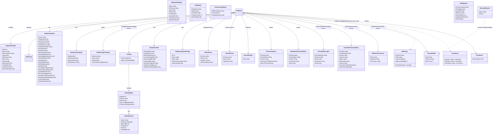
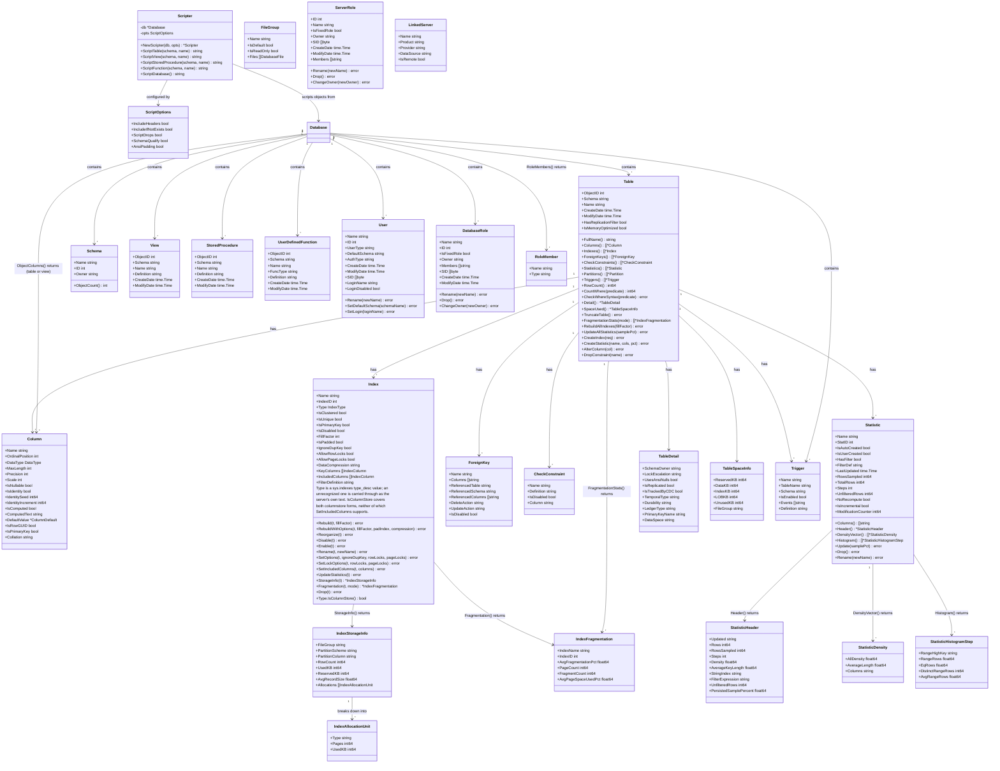
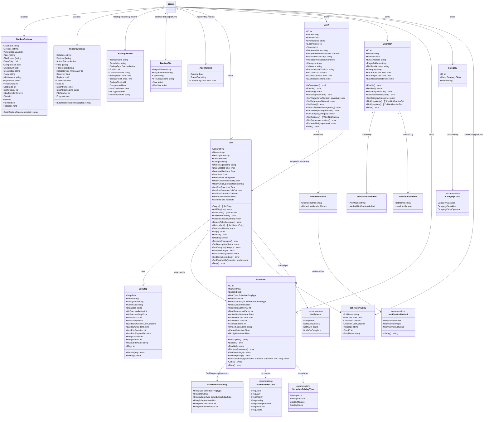
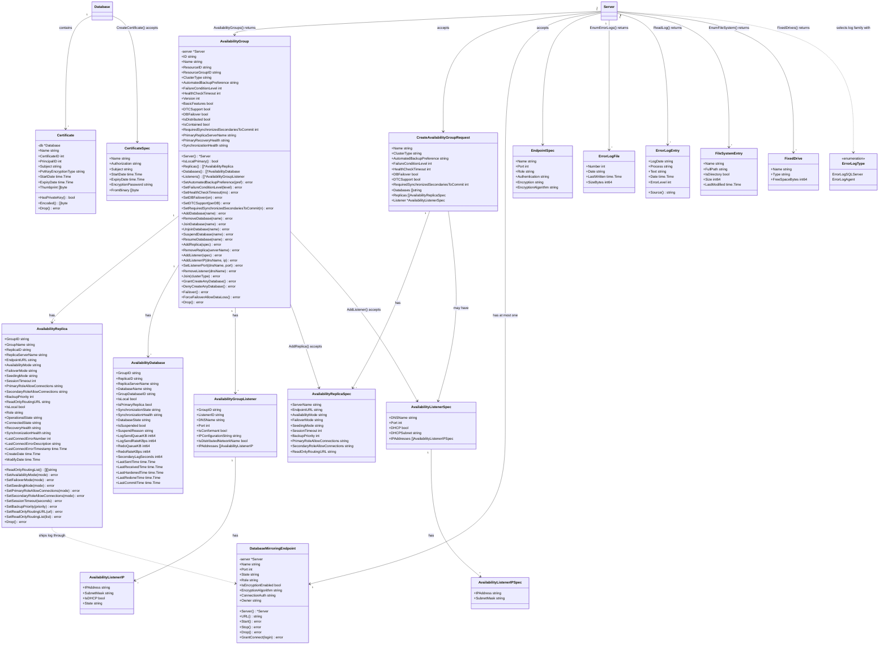

# gosmo

SQLServer Management Objects Library
A Go library that mimics **Microsoft SQL Server Management Objects (SMO)** — without WMI, COM, or Windows-only dependencies.

```
go get github.com/radix29/gosmo
```

> **Go version note:** The module requires Go 1.26

---

## Architecture

The class map is split across five diagrams, one per area. It is one map,
not five — a single Mermaid diagram stops rendering above 50,000 characters
and the whole thing is well past that, so an edge that crosses areas is drawn
in the diagram of the area it points *into* (`Server --> AvailabilityGroup`
is in the high-availability one, where `Server` shows up as a bare box).
`gosmo.mermaid` holds the same five diagrams, concatenated in order, and is
kept byte-identical to what is below.

### Connecting, the server, and logins

The entry point, authentication, server-level security and the login
object — plus the internal connection helpers every read and write goes
through, and the `WithScript` collector that can capture a write instead of
running it.

```mermaid
classDiagram
    %% =========================================================
    %% Top-level entry point
    %% =========================================================
    class ConnectionOptions {
        +Server string
        +Database string
        +Auth AuthMethod
        +User string
        +Password string
        +TenantID string
        +ClientID string
        +ClientCertPath string
        +AccessToken string
        +AccessTokenProvider func
        +ServerSPN string
        +Kerberos KerberosOptions
        +ConnectTimeout Duration
        +ApplicationName string
        +MaxOpenConns int
        +MaxIdleConns int
        +ConnMaxLifetime Duration
        +ConnMaxIdleTime Duration
        +SessionInitSQL string
        +TrustServerCertificate bool
        +Encrypt string
    }

    class Server {
        -db *sql.DB
        -info *ServerInfo
        +Connect(opts) *Server
        +ConnectContext(ctx, opts) *Server
        +ParseServerAddress(server) string
        +Close() error
        +DB() *sql.DB
        +Info() *ServerInfo
        +Name() string
        +CurrentDatabase() string
        +CurrentLogin() string
        +Databases() []*Database
        +DatabaseByName(name) *Database
        +Database(name) *Database
        +CreateDatabase(name, opts) error
        +DropDatabase(name, force) error
        +RenameDatabase(oldName, newName, force) error
        +Logins() []*Login
        +LoginByName(name) *Login
        +Login(name) *Login
        +CreateLogin(name, password, opts) error
        +DropLogin(name) error
        +ServerRoles() []*ServerRole
        +ServerRoleByName(name) *ServerRole
        +DropServerRole(name) error
        +ServerRoleMembers(role) []*RoleMember
        +AddServerRoleMember(role, member) error
        +RemoveServerRoleMember(role, member) error
        +LinkedServers() []*LinkedServer
        +Configurations() []*Configuration
        +AgentInfo() *AgentStatus
        +Jobs() []*Job
        +JobByName(name) *Job
        +Job(name) *Job
        +CreateJob(req) *Job
        +JobHistory(limit) []*JobHistoryEntry
        +Alerts() []*Alert
        +EventAlerts() []*Alert
        +AlertByName(name) *Alert
        +Alert(name) *Alert
        +CreateAlert(req) *Alert
        +Operators() []*Operator
        +OperatorByName(name) *Operator
        +Operator(name) *Operator
        +CreateOperator(req) *Operator
        +Schedules() []*Schedule
        +ScheduleByName(name) *Schedule
        +Schedule(name) *Schedule
        +CreateSchedule(req) *Schedule
        +Categories(class) []*Category
        +CreateCategory(class, name) error
        +DeleteCategory(class, name) error
        +ActiveSessions(sys) []*Session
        +KillSession(id) error
        +EnumErrorLogs(logType) []*ErrorLogFile
        +ReadLog(logType, n) []*ErrorLogEntry
        +ReadErrorLog(n) []*ErrorLogEntry
        +CycleErrorLog() error
        +EnumFileSystem(path) []*FileSystemEntry
        +FixedDrives() []*FixedDrive
        +FileSystemExists(path) bool
        +MailProfiles() []*MailProfile
        +SendMail(opts) error
        +Backup(opts) error
        +Restore(opts) error
        +VerifyBackup(device) error
        +BackupHeaders(device) []*BackupHeader
        +BackupFileList(device) []*BackupFile
        +BackupFileListForSet(device, fileNumber) []*BackupFile
        +SecurityInfo() *ServerSecurityInfo
        +ServerPermissions() []*ServerPermissionEntry
        +GrantServerPermissionWithOptions(perm, principal, opts) error
        +DenyServerPermissionWithOptions(perm, principal, opts) error
        +RevokeServerPermissionWithOptions(perm, principal, opts) error
        +EffectiveServerPermissions(login) []*EffectivePermission
        +GrantServerPermission(perm, principal) error
        +DenyServerPermission(perm, principal) error
        +RevokeServerPermission(perm, principal) error
        +ServerPermissionNames() []string
        +Credentials() []*Credential
        +MemoryStats() *ServerMemoryStats
        +Languages() []*Language
        +ProcessorInfo() *ProcessorInfo
        +DiskVolumes() []DiskVolumeInfo
        +AvailabilityGroups() []*AvailabilityGroup
        +AvailabilityGroupByName(name) *AvailabilityGroup
        +AvailabilityGroup(name) *AvailabilityGroup
        +CreateAvailabilityGroup(req) *AvailabilityGroup
        +DatabaseMirroringEndpoint() *DatabaseMirroringEndpoint
        +CreateDatabaseMirroringEndpoint(spec) *DatabaseMirroringEndpoint
    }

    class ServerInfo {
        +Name string
        +Edition string
        +ProductVersion string
        +ProductLevel string
        +Collation string
        +IsClustered bool
        +IsHADREnabled bool
        +IsSingleUser bool
        +EngineEdition int
        +OSVersion string
        +Platform string
        +PhysicalMemoryMB int64
        +LogicalCPUCount int
        +DefaultDataPath string
        +DefaultLogPath string
        +DefaultBackupPath string
        +VersionMajor int
        +VersionMinor int
        +VersionBuild int
    }

    %% =========================================================
    %% Authentication
    %% =========================================================
    class AuthMethod {
        <<enumeration>>
        AuthSQLServer
        AuthWindows
        AuthEntraMSI
        AuthEntraServicePrincipal
        AuthEntraPassword
        AuthEntraInteractive
        AuthEntraDeviceCode
        AuthEntraDefault
        AuthEntraAzCLI
        AuthEntraAzurePipelines
        AuthEntraServicePrincipalAccessToken
        AuthEntraOnBehalfOf
    }

    class KerberosOptions {
        +ConfigFile string
        +CredCacheFile string
        +KeytabFile string
        +Realm string
        +DNSLookupKDC *bool
        +UDPPreferenceLimit int
        Native SSPI on Windows, unless set.
        Every other platform authenticates
        AuthWindows via Kerberos, using this or
        the ambient kinit cache when it is the
        zero value.
    }

    %% =========================================================
    %% Server security, permissions, memory, languages
    %% =========================================================
    class ServerSecurityInfo {
        +AuthenticationMode string
    }

    class ServerPermissionEntry {
        +Principal string
        +PrincipalType string
        +Grantor string
        +Permission string
        +State string
    }

    class Credential {
        +Name string
        +Identity string
        +CreateDate time.Time
        +ModifyDate time.Time
    }

    class ServerMemoryStats {
        +PhysicalMemoryMB int64
        +AvailableMemoryMB int64
        +TargetServerMemoryMB int64
        +TotalServerMemoryMB int64
    }

    class Language {
        +LangID int
        +Name string
        +Alias string
    }

    class ProcessorInfo {
        +CPUCount int
        +HyperthreadRatio int
        +NUMANodeCount int
        +CPUNUMANode []int
    }

    class DiskVolumeInfo {
        +MountPoint string
        +VolumeName string
        +SamplePath string
        +TotalMB float64
        +AvailableMB float64
    }

    %% =========================================================
    %% Login
    %% =========================================================
    class Login {
        +Name string
        +SID []byte
        +LoginType string
        +IsDisabled bool
        +DefaultDatabase string
        +CreateDate time.Time
        +ModifyDate time.Time
        +Enable() error
        +Disable() error
        +ChangePassword(newPassword) error
        +ChangePasswordWithOptions(pw, mustChange, unlock) error
        +AddServerRoleMember(role) error
        +RemoveServerRoleMember(role) error
        +Drop() error
        +Details() *LoginDetails
        +Rename(newName) error
        +SetDefaultDatabase(name) error
        +SetDefaultLanguage(lang) error
        +SetPasswordPolicy(checkPolicy, checkExpiration) error
        +MapCredential(credential) error
        +UnmapCredential(credential) error
        +UserMappings() []*LoginUserMapping
        +MapToDatabase(dbName, user, schema) error
        +UnmapFromDatabase(dbName) error
    }

    class LoginDetails {
        +IsLocked bool
        +IsExpired bool
        +MustChangePassword bool
        +IsPolicyChecked bool
        +IsExpirationChecked bool
        +PasswordLastSet time.Time
        +LastLogin time.Time
        +BadPasswordCount int
        +BadPasswordTime time.Time
        +DefaultLanguage string
        +CredentialName string
        +ConnectSQLState string
    }

    class LoginUserMapping {
        +Database string
        +User string
        +DefaultSchema string
        +Roles []string
    }

    class nStringLiteral {
        <<internal helper>>
        Quotes a password as an N'...'
        T-SQL string literal, escaping
        any embedded quote.
        Used by CreateLogin and ChangePassword —
        HASHED is never used, since it tells
        SQL Server the value is already one of
        its own password-hash formats, not
        cleartext.
    }

    %% =========================================================
    %% Database
    %% =========================================================
    class Database {
        -server *Server
        -name string
        -id int
        -state string
        -recoveryModel RecoveryModel
        -compatLevel CompatibilityLevel
        -collation string
        -isReadOnly bool
        -createDate time.Time
        +Name() string
        +ID() int
        +State() string
        +IsSystem() bool
        +RecoveryModel() RecoveryModel
        +CompatibilityLevel() CompatibilityLevel
        +Tables() []*Table
        +TablesBySchema(schema) []*Table
        +TableByName(schema, name) *Table
        +Table(schema, name) *Table
        +CreateTable(req) error
        +DropTable(schema, name, cascade) error
        +RenameTable(schema, oldName, newName) error
        +RenameObject(schema, oldName, newName) error
        +Catalog() *Catalog
        +SystemCatalog() *Catalog
        +Views() []*View
        +DropView(schema, name) error
        +StoredProcedures() []*StoredProcedure
        +CreateStoredProcedure(schema, name, body) error
        +DropStoredProcedure(schema, name) error
        +UserDefinedFunctions() []*UserDefinedFunction
        +DropFunction(schema, name) error
        +SystemViews() []*View
        +SystemStoredProcedures() []*StoredProcedure
        +SystemFunctions() []*UserDefinedFunction
        +Schemas() []*Schema
        +CreateSchema(name, owner) error
        +DropSchema(name) error
        +Users() []*User
        +UserByName(name) *User
        +CreateUser(user, login, schema) error
        +DropUser(name) error
        +DatabaseRoles() []*DatabaseRole
        +RoleByName(name) *DatabaseRole
        +DropDatabaseRole(name) error
        +RoleMembers(role) []*RoleMember
        +AddRoleMember(role, member) error
        +RemoveRoleMember(role, member) error
        +FileGroups() []*FileGroup
        +Triggers() []*Trigger
        +DropTrigger(schema, name) error
        +Sequences() []*Sequence
        +DropSequence(schema, name) error
        +Synonyms() []*Synonym
        +DropSynonym(schema, name) error
        +PartitionFunctions() []*PartitionFunction
        +PartitionSchemes() []*PartitionScheme
        +ExtendedProperties(level) []*ExtendedProperty
        +AddExtendedProperty(name, value, level) error
        +SetExtendedProperty(name, value, level) error
        +DropExtendedProperty(name, level) error
        +Certificates() []*Certificate
        +CertificateByName(name) *Certificate
        +CreateCertificate(spec) error
        +HasMasterKey() bool
        +CreateMasterKey(password) error
        +ColumnMasterKeys() []*ColumnMasterKey
        +ColumnEncryptionKeys() []*ColumnEncryptionKey
        +SecurityPolicies() []*SecurityPolicy
        +SpaceUsed() SpaceInfo
        +TableRowCounts() map~int,int64~
        +TableSpaceUsedAll() map~int,TableSpaceInfo~
        +SetRecoveryModel(model) error
        +SetCompatibilityLevel(level) error
        +SetReadOnly(bool) error
        +SetUserAccess(mode) error
        +SetOffline() error
        +SetOnline() error
        +Options() *DatabaseOptions
        +SetDatabaseOption(opt, value) error
        +SetOwner(principal) error
        +DatabaseScopedConfigs() []*DatabaseScopedConfig
        +SetDatabaseScopedConfig(name, value, forSecondary) error
        +QueryStore() *QueryStoreInfo
        +SetQueryStoreOptions(opts) error
        +FlushQueryStore() error
        +ClearQueryStore() error
        +Files() []*DatabaseFileInfo
        +AddFile(spec) error
        +AlterFile(name, m) error
        +RemoveFile(name) error
        +AddFileGroup(name) error
        +RemoveFileGroup(name) error
        +SetDefaultFileGroup(name) error
        +SetFileGroupReadOnly(name, ro) error
        +ChangeTracking() *ChangeTrackingInfo
        +SetChangeTracking(info) error
        +TableChangeTracking() []*TableChangeTracking
        +SetTableChangeTracking(schema, name, enable, cols) error
        +Dependencies(schema, name) []*Dependency
        +Dependents(schema, name) []*Dependency
        +Search(pattern) []*SearchResult
        +FindSecurables(search) []SecurableRef
        +ObjectColumns(schema, name) []*Column
        +Permissions(schema, name) []*PermissionEntry
        +GrantPermission(schema, name, perm, principal) error
        +DenyPermission(schema, name, perm, principal) error
        +RevokePermission(schema, name, perm, principal) error
        +PermissionsForPrincipal(principal) []*PrincipalSecurable
        +GrantPermissionWithOptions(schema, name, perm, principal, opts) error
        +DenyPermissionWithOptions(schema, name, perm, principal, opts) error
        +RevokePermissionWithOptions(schema, name, perm, principal, opts) error
        +ColumnPermissions(schema, name) []*ColumnPermissionEntry
        +ColumnPermissionsForPrincipal(principal) []*ColumnPermissionEntry
        +GrantColumnPermission(schema, name, perm, cols, principal) error
        +DenyColumnPermission(schema, name, perm, cols, principal) error
        +RevokeColumnPermission(schema, name, perm, cols, principal) error
        +GrantColumnPermissionWithOptions(schema, name, perm, cols, principal, opts) error
        +DenyColumnPermissionWithOptions(schema, name, perm, cols, principal, opts) error
        +RevokeColumnPermissionWithOptions(schema, name, perm, cols, principal, opts) error
        +EffectivePermissions(principal) []*EffectivePermission
        +EffectiveObjectPermissions(schema, name, principal) []*EffectivePermission
        +EffectiveSchemaPermissions(schema, principal) []*EffectivePermission
        +SchemaPermissions(schema) []*PermissionEntry
        +GrantSchemaPermission(schema, perm, principal) error
        +DenySchemaPermission(schema, perm, principal) error
        +RevokeSchemaPermission(schema, perm, principal) error
        +GrantSchemaPermissionWithOptions(schema, perm, principal, opts) error
        +DenySchemaPermissionWithOptions(schema, perm, principal, opts) error
        +RevokeSchemaPermissionWithOptions(schema, perm, principal, opts) error
        +DatabasePermissions() []*DatabasePermissionEntry
        +GrantDatabasePermission(perm, principal) error
        +DenyDatabasePermission(perm, principal) error
        +RevokeDatabasePermission(perm, principal) error
        +GrantDatabasePermissionWithOptions(perm, principal, opts) error
        +DenyDatabasePermissionWithOptions(perm, principal, opts) error
        +RevokeDatabasePermissionWithOptions(perm, principal, opts) error
        +EstimatedPlan(sql) *ExecutionPlan
        +ActualPlan(sql) *ExecutionPlan
        +ExecProc(schema, name, params) ProcResult
        +BulkInsert(bc, rows) int64
    }

    %% =========================================================
    %% Connection helpers (internal)
    %% =========================================================
    class withConn {
        <<internal helper>>
        Acquires *sql.Conn from pool.
        Executes USE db, retried on a
        transient failure. Runs callback
        fn(*sql.Conn) — NOT retried, since
        fn is the caller's actual write.
        Releases conn via defer.
        Used by Database.exec.
    }

    class dbRows {
        <<internal type>>
        -Rows *sql.Rows
        -conn *sql.Conn
        +Close() error
        Closes Rows then the conn pinned
        for them. *sql.Rows.Close alone
        leaves the conn checked out of the
        pool forever. Returned by
        Database.query().
    }

    class DatabaseQueryRow {
        <<internal helper>>
        Database.queryRow(ctx, scan, q, args)
        Acquires conn, runs USE, hands the row
        to scan — all inside one retry unit.
        scan must run inside it: QueryRowContext
        never errors, only Scan does.
    }

    class ServerQuery {
        <<internal helpers>>
        Server.query(ctx, q, args)
        Server.queryRow(ctx, scan, q, args)
        Server.queryRowScan(ctx, q, args, dest)
        Server-scoped counterparts, with no USE
        to redo. queryRowScan is the bare-Scan
        convenience over queryRow.
    }

    class withRetry {
        <<internal helper>>
        Generic retry wrapper for idempotent
        reads only. 3 attempts, linear backoff
        of attempt times 50ms. Used by every
        query/queryRow helper above.
    }

    class IsRetryable {
        <<package function>>
        True for the driver's RetryableError, a
        dropped pooled connection (ErrBadConn),
        a net.Error, a corrupted TDS stream, a
        connection-severing ServerError, or EOF
        — including wrapped errors. Exported so
        callers running their own statements can
        make the same retry decision.
    }

    %% =========================================================
    %% Quoting (shared identifier / literal escaping)
    %% =========================================================
    class Quoting {
        <<package functions>>
        +QuoteName(name) string
        +QuoteLiteral(s) string
        Backed by the driver's own TSQLQuoter,
        so gosmo, its callers, and gossms share
        one quoting implementation. The internal
        quoteIdent helper delegates to QuoteName.
    }

    %% =========================================================
    %% Errors
    %% =========================================================
    class ErrNotFound {
        <<sentinel>>
        The error every by-name lookup that
        reports absence wraps, so errors.Is
        separates "does not exist" from
        "the lookup itself failed".
        CertificateByName returns (nil, nil)
        instead, and AgentStatus reports an
        unreachable Agent as a value.
    }

    class SQLError {
        +Number int32
        +State uint8
        +Class uint8
        +Message string
        +ServerName string
        +ProcName string
        +LineNo int32
        +All []SQLError
        +AsSQLError(err) *SQLError
        +Header() string
        +Error() string
        +IsError() bool
    }

    %% =========================================================
    %% Scripting pending writes (dry-run)
    %% =========================================================
    class ScriptCollector {
        -mu sync.Mutex
        +Statements []string
        +WithScript(ctx) *ScriptCollector
        +Scripting(ctx) bool
        Captures the exact statement(s) a set of
        pending write calls would run, without
        running them. Every write funnels through
        Server.execContext or Database.exec, the
        two chokepoints WithScript intercepts.
        Bound parameters are substituted as
        literals so a captured statement runs
        standalone; ExecProc is captured as its
        EXEC form. Scripting(ctx) reports whether
        a context is one of these, so a caller
        does not mirror a write the server never
        saw into its own state.
        Statements is mutex-guarded: one collector
        may be shared across goroutines.
    }

    %% =========================================================
    %% Relationships
    %% =========================================================
    ConnectionOptions --> AuthMethod : uses
    ConnectionOptions --> KerberosOptions : configures AuthWindows via
    Server --> ConnectionOptions : created from
    Server --> ServerInfo : has
    Server "1" --> "*" Database : owns
    Server "1" --> "*" Login : owns
    Server "1" --> "*" ServerRole : owns
    Server "1" --> "*" RoleMember : ServerRoleMembers() returns
    Server "1" --> "*" LinkedServer : owns
    Server --> ServerSecurityInfo : has
    Server "1" --> "*" ServerPermissionEntry : grants
    Server "1" --> "*" Credential : owns
    Server --> ServerMemoryStats : has
    Server "1" --> "*" Language : lists
    Server --> ProcessorInfo : has
    Server "1" --> "*" DiskVolumeInfo : lists

    Login ..> nStringLiteral : password quoted by
    Login --> LoginDetails : has
    Login "1" --> "*" LoginUserMapping : mapped via

    Database ..> withConn : writes run via
    Database ..> dbRows : query() returns
    Database ..> DatabaseQueryRow : single-row reads via
    Database ..> withRetry : reads retried via
    Server ..> ServerQuery : reads run via
    Server ..> withRetry : reads retried via

    withRetry <.. withConn : acquire+USE retried by
    withRetry <.. dbRows : acquire+USE+query retried by
    withRetry <.. DatabaseQueryRow : whole scan retried by
    withRetry <.. ServerQuery : whole scan retried by
    withRetry <.. IsRetryable : same failure test as

    ScriptCollector ..> Server : captures writes from
    ScriptCollector ..> Database : captures writes from
```

### A database: files, options, catalog, and permissions

What `Database` exposes about itself — its files and filegroups, its
`ALTER DATABASE` options, change tracking, the bulk catalog snapshot, Query
Store, dependencies and search, and the whole permissions surface, including
column-level and effective permissions.


```mermaid
classDiagram
    %% =========================================================
    %% Database files, filegroups, and options
    %% =========================================================
    class DatabaseFileInfo {
        +FileID int
        +Name string
        +PhysicalName string
        +Type string
        +FileGroup string
        +State string
        +SizeKB int64
        +MaxSizeKB int64
        +GrowthKB int64
        +GrowthPercent int
        +IsPercentGrowth bool
    }

    class DatabaseFileSpec {
        +Name string
        +FileGroup string
        +Type string
        +Path string
        +SizeKB int64
        +GrowthKB int64
        +GrowthPercent int
        +MaxSizeKB int64
    }

    class FileModify {
        +NewName string
        +SizeKB int64
        +GrowthKB int64
        +GrowthPercent int
        +MaxSizeKB int64
    }

    class DatabaseOptions {
        +Owner string
        +PageVerify string
        +UserAccess string
        +Containment string
        +DefaultCursor string
        +SnapshotIsolation string
        +AutoClose bool
        +AutoShrink bool
        +AutoCreateStats bool
        +AutoUpdateStats bool
        +AutoUpdateStatsAsync bool
        +ANSINullDefault bool
        +ANSINulls bool
        +ANSIPadding bool
        +ANSIWarnings bool
        +ArithAbort bool
        +ConcatNullYieldsNull bool
        +NumericRoundAbort bool
        +QuotedIdentifier bool
        +RecursiveTriggers bool
        +CursorCloseOnCommit bool
        +ReadCommittedSnapshot bool
        +IsTrustworthy bool
        +IsBrokerEnabled bool
    }

    %% =========================================================
    %% Change tracking
    %% =========================================================
    class ChangeTrackingInfo {
        +Enabled bool
        +AutoCleanup bool
        +RetentionPeriod int
        +RetentionUnit string
    }

    class TableChangeTracking {
        +Schema string
        +Name string
        +Enabled bool
        +TrackColumnsUpdated bool
    }

    %% =========================================================
    %% Catalog snapshot (bulk table/view + column inventory)
    %% =========================================================
    class Catalog {
        +Schemas []string
        +Objects []CatalogObject
    }

    class CatalogObject {
        +ObjectID int
        +Schema string
        +Name string
        +Type CatalogObjectType
        +Columns []CatalogColumn
    }

    class CatalogColumn {
        +Name string
        +DataType DataType
        +MaxLength int
        +Precision int
        +Scale int
        +IsNullable bool
    }

    %% =========================================================
    %% Query Store and Database Scoped Configuration
    %% =========================================================
    class QueryStoreInfo {
        +DesiredState string
        +ActualState string
        +ReadOnlyReason int
        +CurrentStorageMB int64
        +MaxStorageMB int64
        +CaptureMode string
        +SizeCleanupMode string
        +StaleThresholdDays int
        +WaitStatsCaptureMode string
    }

    class DatabaseScopedConfig {
        +ID int
        +Name string
        +Value string
        +ValueForSecondary string
        +IsValueDefault bool
    }

    %% =========================================================
    %% Dependencies and object search
    %% =========================================================
    class Dependency {
        +Schema string
        +Name string
        +TypeDesc string
        +IsSchemaBound bool
    }

    class SearchResult {
        +Schema string
        +Name string
        +TypeDesc string
    }

    %% =========================================================
    %% Execution plans
    %% =========================================================
    class ExecutionPlan {
        +XML string
    }

    %% =========================================================
    %% Object and database-scoped permissions
    %% =========================================================
    class PermissionEntry {
        +Principal string
        +PrincipalType string
        +Grantor string
        +Permission ObjectPermission
        +State PermissionState
    }

    class DatabasePermissionEntry {
        +Principal string
        +PrincipalType string
        +Grantor string
        +Permission string
        +State string
    }

    class PrincipalSecurable {
        +SecurableType string
        +Schema string
        +Name string
        +Permission string
        +State string
    }

    class ColumnPermissionEntry {
        +Principal string
        +PrincipalType string
        +Grantor string
        +Schema string
        +Object string
        +ObjectType string
        +Column string
        +Permission ObjectPermission
        +State PermissionState
    }

    class EffectivePermission {
        +Entity string
        +Subentity string
        +Permission string
    }

    class PermissionOptions {
        +WithGrantOption bool
        +Cascade bool
        +GrantOptionOnly bool
    }

    class SecurableSearch {
        +Name string
        +Limit int
    }

    class SecurableRef {
        +Type string
        +Schema string
        +Name string
    }

    %% =========================================================
    %% Bulk copy (fast import — bcp / SSMS "Import Data")
    %% =========================================================
    class BulkCopy {
        +Schema string
        +Table string
        +Columns []string
        +Options BulkOptions
        +SliceRows(rows) iter.Seq2
    }

    class BulkOptions {
        +CheckConstraints bool
        +FireTriggers bool
        +KeepNulls bool
        +TableLock bool
        +RowsPerBatch int
        +KilobytesPerBatch int
        +Order []string
    }

    %% =========================================================
    %% Stored-procedure execution
    %% =========================================================
    class ProcParam {
        +In(name, value) ProcParam
        +Out(name, dest) ProcParam
        +InOut(name, dest) ProcParam
    }

    class ProcResult {
        +ReturnStatus int32
    }

    %% =========================================================
    %% Relationships
    %% =========================================================
    Database "1" --> "*" DatabaseFileInfo : contains
    Database "1" --> "*" FileGroup : contains
    Database --> DatabaseOptions : has
    Database --> ChangeTrackingInfo : has
    Database "1" --> "*" TableChangeTracking : tracks
    Database --> Catalog : Catalog()/SystemCatalog() returns
    Catalog "1" --> "*" CatalogObject : contains
    CatalogObject "1" --> "*" CatalogColumn : has
    Database --> QueryStoreInfo : has
    Database "1" --> "*" DatabaseScopedConfig : lists
    Database "1" --> "*" Dependency : dependencies of
    Database "1" --> "*" SearchResult : search() returns
    Database --> ExecutionPlan : produces
    Database "1" --> "*" PermissionEntry : grants
    Database "1" --> "*" DatabasePermissionEntry : grants
    Database "1" --> "*" PrincipalSecurable : PermissionsForPrincipal() returns
    Database "1" --> "*" ColumnPermissionEntry : ColumnPermissions() returns
    Database "1" --> "*" EffectivePermission : EffectivePermissions() returns
    Database "1" --> "*" SecurableRef : FindSecurables() returns
    SecurableSearch ..> SecurableRef : narrows FindSecurables()
    Database ..> BulkCopy : bulk-loads via
    Database ..> ProcParam : executes procs with
    Database --> ProcResult : returns
```

### Tables, their children, and the object families

`Table` and everything hanging off it (columns, indexes, foreign keys,
constraints, statistics, partitions), the other object families a database
contains, and the `Scripter` that generates CREATE DDL for any of them.


```mermaid
classDiagram
    %% =========================================================
    %% Table and its children
    %% =========================================================
    class Table {
        +ObjectID int
        +Schema string
        +Name string
        +CreateDate time.Time
        +ModifyDate time.Time
        +HasReplicationFilter bool
        +IsMemoryOptimized bool
        +FullName() string
        +Columns() []*Column
        +Indexes() []*Index
        +ForeignKeys() []*ForeignKey
        +CheckConstraints() []*CheckConstraint
        +Statistics() []*Statistic
        +Partitions() []*Partition
        +Triggers() []*Trigger
        +RowCount() int64
        +CountWhere(predicate) int64
        +CheckWhereSyntax(predicate) error
        +Detail() *TableDetail
        +SpaceUsed() *TableSpaceInfo
        +TruncateTable() error
        +FragmentationStats(mode) []*IndexFragmentation
        +RebuildAllIndexes(fillFactor) error
        +UpdateAllStatistics(samplePct) error
        +CreateIndex(req) error
        +CreateStatistic(name, cols, pct) error
        +AlterColumn(col) error
        +DropConstraint(name) error
    }

    class Column {
        +Name string
        +OrdinalPosition int
        +DataType DataType
        +MaxLength int
        +Precision int
        +Scale int
        +IsNullable bool
        +IsIdentity bool
        +IdentitySeed int64
        +IdentityIncrement int64
        +IsComputed bool
        +ComputedText string
        +DefaultValue *ColumnDefault
        +IsRowGUID bool
        +IsPrimaryKey bool
        +Collation string
    }

    class Index {
        +Name string
        +IndexID int
        +Type IndexType
        +IsClustered bool
        +IsUnique bool
        +IsPrimaryKey bool
        +IsDisabled bool
        +FillFactor int
        +IsPadded bool
        +IgnoreDupKey bool
        +AllowRowLocks bool
        +AllowPageLocks bool
        +DataCompression string
        +KeyColumns []IndexColumn
        +IncludedColumns []IndexColumn
        +FilterDefinition string
        +Rebuild(t, fillFactor) error
        +RebuildWithOptions(t, fillFactor, padIndex, compression) error
        +Reorganize(t) error
        +Disable(t) error
        +Enable(t) error
        +Rename(t, newName) error
        +SetOptions(t, ignoreDupKey, rowLocks, pageLocks) error
        +SetLockOptions(t, rowLocks, pageLocks) error
        +SetIncludedColumns(t, columns) error
        +UpdateStatistics(t) error
        +StorageInfo(t) *IndexStorageInfo
        +Fragmentation(t, mode) *IndexFragmentation
        +Drop(t) error
        +Type.IsColumnStore() bool
        Type is a sys.indexes type_desc value; an
        unrecognized one is carried through as the
        server's own text. IsColumnStore covers
        both columnstore forms, neither of which
        SetIncludedColumns supports.
    }

    class IndexStorageInfo {
        +FileGroup string
        +PartitionScheme string
        +PartitionColumn string
        +RowCount int64
        +UsedKB int64
        +ReservedKB int64
        +AvgRecordSize float64
        +Allocations []IndexAllocationUnit
    }

    class IndexAllocationUnit {
        +Type string
        +Pages int64
        +UsedKB int64
    }

    class IndexFragmentation {
        +IndexName string
        +IndexID int
        +AvgFragmentationPct float64
        +PageCount int64
        +FragmentCount int64
        +AvgPageSpaceUsedPct float64
    }

    class ForeignKey {
        +Name string
        +Columns []string
        +ReferencedTable string
        +ReferencedSchema string
        +ReferencedColumns []string
        +DeleteAction string
        +UpdateAction string
        +IsDisabled bool
    }

    class CheckConstraint {
        +Name string
        +Definition string
        +IsDisabled bool
        +Column string
    }

    class Statistic {
        +Name string
        +StatID int
        +IsAutoCreated bool
        +IsUserCreated bool
        +HasFilter bool
        +FilterDef string
        +LastUpdated time.Time
        +RowsSampled int64
        +TotalRows int64
        +Steps int
        +UnfilteredRows int64
        +NoRecompute bool
        +IsIncremental bool
        +ModificationCounter int64
        +Columns() []string
        +Header() *StatisticHeader
        +DensityVector() []*StatisticDensity
        +Histogram() []*StatisticHistogramStep
        +Update(samplePct) error
        +Drop() error
        +Rename(newName) error
    }

    class StatisticHeader {
        +Updated string
        +Rows int64
        +RowsSampled int64
        +Steps int
        +Density float64
        +AverageKeyLength float64
        +StringIndex string
        +FilterExpression string
        +UnfilteredRows int64
        +PersistedSamplePercent float64
    }

    class StatisticDensity {
        +AllDensity float64
        +AverageLength float64
        +Columns string
    }

    class StatisticHistogramStep {
        +RangeHighKey string
        +RangeRows float64
        +EqRows float64
        +DistinctRangeRows int64
        +AvgRangeRows float64
    }

    class TableDetail {
        +SchemaOwner string
        +LockEscalation string
        +UsesAnsiNulls bool
        +IsReplicated bool
        +IsTrackedByCDC bool
        +TemporalType string
        +Durability string
        +LedgerType string
        +PrimaryKeyName string
        +DataSpace string
    }

    class TableSpaceInfo {
        +ReservedKB int64
        +DataKB int64
        +IndexKB int64
        +LOBKB int64
        +UnusedKB int64
        +FileGroup string
    }

    %% =========================================================
    %% Scripter (generates CREATE DDL for existing objects — distinct
    %% from ScriptCollector, which captures pending write statements)
    %% =========================================================
    class Scripter {
        -db *Database
        -opts ScriptOptions
        +NewScripter(db, opts) *Scripter
        +ScriptTable(schema, name) string
        +ScriptView(schema, name) string
        +ScriptStoredProcedure(schema, name) string
        +ScriptFunction(schema, name) string
        +ScriptDatabase() string
    }

    class ScriptOptions {
        +IncludeHeaders bool
        +IncludeIfNotExists bool
        +ScriptDrops bool
        +SchemaQualify bool
        +AnsiPadding bool
    }

    %% =========================================================
    %% Database objects
    %% =========================================================
    class Schema {
        +Name string
        +ID int
        +Owner string
        +ObjectCount() int
    }

    class View {
        +ObjectID int
        +Schema string
        +Name string
        +Definition string
        +CreateDate time.Time
        +ModifyDate time.Time
    }

    class StoredProcedure {
        +ObjectID int
        +Schema string
        +Name string
        +Definition string
        +CreateDate time.Time
        +ModifyDate time.Time
    }

    class UserDefinedFunction {
        +ObjectID int
        +Schema string
        +Name string
        +FuncType string
        +Definition string
        +CreateDate time.Time
        +ModifyDate time.Time
    }

    class User {
        +Name string
        +ID int
        +UserType string
        +DefaultSchema string
        +AuthType string
        +CreateDate time.Time
        +ModifyDate time.Time
        +SID []byte
        +LoginName string
        +LoginDisabled bool
        +Rename(newName) error
        +SetDefaultSchema(schemaName) error
        +SetLogin(loginName) error
    }

    class DatabaseRole {
        +Name string
        +ID int
        +IsFixedRole bool
        +Owner string
        +Members []string
        +SID []byte
        +CreateDate time.Time
        +ModifyDate time.Time
        +Rename(newName) error
        +Drop() error
        +ChangeOwner(newOwner) error
    }

    class RoleMember {
        +Name string
        +Type string
    }

    class FileGroup {
        +Name string
        +IsDefault bool
        +IsReadOnly bool
        +Files []DatabaseFile
    }

    class Trigger {
        +Name string
        +TableName string
        +Schema string
        +IsEnabled bool
        +Events []string
        +Definition string
    }

    class ServerRole {
        +ID int
        +Name string
        +IsFixedRole bool
        +Owner string
        +SID []byte
        +CreateDate time.Time
        +ModifyDate time.Time
        +Members []string
        +Rename(newName) error
        +Drop() error
        +ChangeOwner(newOwner) error
    }

    class LinkedServer {
        +Name string
        +Product string
        +Provider string
        +DataSource string
        +IsRemote bool
    }

    %% =========================================================
    %% Relationships
    %% =========================================================
    Database "1" --> "*" Table : contains
    Database "1" --> "*" View : contains
    Database "1" --> "*" StoredProcedure : contains
    Database "1" --> "*" UserDefinedFunction : contains
    Database "1" --> "*" Schema : contains
    Database "1" --> "*" User : contains
    Database "1" --> "*" DatabaseRole : contains
    Database "1" --> "*" Trigger : contains
    Database "1" --> "*" RoleMember : RoleMembers() returns
    Database "1" --> "*" Column : ObjectColumns() returns (table or view)

    Table "1" --> "*" Column : has
    Table "1" --> "*" Index : has
    Table "1" --> "*" ForeignKey : has
    Table "1" --> "*" CheckConstraint : has
    Table "1" --> "*" Statistic : has
    Table "1" --> "*" Trigger : has
    Table --> TableDetail : has
    Table --> TableSpaceInfo : has
    Table "1" --> "*" IndexFragmentation : FragmentationStats() returns

    Index --> IndexStorageInfo : StorageInfo() returns
    IndexStorageInfo "1" --> "*" IndexAllocationUnit : breaks down into
    Index --> IndexFragmentation : Fragmentation() returns

    Statistic --> StatisticHeader : Header() returns
    Statistic "1" --> "*" StatisticDensity : DensityVector() returns
    Statistic "1" --> "*" StatisticHistogramStep : Histogram() returns

    Scripter --> Database : scripts objects from
    Scripter --> ScriptOptions : configured by
```

### Backup, restore, and SQL Server Agent

Backup and restore options and the metadata read back off a device, and
the whole Agent node — jobs and their steps and history, alerts, operators,
shared schedules, and categories.


```mermaid
classDiagram
    %% =========================================================
    %% Backup / Restore
    %% =========================================================
    class BackupOptions {
        +Database string
        +Devices []string
        +Action BackupAction
        +Files []string
        +FileGroups []string
        +CopyOnly bool
        +Compression bool
        +Checksum bool
        +Description string
        +Name string
        +MediaName string
        +Expiry time.Time
        +RetainDays int
        +BlockSize int
        +BufferCount int
        +MaxTransferSize int
        +Stats int
        +Init bool
        +Format bool
        +Progress func
        +BuildBackupStatement(opts) string
    }

    class RestoreOptions {
        +Database string
        +Devices []string
        +Action BackupAction
        +Files []string
        +FileGroups []string
        +RelocateFiles []RelocateFile
        +Recovery bool
        +Replace bool
        +Checksum bool
        +Stats int
        +StopAt time.Time
        +StopAtMarkName string
        +FileNumber int
        +Progress func
        +BuildRestoreStatement(opts) string
    }

    class BackupHeader {
        +BackupName string
        +Description string
        +BackupType BackupAction
        +Position int
        +DatabaseName string
        +BackupStart time.Time
        +BackupFinish time.Time
        +BackupSize int64
        +Compressed bool
        +HasChecksums bool
        +IsCopyOnly bool
        +RecoveryModel string
    }

    class BackupFile {
        +LogicalName string
        +PhysicalName string
        +Type string
        +FileGroupName string
        +Size int64
        +MaxSize int64
    }

    %% =========================================================
    %% SQL Server Agent
    %% =========================================================
    class AgentStatus {
        +Running bool
        +StatusText string
        +LastStartupTime time.Time
    }

    class Job {
        +JobID string
        +Name string
        +Description string
        +IsEnabled bool
        +Category string
        +OwnerLoginName string
        +DateCreated time.Time
        +DateModified time.Time
        +StartStepID int
        +DeleteLevel NotifyLevel
        +NotifyLevelEmail NotifyLevel
        +NotifyEmailOperatorName string
        +LastRunDate time.Time
        +LastRunOutcome JobOutcome
        +LastRunDuration Duration
        +NextRunDate time.Time
        +CurrentState JobState
        +Steps() []*JobStep
        +AddStep(req) error
        +Schedules() []*Schedule
        +AddSchedule(req) error
        +AttachSchedule(name) error
        +DetachSchedule(name) error
        +History(limit) []*JobHistoryEntry
        +Start(stepName) error
        +Stop() error
        +Enable() error
        +Disable() error
        +Rename(newName) error
        +SetDescription(desc) error
        +SetCategory(category) error
        +SetOwner(login) error
        +SetStartStep(stepID) error
        +SetDeleteLevel(level) error
        +SetEmailNotify(operator, level) error
        +Drop() error
    }

    class JobStep {
        +StepID int
        +Name string
        +Subsystem string
        +Command string
        +Database string
        +OnSuccessAction int
        +OnSuccessStepID int
        +OnFailAction int
        +OnFailStepID int
        +LastRunOutcome JobOutcome
        +LastRunDate time.Time
        +LastRunDuration int
        +LastRunElapsed Duration
        +RetryAttempts int
        +RetryInterval int
        +OutputFileName string
        +Flags int
        +Update(req) error
        +Delete() error
    }

    class JobHistoryEntry {
        +JobName string
        +RunDate time.Time
        +Duration Duration
        +Outcome JobOutcome
        +Message string
        +StepID int
        +StepName string
    }

    class Alert {
        +ID int
        +Name string
        +Enabled bool
        +EventSource string
        +ErrorNumber int
        +Severity int
        +DatabaseName string
        +DelayBetweenResponses Duration
        +NotificationMessage string
        +IncludeEventDescriptionIn int
        +Category string
        +JobName string
        +PerformanceCondition string
        +OccurrenceCount int
        +LastOccurrence time.Time
        +LastResponse time.Time
        +IsEventAlert() bool
        +Enable() error
        +Disable() error
        +Rename(newName) error
        +SetTrigger(errorNumber, severity) error
        +SetDatabase(dbName) error
        +SetDelay(d) error
        +SetNotificationMessage(msg) error
        +SetJobResponse(jobName) error
        +SetCategory(category) error
        +Notifications() []*AlertNotification
        +Notify(operator, method) error
        +RemoveNotify(operator) error
        +Drop() error
    }

    class AlertNotification {
        +OperatorName string
        +Method NotificationMethod
    }

    class Operator {
        +ID int
        +Name string
        +Enabled bool
        +EmailAddress string
        +PagerAddress string
        +NetSendAddress string
        +Category string
        +LastEmailDate time.Time
        +LastPagerDate time.Time
        +LastNetSendDate time.Time
        +Enable() error
        +Disable() error
        +Rename(newName) error
        +SetEmailAddress(addr) error
        +SetCategory(category) error
        +NotifyingAlerts() []*AlertNotificationRef
        +NotifyingJobs() []*JobNotificationRef
        +Drop() error
    }

    class AlertNotificationRef {
        +AlertName string
        +Method NotificationMethod
    }

    class JobNotificationRef {
        +JobName string
        +Level NotifyLevel
    }

    class Schedule {
        +ID int
        +Name string
        +Enabled bool
        +FreqType ScheduleFreqType
        +FreqInterval int
        +FreqSubdayType ScheduleSubdayType
        +FreqSubdayInterval int
        +FreqRelativeInterval int
        +FreqRecurrenceFactor int
        +ActiveStartDate time.Time
        +ActiveEndDate time.Time
        +ActiveStartTime int
        +ActiveEndTime int
        +OwnerLoginName string
        +CreateDate time.Time
        +ModifyDate time.Time
        +Description() string
        +Enable() error
        +Disable() error
        +Rename(newName) error
        +SetOwner(login) error
        +SetFrequency(f) error
        +SetActiveRange(startDate, endDate, startTime, endTime) error
        +Jobs() []*Job
        +Drop() error
    }

    class ScheduleFrequency {
        +FreqType ScheduleFreqType
        +FreqInterval int
        +FreqSubdayType ScheduleSubdayType
        +FreqSubdayInterval int
        +FreqRelativeInterval int
        +FreqRecurrenceFactor int
    }

    class Category {
        +ID int
        +Class CategoryClass
        +Name string
    }

    class ScheduleFreqType {
        <<enumeration>>
        FreqOnce
        FreqDaily
        FreqWeekly
        FreqMonthly
        FreqMonthlyRelative
        FreqAutoStart
        FreqOnIdle
    }

    class ScheduleSubdayType {
        <<enumeration>>
        SubdayOnce
        SubdaySeconds
        SubdayMinutes
        SubdayHours
    }

    class NotificationMethod {
        <<enumeration>>
        NotifyMethodEmail
        NotifyMethodPager
        NotifyMethodNetSend
        +String() string
    }

    class NotifyLevel {
        <<enumeration>>
        NotifyNever
        NotifyOnSuccess
        NotifyOnFailure
        NotifyOnComplete
    }

    class CategoryClass {
        <<enumeration>>
        CategoryClassJob
        CategoryClassAlert
        CategoryClassOperator
    }

    %% =========================================================
    %% Relationships
    %% =========================================================
    Server --> BackupOptions : accepts
    Server --> RestoreOptions : accepts
    Server "1" --> "*" BackupHeader : BackupHeaders() returns
    Server "1" --> "*" BackupFile : BackupFileList() returns

    Server --> AgentStatus : AgentInfo() returns
    Server "1" --> "*" Job : owns
    Server "1" --> "*" Alert : owns
    Server "1" --> "*" Operator : owns
    Server "1" --> "*" Schedule : owns
    Server "1" --> "*" Category : owns
    Server "1" --> "*" JobHistoryEntry : JobHistory() returns

    Job "1" --> "*" JobStep : has
    Job "1" --> "*" Schedule : attached to
    Job "1" --> "*" JobHistoryEntry : History() returns
    Job --> NotifyLevel : notified per
    Schedule --> ScheduleFrequency : SetFrequency() accepts
    Schedule --> ScheduleFreqType : recurs per
    Schedule --> ScheduleSubdayType : repeats per
    Alert "1" --> "*" AlertNotification : notifies via
    Alert --> Job : responds by running
    Operator "1" --> "*" AlertNotificationRef : notified by
    Operator "1" --> "*" JobNotificationRef : emailed by
    AlertNotification --> NotificationMethod : delivered by
    Category --> CategoryClass : classified by
```

### High availability and instance-level services

Always On availability groups with their replicas, databases and listeners;
the database mirroring endpoint they ship log through; the certificates that
authenticate it; and the two host-facing reads — the error log and the
server's own filesystem.


```mermaid
classDiagram
    %% =========================================================
    %% Always On availability groups
    %% =========================================================
    class AvailabilityGroup {
        -server *Server
        +ID string
        +Name string
        +ResourceID string
        +ResourceGroupID string
        +ClusterType string
        +AutomatedBackupPreference string
        +FailureConditionLevel int
        +HealthCheckTimeout int
        +Version int
        +BasicFeatures bool
        +DTCSupport bool
        +DBFailover bool
        +IsDistributed bool
        +IsContained bool
        +RequiredSynchronizedSecondariesToCommit int
        +PrimaryReplicaServerName string
        +PrimaryRecoveryHealth string
        +SynchronizationHealth string
        +Server() *Server
        +IsLocalPrimary() bool
        +Replicas() []*AvailabilityReplica
        +Databases() []*AvailabilityDatabase
        +Listeners() []*AvailabilityGroupListener
        +SetAutomatedBackupPreference(pref) error
        +SetFailureConditionLevel(level) error
        +SetHealthCheckTimeout(ms) error
        +SetDBFailover(on) error
        +SetDTCSupport(perDB) error
        +SetRequiredSynchronizedSecondariesToCommit(n) error
        +AddDatabase(name) error
        +RemoveDatabase(name) error
        +JoinDatabase(name) error
        +UnjoinDatabase(name) error
        +SuspendDatabase(name) error
        +ResumeDatabase(name) error
        +AddReplica(spec) error
        +RemoveReplica(serverName) error
        +AddListener(spec) error
        +AddListenerIP(dnsName, ip) error
        +SetListenerPort(dnsName, port) error
        +RemoveListener(dnsName) error
        +Join(clusterType) error
        +GrantCreateAnyDatabase() error
        +DenyCreateAnyDatabase() error
        +Failover() error
        +ForceFailoverAllowDataLoss() error
        +Drop() error
    }

    class AvailabilityReplica {
        +GroupID string
        +GroupName string
        +ReplicaID string
        +ReplicaServerName string
        +EndpointURL string
        +AvailabilityMode string
        +FailoverMode string
        +SeedingMode string
        +SessionTimeout int
        +PrimaryRoleAllowConnections string
        +SecondaryRoleAllowConnections string
        +BackupPriority int
        +ReadOnlyRoutingURL string
        +IsLocal bool
        +Role string
        +OperationalState string
        +ConnectedState string
        +RecoveryHealth string
        +SynchronizationHealth string
        +LastConnectErrorNumber int
        +LastConnectErrorDescription string
        +LastConnectErrorTimestamp time.Time
        +CreateDate time.Time
        +ModifyDate time.Time
        +ReadOnlyRoutingList() [][]string
        +SetAvailabilityMode(mode) error
        +SetFailoverMode(mode) error
        +SetSeedingMode(mode) error
        +SetPrimaryRoleAllowConnections(mode) error
        +SetSecondaryRoleAllowConnections(mode) error
        +SetSessionTimeout(seconds) error
        +SetBackupPriority(priority) error
        +SetReadOnlyRoutingURL(url) error
        +SetReadOnlyRoutingList(list) error
        +Drop() error
    }

    class AvailabilityDatabase {
        +GroupID string
        +ReplicaID string
        +ReplicaServerName string
        +DatabaseName string
        +GroupDatabaseID string
        +IsLocal bool
        +IsPrimaryReplica bool
        +SynchronizationState string
        +SynchronizationHealth string
        +DatabaseState string
        +IsSuspended bool
        +SuspendReason string
        +LogSendQueueKB int64
        +LogSendRateKBps int64
        +RedoQueueKB int64
        +RedoRateKBps int64
        +SecondaryLagSeconds int64
        +LastSentTime time.Time
        +LastReceivedTime time.Time
        +LastHardenedTime time.Time
        +LastRedoneTime time.Time
        +LastCommitTime time.Time
    }

    class AvailabilityGroupListener {
        +GroupID string
        +ListenerID string
        +DNSName string
        +Port int
        +IsConformant bool
        +IPConfigurationString string
        +IsDistributedNetworkName bool
        +IPAddresses []AvailabilityListenerIP
    }

    class AvailabilityListenerIP {
        +IPAddress string
        +SubnetMask string
        +IsDHCP bool
        +State string
    }

    class CreateAvailabilityGroupRequest {
        +Name string
        +ClusterType string
        +AutomatedBackupPreference string
        +FailureConditionLevel int
        +HealthCheckTimeout int
        +DBFailover bool
        +DTCSupport bool
        +RequiredSynchronizedSecondariesToCommit int
        +Databases []string
        +Replicas []AvailabilityReplicaSpec
        +Listener *AvailabilityListenerSpec
    }

    class AvailabilityReplicaSpec {
        +ServerName string
        +EndpointURL string
        +AvailabilityMode string
        +FailoverMode string
        +SeedingMode string
        +SessionTimeout int
        +BackupPriority int
        +PrimaryRoleAllowConnections string
        +SecondaryRoleAllowConnections string
        +ReadOnlyRoutingURL string
    }

    class AvailabilityListenerSpec {
        +DNSName string
        +Port int
        +DHCP bool
        +DHCPSubnet string
        +IPAddresses []AvailabilityListenerIPSpec
    }

    class AvailabilityListenerIPSpec {
        +IPAddress string
        +SubnetMask string
    }

    %% =========================================================
    %% Database mirroring endpoint (Always On's transport)
    %% =========================================================
    class DatabaseMirroringEndpoint {
        -server *Server
        +Name string
        +Port int
        +State string
        +Role string
        +IsEncryptionEnabled bool
        +EncryptionAlgorithm string
        +ConnectionAuth string
        +Owner string
        +Server() *Server
        +URL() string
        +Start() error
        +Stop() error
        +Drop() error
        +GrantConnect(login) error
    }

    class EndpointSpec {
        +Name string
        +Port int
        +Role string
        +Authentication string
        +Encryption string
        +EncryptionAlgorithm string
    }

    %% =========================================================
    %% Certificates and the database master key
    %% =========================================================
    class Certificate {
        -db *Database
        +Name string
        +CertificateID int
        +PrincipalID int
        +Subject string
        +PvtKeyEncryptionType string
        +StartDate time.Time
        +ExpiryDate time.Time
        +Thumbprint []byte
        +HasPrivateKey() bool
        +Encoded() []byte
        +Drop() error
    }

    class CertificateSpec {
        +Name string
        +Authorization string
        +Subject string
        +StartDate time.Time
        +ExpiryDate time.Time
        +EncryptionPassword string
        +FromBinary []byte
    }

    %% =========================================================
    %% Error log
    %% =========================================================
    class ErrorLogType {
        <<enumeration>>
        ErrorLogSQLServer
        ErrorLogAgent
    }

    class ErrorLogFile {
        +Number int
        +Date string
        +LastWritten time.Time
        +SizeBytes int64
    }

    class ErrorLogEntry {
        +LogDate string
        +Process string
        +Text string
        +Date time.Time
        +ErrorLevel int
        +Source() string
    }

    %% =========================================================
    %% Server filesystem (paths the SERVER resolves, not the client)
    %% =========================================================
    class FileSystemEntry {
        +Name string
        +FullPath string
        +IsDirectory bool
        +Size int64
        +LastModified time.Time
    }

    class FixedDrive {
        +Name string
        +Type string
        +FreeSpaceBytes int64
    }

    %% =========================================================
    %% Relationships
    %% =========================================================
    Server "1" --> "*" AvailabilityGroup : AvailabilityGroups() returns
    Server --> CreateAvailabilityGroupRequest : accepts
    Server "1" --> "1" DatabaseMirroringEndpoint : has at most one
    Server --> EndpointSpec : accepts
    Server "1" --> "*" ErrorLogFile : EnumErrorLogs() returns
    Server "1" --> "*" ErrorLogEntry : ReadLog() returns
    Server "1" --> "*" FileSystemEntry : EnumFileSystem() returns
    Server "1" --> "*" FixedDrive : FixedDrives() returns
    Server ..> ErrorLogType : selects log family with

    AvailabilityGroup "1" --> "*" AvailabilityReplica : has
    AvailabilityGroup "1" --> "*" AvailabilityDatabase : has
    AvailabilityGroup "1" --> "*" AvailabilityGroupListener : has
    AvailabilityGroup --> AvailabilityReplicaSpec : AddReplica() accepts
    AvailabilityGroup --> AvailabilityListenerSpec : AddListener() accepts
    AvailabilityGroupListener "1" --> "*" AvailabilityListenerIP : has
    AvailabilityListenerSpec "1" --> "*" AvailabilityListenerIPSpec : has
    CreateAvailabilityGroupRequest "1" --> "*" AvailabilityReplicaSpec : has
    CreateAvailabilityGroupRequest --> AvailabilityListenerSpec : may have
    AvailabilityReplica ..> DatabaseMirroringEndpoint : ships log through

    Database "1" --> "*" Certificate : contains
    Database --> CertificateSpec : CreateCertificate() accepts
```

---

## Security

- **Passwords are escaped, never spliced in raw.** `CreateLogin`, `ChangePassword`, and `ChangePasswordWithOptions` quote the password as an `N'...'` literal through the same `nStringLiteral` escaping every other string literal in the package uses, so it's injection-proof regardless of password content.
- **Connection lifetimes are correctly scoped.** `Database.query` returns a `*dbRows` that owns both the `*sql.Rows` and the `*sql.Conn` pinned to run its `USE`, closing both together — `*sql.Rows.Close` on its own would leave that connection checked out of the pool for good.
- **Values that can't be parameterized are validated by shape or allowlist.** DDL can't parameterize keyword or literal arguments, so anything spliced into one is checked first: recovery models, data types, and backup actions against their known sets; partition function boundary values against the shape of a well-formed SQL Server literal; Query Store mode keywords and index data-compression settings against their allowlists.
- **One shared quoting implementation.** `QuoteName` and `QuoteLiteral` wrap the driver's own `TSQLQuoter`, so gosmo's internal identifier/literal escaping — and any caller or downstream consumer (e.g. gossms) building its own DDL — go through the same tested implementation rather than a hand-rolled one.
- **Permission and SET-option names are allowlisted, not interpolated.** `GRANT`/`DENY`/`REVOKE` and `ALTER DATABASE ... SET` are DDL and can't parameterize their keyword arguments; every method that accepts one (`GrantServerPermission`, `GrantPermission`, `GrantDatabasePermission`, `SetDatabaseOption`, ...) rejects any name not on its allowlist instead of splicing caller input directly into the statement.

---

## Packages

| Path        | Purpose                                                    |
| ----------- | ---------------------------------------------------------- |
| `/`         | All SMO types and logic                                    |
| `examples/` | Nine runnable programs — see [`examples/README.md`](examples/README.md) |

---

## Quick start

```go
import "github.com/radix29/gosmo"

srv, err := gosmo.Connect(gosmo.ConnectionOptions{
    Server:                 "localhost:1433",
    User:                   "sa",
    Password:               "YourPassword",
    TrustServerCertificate: true,
})
if err != nil { log.Fatal(err) }
defer srv.Close()

fmt.Println(srv.Info().ProductVersion)
```

---

## Feature map

### Server

| SMO equivalent          | gosmo                                      |
| ----------------------- | ------------------------------------------ |
| `Server.Databases`      | `srv.Databases()` / `srv.Database(name)` (no-I/O handle) |
| Current database         | `srv.CurrentDatabase()`                    |
| Current login (`SUSER_NAME()`) | `srv.CurrentLogin()`                 |
| `Server.Logins`         | `srv.Logins()` / `srv.LoginByName(name)` / `srv.Login(name)` (no-I/O handle) |
| `Server.Roles`          | `srv.ServerRoles()` / `srv.ServerRoleByName(name)` / `srv.ServerRoleMembers(role)` |
| Server role administration | `role.Rename(newName)` / `role.ChangeOwner(owner)` / `srv.Add\|RemoveServerRoleMember(role, member)` |
| Drop a server role      | `srv.DropServerRole(name)` / `role.Drop()`  |
| Rename a database       | `srv.RenameDatabase(old, new, force)` — `force` puts it in single-user mode first |
| `Server.LinkedServers`  | `srv.LinkedServers()`                      |
| `Server.Configuration`  | `srv.Configurations()`                     |
| `Server.JobServer` (Agent) | see [SQL Server Agent](#sql-server-agent) below |
| Active sessions         | `srv.ActiveSessions(includeSystem)`        |
| Kill session            | `srv.KillSession(id)`                      |
| Error log               | `srv.ReadLog(logType, n)` / `srv.EnumErrorLogs(logType)` / `srv.ReadErrorLog(n)` / `srv.CycleErrorLog()` — see [Error log](#error-log) |
| Database Mail           | `srv.MailProfiles()` / `srv.SendMail(...)` |
| Create login (safe)     | `srv.CreateLogin(name, password, opts)`    |
| Authentication mode     | `srv.SecurityInfo()`                       |
| Server-level permissions | `srv.ServerPermissions()` / `srv.Grant\|Deny\|RevokeServerPermission(...)` / `srv.ServerPermissionNames()` |
| Server permissions with modifiers | `srv.Grant\|Deny\|RevokeServerPermissionWithOptions(perm, principal, opts)` — `WITH GRANT OPTION`, `CASCADE`, `GRANT OPTION FOR` |
| Effective server permissions | `srv.EffectiveServerPermissions(login)` (`EXECUTE AS LOGIN` + `fn_my_permissions`) |
| Credentials              | `srv.Credentials()`                        |
| Live memory stats        | `srv.MemoryStats()`                        |
| Languages                | `srv.Languages()`                          |
| Processors / NUMA topology | `srv.ProcessorInfo()`                    |
| Disk volumes              | `srv.DiskVolumes()`                        |
| `Server.EnumDirectories` / `EnumFiles` | `srv.EnumFileSystem(path)` / `srv.FixedDrives()` / `srv.FileSystemExists(path)` — see [Server filesystem](#server-filesystem) |
| Host OS family            | `srv.Info().Platform` (`"Windows"` / `"Linux"`, from `@@VERSION`) |
| `Server.AvailabilityGroups` | `srv.AvailabilityGroups()` / `srv.AvailabilityGroup(name)` (no-I/O handle) / `srv.AvailabilityGroupByName(name)` — see [Always On](#always-on-availability-groups) |
| Database mirroring endpoint | `srv.DatabaseMirroringEndpoint()` / `srv.CreateDatabaseMirroringEndpoint(spec)` |
| Verify / inspect a backup device | `srv.VerifyBackup(device)` / `srv.BackupHeaders(device)` / `srv.BackupFileList(device)` |

### Database

| SMO equivalent                  | gosmo                                       |
| ------------------------------- | ------------------------------------------- |
| Is a system database             | `db.IsSystem()`                             |
| `Database.Tables`               | `db.Tables()` / `db.TablesBySchema(schema)` |
| Bulk table/view + column snapshot | `db.Catalog()` (user objects) / `db.SystemCatalog()` (`sys` schema) |
| `Database.Views`                | `db.Views()` / `db.DropView(schema, name)`  |
| `Database.StoredProcedures`     | `db.StoredProcedures()`                     |
| `Database.UserDefinedFunctions` | `db.UserDefinedFunctions()` / `db.DropFunction(schema, name)` |
| System Views/Procedures/Functions | `db.SystemViews()` / `db.SystemStoredProcedures()` / `db.SystemFunctions()` |
| `Database.Schemas`              | `db.Schemas()` / `schema.ObjectCount()`     |
| `Database.Users`                | `db.Users()` / `db.UserByName(name)`        |
| Database user administration    | `user.Rename(newName)` / `user.SetDefaultSchema(schemaName)` / `user.SetLogin(loginName)` |
| `Database.Roles`                | `db.DatabaseRoles()` / `db.RoleByName(name)` / `db.RoleMembers(roleName)` |
| Database role administration    | `role.Rename(newName)` / `role.ChangeOwner(newOwner)` / `role.Drop()` / `db.DropDatabaseRole(name)` |
| `Database.FileGroups`           | `db.FileGroups()`                           |
| `Database.Triggers`             | `db.Triggers()` / `db.DropTrigger(schema, name)` |
| `Database.Sequences`            | `db.Sequences()` / `db.DropSequence(schema, name)` |
| `Database.Synonyms`             | `db.Synonyms()` / `db.DropSynonym(schema, name)` |
| Rename any `sp_rename`-able object | `db.RenameObject(schema, oldName, newName)` — view, procedure, function, sequence, synonym, trigger |
| Partition functions             | `db.PartitionFunctions()`                   |
| Partition schemes               | `db.PartitionSchemes()`                     |
| Extended properties             | `db.ExtendedProperties(level)` / `db.AddExtendedProperty(...)` / `db.SetExtendedProperty(...)` / `db.DropExtendedProperty(...)` |
| `Database.Certificates`         | `db.Certificates()` / `db.CertificateByName(name)` / `db.CreateCertificate(spec)` / `cert.Drop()` — see [Certificates](#certificates-and-the-database-master-key) |
| Database master key             | `db.HasMasterKey()` / `db.CreateMasterKey(password)` |
| Column master keys              | `db.ColumnMasterKeys()`                     |
| Column encryption keys          | `db.ColumnEncryptionKeys()`                 |
| Security policies (RLS)         | `db.SecurityPolicies()`                     |
| `Database.RecoveryModel`        | `db.SetRecoveryModel(model)`                |
| `Database.CompatibilityLevel`   | `db.SetCompatibilityLevel(level)`           |
| Space used                      | `db.SpaceUsed()`                            |
| Every table's row count / space used, in one query | `db.TableRowCounts()` / `db.TableSpaceUsedAll()` (keyed by `object_id`) |
| ALTER DATABASE SET options      | `db.Options()` / `db.SetDatabaseOption(opt, value)` |
| Restrict access (single/multi/restricted user) | `db.SetUserAccess(mode)`     |
| Take offline / bring online     | `db.SetOffline()` / `db.SetOnline()`        |
| Change ownership                | `db.SetOwner(principal)`                    |
| Database Scoped Configuration   | `db.DatabaseScopedConfigs()` / `db.SetDatabaseScopedConfig(name, value, forSecondary)` |
| Query Store                     | `db.QueryStore()` / `db.SetQueryStoreOptions(opts)` / `db.FlushQueryStore()` / `db.ClearQueryStore()` |
| Every file, incl. log           | `db.Files()`                                |
| Add / alter / remove file       | `db.AddFile(spec)` / `db.AlterFile(name, m)` / `db.RemoveFile(name)` |
| Add / remove filegroup          | `db.AddFileGroup(name)` / `db.RemoveFileGroup(name)` |
| Filegroup default / read-only   | `db.SetDefaultFileGroup(name)` / `db.SetFileGroupReadOnly(name, ro)` |
| CREATE DATABASE file placement  | `CreateDatabaseOptions.PrimaryFile` / `.LogFile` (`*DatabaseFileSpec`) |
| Change tracking                 | `db.ChangeTracking()` / `db.SetChangeTracking(info)` |
| Table change tracking           | `db.TableChangeTracking()` / `db.SetTableChangeTracking(...)` |
| Database-level permissions      | `db.DatabasePermissions()` / `db.Grant\|Deny\|RevokeDatabasePermission(...)` |

### Table

| SMO equivalent        | gosmo                              |
| --------------------- | ---------------------------------- |
| `Database.Tables` (no-I/O handle) | `db.Table(schema, name)` — works under `WithScript`, where `TableByName`'s catalog read has nothing to find |
| `Table.Columns`       | `t.Columns()`                      |
| `Table.Indexes`       | `t.Indexes()`                      |
| `Table.ForeignKeys`   | `t.ForeignKeys()`                  |
| `Table.Checks`        | `t.CheckConstraints()`             |
| `Table.Statistics`    | `t.Statistics()`                   |
| `Table.Partitions`    | `t.Partitions()`                   |
| `Table.Triggers`      | `t.Triggers()`                     |
| `Table.RowCount`      | `t.RowCount()` (all tables at once: `db.TableRowCounts()`) |
| Rows matching a filter predicate | `t.CountWhere(predicate)`  |
| Validate a filter predicate | `t.CheckWhereSyntax(predicate)` |
| Object details (lock escalation, ANSI_NULLS, CDC, temporal, ledger, ...) | `t.Detail()` |
| Space used (`sp_spaceused`-style) | `t.SpaceUsed()` (all tables at once: `db.TableSpaceUsedAll()`) |
| Truncate              | `t.TruncateTable()`                |
| Fragmentation         | `t.FragmentationStats(mode)`       |
| Rebuild all indexes   | `t.RebuildAllIndexes(fillFactor)`  |
| Update all statistics | `t.UpdateAllStatistics(samplePct)` |
| Create index          | `t.CreateIndex(req)`               |
| Alter column          | `t.AlterColumn(col)`               |
| Drop a constraint     | `t.DropConstraint(name)`           |
| Columns of a table *or view* | `db.ObjectColumns(schema, name)` — `Table.Columns` reaches tables only |

### Index

| gosmo                               |
| ----------------------------------- |
| `idx.Rebuild(t, fillFactor)`        |
| `idx.RebuildWithOptions(t, fillFactor, padIndex, dataCompression)` |
| `idx.Reorganize(t)`                 |
| `idx.Disable(t)` / `idx.Enable(t)` |
| `idx.Rename(t, newName)` — also renames a PK/UNIQUE constraint |
| `idx.SetOptions(t, ignoreDupKey, allowRowLocks, allowPageLocks)` |
| `idx.SetLockOptions(t, allowRowLocks, allowPageLocks)` — no `IGNORE_DUP_KEY`, which a PK/UNIQUE-backing index rejects |
| `idx.SetIncludedColumns(t, columns)` — via `CREATE INDEX ... DROP_EXISTING` |
| `idx.UpdateStatistics(t)`           |
| `idx.StorageInfo(t)` — filegroup, partitioning, allocation-unit space |
| `idx.Fragmentation(t, mode)` — one index (`t.FragmentationStats(mode)` does all) |
| `idx.Drop(t)`                       |

`Index.Type` is a `sys.indexes.type_desc` value — `IndexTypeClustered`,
`IndexTypeNonClustered`, `IndexTypeXML`, `IndexTypeSpatial`,
`IndexTypeColumnStore`, `IndexTypeClusteredColumnStore`, or the server's own
text for a type gosmo has no constant for (e.g. `NONCLUSTERED HASH`), so it
is never empty for an index that exists. `idx.Type.IsColumnStore()` covers
both columnstore forms — neither has an `INCLUDE` list, and a clustered
columnstore index takes no key columns at all, so `SetIncludedColumns` and
`CreateIndex` reject them rather than silently producing a rowstore index.

### Statistics

| SSMS equivalent                | gosmo                                     |
| ------------------------------ | ----------------------------------------- |
| Statistics of a table          | `t.Statistics()` / `t.CreateStatistic(name, cols, pct)` |
| Statistic's key columns        | `st.Columns()`                            |
| `DBCC SHOW_STATISTICS` header  | `st.Header()` → `*StatisticHeader`        |
| ... density vector             | `st.DensityVector()` → `[]*StatisticDensity` |
| ... histogram                  | `st.Histogram()` → `[]*StatisticHistogramStep` |
| Update / drop                  | `st.Update(samplePct)` / `st.Drop()`      |
| Rename                         | `st.Rename(newName)`                      |

### Login

| gosmo                                   |
| --------------------------------------- |
| `srv.CreateLogin(name, password, opts)` |
| `login.ChangePassword(newPassword)`     |
| `login.Enable()` / `login.Disable()`   |
| `login.AddServerRoleMember(role)`       |
| `login.RemoveServerRoleMember(role)`    |
| `login.Drop()`                          |
| `login.Rename(newName)`                 |
| `login.SetDefaultDatabase(name)` / `login.SetDefaultLanguage(name)` |
| `login.SetPasswordPolicy(checkPolicy, checkExpiration)` |
| `login.ChangePasswordWithOptions(pw, mustChange, unlock)` |
| `login.MapCredential(name)` / `login.UnmapCredential(name)` |
| `login.Details()` — locked/expired/policy/last-login status |
| `login.UserMappings()` / `login.MapToDatabase(...)` / `login.UnmapFromDatabase(db)` |

### Dependencies, search, permissions, and execution plans

| SMO / SSMS equivalent      | gosmo                                                     |
| --------------------------- | ---------------------------------------------------------- |
| Object dependencies (uses)  | `db.Dependencies(schema, name)`                            |
| Object dependencies (used by) | `db.Dependents(schema, name)`                            |
| Object search                | `db.Search(pattern)`                                      |
| Securable search (for a permissions picker) | `db.FindSecurables(gosmo.SecurableSearch{Name: ..., Limit: ...})` → `[]SecurableRef` (schemas, tables, views) |
| Object permissions           | `db.Permissions(schema, name)`                            |
| Grant / deny / revoke        | `db.GrantPermission(...)` / `db.DenyPermission(...)` / `db.RevokePermission(...)` |
| Schema permissions            | `db.SchemaPermissions(schema)`                            |
| Grant / deny / revoke (schema) | `db.GrantSchemaPermission(...)` / `db.DenySchemaPermission(...)` / `db.RevokeSchemaPermission(...)` |
| Every securable one principal holds | `db.PermissionsForPrincipal(principal)`             |
| Permissions with modifiers   | `db.Grant\|Deny\|RevokePermissionWithOptions(...)` / `...SchemaPermissionWithOptions(...)` / `...DatabasePermissionWithOptions(...)` |
| Column permissions           | `db.ColumnPermissions(schema, name)` / `db.ColumnPermissionsForPrincipal(principal)` |
| Grant / deny / revoke (column) | `db.Grant\|Deny\|RevokeColumnPermission(schema, name, perm, cols, principal)` |
| Effective permissions        | `db.EffectivePermissions(principal)` / `db.EffectiveObjectPermissions(schema, name, principal)` / `db.EffectiveSchemaPermissions(schema, principal)` |
| Permission-name catalogs (for pickers) | `gosmo.ObjectPermissionNames()` / `SchemaPermissionNames()` / `DatabasePermissionNames()` / `ServerPermissionNames()` / `ColumnPermissionNames()` |
| Estimated execution plan     | `db.EstimatedPlan(sql)` (`SET SHOWPLAN_XML`, statement not run) |
| Actual execution plan        | `db.ActualPlan(sql)` (`SET STATISTICS XML`, statement runs)|

Every `Grant|Deny|Revoke...` method has a `...WithOptions` counterpart taking
a `PermissionOptions`, at all four scopes (object, column, schema, database,
server). The zero value renders exactly the statement the plain method
renders — the plain methods *are* one-line delegations to the `WithOptions`
form, so there is one renderer and one set of error strings rather than two
that have to be kept in step.

```go
// WITH GRANT OPTION, and the CASCADE that taking such a grant back requires.
db.GrantPermissionWithOptions("dbo", "Orders", gosmo.PermSelect, "app_reader",
    gosmo.PermissionOptions{WithGrantOption: true})
db.RevokePermissionWithOptions("dbo", "Orders", gosmo.PermSelect, "app_reader",
    gosmo.PermissionOptions{Cascade: true})

// Downgrade WITH GRANT OPTION back to a plain GRANT (REVOKE GRANT OPTION FOR).
db.RevokePermissionWithOptions("dbo", "Orders", gosmo.PermSelect, "app_reader",
    gosmo.PermissionOptions{GrantOptionOnly: true})
```

A modifier the verb has no form for is rejected rather than quietly dropped —
`WithGrantOption` on a `DENY`, `Cascade` on a `GRANT`. Column permissions are
their own grants, separate from the object-level ones (`Permissions` reports
those), and only `SELECT`, `UPDATE` and `REFERENCES` have a column-level form
at all; `ColumnPermissionNames()` is that catalog.

`Effective*Permissions` answers "what can this principal actually do", with
role membership, inherited scopes, ownership and `DENY` already resolved —
SSMS's Effective tab. It resolves by impersonating the principal, so the
argument must be a database *user* (or, for `srv.EffectiveServerPermissions`,
a login): SQL Server refuses to impersonate a role, and `fn_my_permissions`
has no principal argument to use instead.

### Scripter

```go
sc := gosmo.NewScripter(db, gosmo.DefaultScriptOptions())
ddl, _ := sc.ScriptTable("dbo", "MyTable")
ddl, _ := sc.ScriptView("dbo", "MyView")
ddl, _ := sc.ScriptStoredProcedure("dbo", "MyProc")
ddl, _ := sc.ScriptFunction("dbo", "MyFunc")
ddl, _ := sc.ScriptDatabase()
```

`ScriptOptions.IncludeHeaders` and `IncludeIfNotExists` apply to
`ScriptTable` and `ScriptDatabase` only — the view/procedure/function
methods return the module's definition verbatim from `sys.sql_modules` and
synthesize no DDL to guard. The existence check is per statement, never a
block spanning several: `GO` is a client-side batch break, so a `BEGIN`
block containing one is split across batches and the script can't parse.
`ScriptTable` emits a unique constraint as the `ALTER TABLE ... ADD
CONSTRAINT` it really is rather than as a `CREATE INDEX`, and skips XML and
spatial indexes with a comment naming what was left out, their DDL having no
generic form here.

### Iterators (`*Seq`)

Every collection method has a `FooSeq(ctx, ...)` counterpart in `iter.go`
returning an `iter.Seq2[T, error]`, for ranging over a collection without
materializing the slice at the call site:

```go
for t, err := range db.TableSeq(ctx) {
    if err != nil { return err }
    fmt.Println(t.FullName())
}
```

The fetch is deferred until the iterator is ranged over — an iterator built
and never ranged queries nothing — but it is **not streaming**: the
underlying `FooContext` method runs to completion first, and the loop then
yields from the slice it returned. So `ctx` cancels the fetch, an error
arrives as a single `(zero, err)` yield in place of any items rather than
partway through, and breaking out early saves no query work and no memory.
These exist for range-over-func ergonomics, not to bound memory or stop the
server mid-scan; where that matters, use the `...Context` method with a
bounded query.

**Breaking, since `v0.0.7`:** these took no `context.Context` before — they
wrapped the non-`Context` collection method, i.e. `context.Background()`.
`db.TableSeq()` becomes `db.TableSeq(ctx)`, for all 75 that existed then
(89 now).

### Scripting pending writes (`WithScript`)

Distinct from the Scripter above (which generates CREATE DDL for objects
that already exist): `WithScript` captures the exact statement(s) a set of
*pending* write calls would run, without running them — for an editor-style
"preview the SQL" or "script my changes instead of applying them" action.

```go
ctx, script := gosmo.WithScript(context.Background())

srv.GrantServerPermissionContext(ctx, "CONNECT SQL", "app_user")
db.SetDatabaseOptionContext(ctx, gosmo.DBOptAutoShrink, "ON")

for _, stmt := range script.Statements {
    fmt.Println(stmt) // never executed against the server
}
```

Every write method in the package funnels through one of two chokepoints
(`Server.execContext`, `Database.exec`); `WithScript` intercepts there, so
this works for any write call, not just an allowlisted subset. Database-
scoped statements carry their own `USE [db];` prefix, since the caller may
run the resulting script against a session scoped to a different database
(or none) than the one that produced it. Read methods are unaffected —
only the two exec chokepoints consult the collector.

Bound parameters are substituted into the captured text as literals, since
a script pasted into a query editor has nothing to bind `@p1` to, and
`ExecProc` is captured as the `EXEC` form it would run — inputs as literals,
`OUTPUT` parameters as a `DECLARE`d variable — rather than as the bare
procedure name the driver sends over RPC.

`gosmo.Scripting(ctx)` reports whether a context is one of these. It matters
to any caller mirroring a write into its own state: under `WithScript` the
write returns success without the server ever seeing it, so a rename
followed by a re-read *by the new name* finds nothing. gosmo honours this
for its own cached state too — a scripted `Rename`/`Enable`/`SetOwner`
leaves the object it was called on unchanged. The lookup-free handles
(`srv.Database(name)`, `srv.Login(name)`, `srv.Alert(name)`, `srv.Job(name)`,
`srv.Operator(name)`, `srv.Schedule(name)`) exist for the same reason: an
object whose `CREATE` was only collected can't be found by a `...ByName`
query, and the `Create*` methods return one of these handles under
`WithScript`.

### Backup & Restore

```go
srv.Backup(gosmo.BackupOptions{
    Database: "MyDB",
    Devices:  []string{`C:\Backups\MyDB.bak`},
    CopyOnly: true,
    // Optional: receive "N percent processed" notices as the backup runs
    // (Stats defaults to 10 automatically once Progress is set).
    Progress: func(pct int, message string) { fmt.Println(pct, message) },
})

srv.Restore(gosmo.RestoreOptions{
    Database: "MyDB_Restored",
    Devices:  []string{`C:\Backups\MyDB.bak`},
    RelocateFiles: []gosmo.RelocateFile{
        {LogicalName: "MyDB",     PhysicalName: `C:\Data\MyDB.mdf`},
        {LogicalName: "MyDB_log", PhysicalName: `C:\Data\MyDB.ldf`},
    },
    Recovery: true,
    Replace:  true,
    // Optional: which backup set on the device to restore (WITH FILE = n,
    // 1-based, as reported by BackupHeader.Position). Left at 0, SQL Server
    // restores the first set — so an appended differential or log needs this.
    FileNumber: 1,
    // Optional: same progress callback as Backup, above.
    Progress: func(pct int, message string) { fmt.Println(pct, message) },
})

// File / filegroup backup and restore. There is no BACKUP FILES verb in
// T-SQL — these render as a BACKUP/RESTORE DATABASE carrying FILE = /
// FILEGROUP = clauses — and at least one file or filegroup is required.
srv.Backup(gosmo.BackupOptions{
    Database:   "MyDB",
    Action:     gosmo.BackupActionFiles,
    FileGroups: []string{"FG_Archive"},
    Devices:    []string{`C:\Backups\MyDB_FG.bak`},
})

// Inspect a backup device before restoring — SSMS's Restore Database
// dialog's backup-set/file picker.
headers, _ := srv.BackupHeaders(`C:\Backups\MyDB.bak`)
files, _ := srv.BackupFileList(`C:\Backups\MyDB.bak`) // first set on the device
err := srv.VerifyBackup(`C:\Backups\MyDB.bak`)

// A device backups were appended to holds one set per backup, and their file
// lists differ. Pass the same 1-based set number to the file list and to the
// restore, or the MOVE clauses name logical files the restored set doesn't
// contain and SQL Server rejects the statement.
files, _ = srv.BackupFileListForSet(`C:\Backups\MyDB.bak`, headers[1].Position)
```

### SQL Server Agent

Everything under SSMS's SQL Server Agent node that a SQL-only client can
reach: jobs and their steps, shared schedules, alerts, operators, and the
categories they're filed under. WMI alerts and performance-condition
alerts are visible but not manageable — see
[Features intentionally excluded](#features-intentionally-excluded-require-wmi--com--os-apis).

```go
// Is Agent even running? (Reported, not inferred from a failed call.)
status, _ := srv.AgentInfo()
fmt.Println(status.Running, status.StatusText, status.LastStartupTime)
```

`srv.Job(name)`, `srv.Alert(name)`, `srv.Operator(name)` and
`srv.Schedule(name)` return a no-I/O handle carrying only the name — the
Agent counterparts of `srv.Database`/`srv.Login`. Every write method on
those types addresses its object by name, so a handle is enough to keep
operating on one you already know exists; the `...ByName` form is what
queries `msdb` and populates the cached fields. Under `WithScript` the
handle is the only usable form, and is what `CreateJob`/`CreateAlert`/
`CreateOperator`/`CreateSchedule` return there.

#### Jobs and steps

```go
job, _ := srv.CreateJob(gosmo.CreateJobRequest{Name: "NightlyBackup", Enabled: true})
job.AddStep(gosmo.JobStepRequest{
    Name:            "Run backup",
    Subsystem:       "TSQL",
    Command:         "EXEC dbo.RunNightlyBackup",
    Database:        "MyDB",
    OnSuccessAction: 1,
    OnFailAction:    2,
})
job.SetEmailNotify("DBA on call", gosmo.NotifyOnFailure)
job.Start("")

// Edit or remove a step in place.
steps, _ := job.Steps()
steps[0].Update(gosmo.JobStepRequest{ /* ... */ })
steps[0].Delete()

// History, per job or across every job at once.
entries, _ := job.History(50)
recent, _ := srv.JobHistory(200)
```

`JobStep.LastRunDate` is when the step last ran (zero — test with `IsZero()` —
for a step that never has), and `LastRunElapsed` is `LastRunDuration` decoded:
the raw field is msdb's `HHMMSS` integer, so `10230` is 1h 02m 30s, not 10230
seconds. Display code should use `LastRunElapsed`.

`JobStepRequest`'s two string fields read an empty value differently, because
msdb does: an empty `Database` means "leave the step's database alone"
(`sp_update_jobstep` accepts `N''` for `@database_name` and changes nothing),
while an empty `OutputFileName` is sent and *does* clear the step's output
file. There is no way to null the step's database through msdb at all.

#### Shared schedules

A schedule is an object in its own right, shared by any number of jobs —
`Job.AddSchedule` creates one and attaches it in a single step, while
`AttachSchedule`/`DetachSchedule` wire up (or unwire) one that already
exists without creating or deleting it.

```go
sched, _ := srv.CreateSchedule(gosmo.CreateScheduleRequest{
    Name:            "Weeknights at 2am",
    Enabled:         true,
    FreqType:        gosmo.FreqWeekly,
    FreqInterval:    gosmo.WeekdayMonday | gosmo.WeekdayTuesday | gosmo.WeekdayWednesday |
                     gosmo.WeekdayThursday | gosmo.WeekdayFriday,
    FreqSubdayType:  gosmo.SubdayOnce,
    ActiveStartTime: 20000, // HHMMSS — 02:00:00
})

job.AttachSchedule(sched.Name)
// "Occurs every week on Monday, Tuesday, Wednesday, Thursday, Friday at
// 02:00:00. Schedule is active from 2026-07-28."
fmt.Println(sched.Description())

jobs, _ := sched.Jobs() // which jobs this schedule drives
```

#### Alerts and operators

```go
op, _ := srv.CreateOperator(gosmo.CreateOperatorRequest{
    Name:         "DBA on call",
    Enabled:      true,
    EmailAddress: "dba@example.com",
})

alert, _ := srv.CreateAlert(gosmo.CreateAlertRequest{
    Name:     "Severity 17+",
    Enabled:  true,
    Severity: 17,
})
alert.Notify(op.Name, gosmo.NotifyMethodEmail)
alert.SetJobResponse("NightlyBackup") // run a job in response

// The "referenced by" direction, for an operator's properties page.
alerts, _ := op.NotifyingAlerts()
notified, _ := op.NotifyingJobs()

// Only the alerts gosmo can fully manage (no WMI, no perf counters).
manageable, _ := srv.EventAlerts()
```

#### Categories

```go
cats, _ := srv.Categories(gosmo.CategoryClassJob)
srv.CreateCategory(gosmo.CategoryClassAlert, "Storage")
srv.DeleteCategory(gosmo.CategoryClassAlert, "Storage")
```

### Always On availability groups

The whole SSMS Always On node — the group, its replicas, the per-database
synchronization state, and the listeners clients connect through.

| SSMS equivalent                   | gosmo                                                        |
| --------------------------------- | ------------------------------------------------------------ |
| Availability Groups node          | `srv.AvailabilityGroups()` / `srv.AvailabilityGroup(name)` (no-I/O handle) / `srv.AvailabilityGroupByName(name)` |
| Availability Replicas node        | `ag.Replicas()` → `[]*AvailabilityReplica`                    |
| Availability Databases node       | `ag.Databases()` → `[]*AvailabilityDatabase` (queue sizes, rates, `SecondaryLagSeconds`, last sent/received/hardened/redone/commit times) |
| Availability Group Listeners node | `ag.Listeners()` → `[]*AvailabilityGroupListener` (with their IP configurations) |
| Group properties                  | `ag.SetAutomatedBackupPreference(p)` / `SetFailureConditionLevel(n)` / `SetHealthCheckTimeout(ms)` / `SetDBFailover(on)` / `SetDTCSupport(perDB)` / `SetRequiredSynchronizedSecondariesToCommit(n)` |
| Replica properties                | `r.SetAvailabilityMode(m)` / `SetFailoverMode(m)` / `SetSeedingMode(m)` / `SetSessionTimeout(s)` / `SetBackupPriority(n)` / `SetPrimaryRoleAllowConnections(m)` / `SetSecondaryRoleAllowConnections(m)` |
| Read-only routing                 | `r.SetReadOnlyRoutingURL(url)` / `r.SetReadOnlyRoutingList(list)` / `r.ReadOnlyRoutingList()` |
| Add / remove a replica            | `ag.AddReplica(spec)` / `ag.RemoveReplica(serverName)` / `r.Drop()` |
| Add / remove a database           | `ag.AddDatabase(name)` / `ag.RemoveDatabase(name)`            |
| Join / unjoin on a secondary      | `ag.JoinDatabase(name)` / `ag.UnjoinDatabase(name)`           |
| Suspend / resume data movement    | `ag.SuspendDatabase(name)` / `ag.ResumeDatabase(name)`        |
| Listeners                         | `ag.AddListener(spec)` / `ag.AddListenerIP(dns, ip)` / `ag.SetListenerPort(dns, port)` / `ag.RemoveListener(dns)` |
| New Availability Group wizard     | `srv.CreateAvailabilityGroup(req)` / `ag.Join(clusterType)` / `ag.GrantCreateAnyDatabase()` / `ag.DenyCreateAnyDatabase()` |
| Failover / forced failover        | `ag.Failover()` / `ag.ForceFailoverAllowDataLoss()`           |
| Drop                              | `ag.Drop()`                                                   |

**Read from the primary when the answer has to be complete.**
`sys.availability_groups` and `sys.availability_replicas` are cluster-wide
metadata and agree on every replica, but the `sys.dm_hadr_*` DMVs describe
only what *this* instance can currently see — most visibly, per-database
queue sizes and commit times are populated only for databases the local
instance actually hosts. `ag.PrimaryReplicaServerName` and
`ag.IsLocalPrimary()` are there so a caller can tell where it is and follow
the primary; an empty `PrimaryReplicaServerName` means "unknown from here",
not "no primary exists".

Setting a group up needs two things below it, both also new here: every
instance must have a **database mirroring endpoint** started with `CONNECT`
granted to the other instances' service accounts, and — for certificate
authentication — each instance needs the others' public **certificates**.

### Certificates and the database master key

| SSMS equivalent                  | gosmo                                                    |
| -------------------------------- | -------------------------------------------------------- |
| Security → Certificates          | `db.Certificates()` / `db.CertificateByName(name)`        |
| New / drop certificate           | `db.CreateCertificate(gosmo.CertificateSpec{...})` / `cert.Drop()` |
| Database master key              | `db.HasMasterKey()` / `db.CreateMasterKey(password)`      |
| Export the public certificate    | `cert.Encoded()` → `[]byte` (`CERTENCODED`)               |
| Import it on another instance    | `CertificateSpec.FromBinary` (`CREATE CERTIFICATE ... FROM BINARY`, SQL Server 2022+) |

`Encoded` and `FromBinary` are the pair that moves a certificate between
instances **without filesystem access on either host**. The documented route
is `BACKUP CERTIFICATE` to a file, copy the file, `CREATE CERTIFICATE FROM
FILE` — which a client library cannot do. Only the ASN.1-encoded *public*
certificate crosses the wire, which is what makes this safe over an ordinary
connection, and it is enough for database mirroring endpoints, where each
instance keeps its own key pair and holds only its peers' public
certificates.

`CertificateByName` reports a certificate that isn't there as `(nil, nil)`,
not an error — its callers branch on absence as the ordinary case. See
[Errors](#errors) for the package's three not-found conventions.

### Database mirroring endpoints

| SSMS equivalent                | gosmo                                                     |
| ------------------------------ | --------------------------------------------------------- |
| Server Objects → Endpoints     | `srv.DatabaseMirroringEndpoint()` → `*DatabaseMirroringEndpoint` |
| New endpoint                   | `srv.CreateDatabaseMirroringEndpoint(gosmo.EndpointSpec{...})` |
| Start / stop / drop            | `e.Start()` / `e.Stop()` / `e.Drop()`                      |
| Grant CONNECT to a peer's login | `e.GrantConnect(login)`                                   |
| The `TCP://host:port` form     | `e.URL()`                                                  |

An instance can have **at most one** database mirroring endpoint, whatever
it is called and however many availability groups use it — a server rule,
not a convention. A second availability group over the same pair of
instances reuses the first one's endpoint and port, so code that sets a
group up should read the endpoint before considering creating one. An
endpoint left `STOPPED` is the usual reason a replica that looks correctly
configured never synchronizes.

### Error log

| SSMS equivalent                  | gosmo                                        |
| -------------------------------- | -------------------------------------------- |
| Management → SQL Server Logs     | `srv.EnumErrorLogs(gosmo.ErrorLogSQLServer)` → `[]*ErrorLogFile` |
| Agent → Error Logs               | `srv.EnumErrorLogs(gosmo.ErrorLogAgent)`      |
| Open a log                       | `srv.ReadLog(logType, n)` → `[]*ErrorLogEntry` |
| ... the SQL Server log, shorthand | `srv.ReadErrorLog(n)`                        |
| Recycle the log                  | `srv.CycleErrorLog()`                         |

`ErrorLogType` is the log-type argument `xp_readerrorlog` and
`sp_enumerrorlogs` themselves take, so it passes straight through — which is
why the Agent log is readable through the same two methods rather than a
second pair of them. Log number 0 is the current log, 1 the most recent
archive, and so on.

### Server filesystem

SMO's `Server.EnumDirectories`/`EnumFiles`, and the fixed-drive list behind
SSMS's file-browse dialogs.

| SSMS equivalent               | gosmo                                       |
| ----------------------------- | ------------------------------------------- |
| Browse a server-side folder   | `srv.EnumFileSystem(path)` → `[]*FileSystemEntry` |
| Drive list in a browse dialog | `srv.FixedDrives()` → `[]*FixedDrive`        |
| Does this path exist?         | `srv.FileSystemExists(path)` → `(exists, isDirectory bool, err error)` |

Every path here is interpreted by the **server**, not by the process calling
gosmo — routinely two different machines with different path conventions,
which is the whole reason these exist rather than a caller using
`os.ReadDir`. Each reads `sys.dm_os_enumerate_filesystem` /
`sys.dm_os_enumerate_fixed_drives` on SQL Server 2017 and later, and falls
back to `xp_dirtree` / `xp_fixeddrives` otherwise. The fallback reports no
`Size` and no `LastModified`; an instance whose version gosmo has not
established takes it, since `xp_dirtree` exists everywhere and the DMV does
not.

### Bulk copy

Streams rows into a table over the TDS bulk-copy protocol — the same fast
path `bcp` and SSMS's "Import Data" use, far faster than row-by-row
`INSERT`s.

```go
n, err := db.BulkInsert(gosmo.BulkCopy{
    Table:   "Orders",
    Columns: []string{"OrderID", "CustomerID", "OrderDate"},
    Options: gosmo.BulkOptions{TableLock: true},
}, gosmo.SliceRows(rows)) // or your own iter.Seq2[[]any, error], e.g. a CSV reader
```

### Execute stored procedures

Runs a stored procedure as an RPC, so `OUTPUT` parameters and the return
status come back to the caller — unlike a plain `db.Exec`-style call.

```go
var rowsAffected int
result, err := db.ExecProc("dbo", "usp_UpdateStock",
    gosmo.In("ProductID", 42),
    gosmo.Out("RowsAffected", &rowsAffected),
)
fmt.Println(result.ReturnStatus, rowsAffected)
```

---

## Errors

Every error is wrapped `gosmo: <what was being attempted>: %w`, including
the ones raised partway through reading a result set — so a cancellation
mid-scan names the operation it interrupted rather than arriving as a bare
`context deadline exceeded`.

`AsSQLError` unwraps a driver error into a structured `SQLError` — number,
severity class, state, originating procedure/line, and (for a batch that
raised more than one) the full `All` list — without callers needing to
import the underlying driver package themselves.

```go
if _, err := db.CreateTable(req); err != nil {
    if sqlErr, ok := gosmo.AsSQLError(err); ok {
        fmt.Println(sqlErr.Header()) // "Msg 2714, Level 16, State 6, Line 1"
    }
}
```

### `ErrNotFound`

Every by-name lookup that reports absence as an error wraps `ErrNotFound`,
so "this object does not exist" is testable without matching on message
text:

```go
db, err := srv.DatabaseByName("Sales")
switch {
case errors.Is(err, gosmo.ErrNotFound):
    // create it
case err != nil:
    return err // permission, connection, timeout — not absence
}
```

The distinction matters: a caller that reads *any* error as absence goes on
to create an object it never established was missing, and then reports the
creation's failure instead of the permission or connection error that
actually stopped it.

Three conventions coexist, deliberately:

- Most by-name lookups — `LoginByName`, `DatabaseByName`, `TableByName`,
  `UserByName`, `RoleByName`, `AgentJobByName`, `AlertByName`,
  `OperatorByName`, `ScheduleByName`, `ServerRoleByName`,
  `ConfigurationByName`, `AvailabilityGroupByName`, and the Scripter's
  view/procedure/function lookups — return an error wrapping `ErrNotFound`.
- `CertificateByName` returns `(nil, nil)`, because its callers branch on
  absence as the ordinary case rather than the exceptional one.
- `AgentStatus` reports an unreachable Agent as a populated value
  (`StatusText` "Unknown"), not an error.

`AvailabilityGroupByName`'s not-found error additionally still satisfies
`errors.Is(err, sql.ErrNoRows)`, which it promised before `ErrNotFound`
existed.

A `Drop` method does **not** use `IF EXISTS`: dropping something that isn't
there comes back as the server's own "Cannot drop ... because it does not
exist", uniformly across every object family. A caller that wants the
idempotent form ignores the error — a decision it can make and this package
cannot make for it. The DDL that `Scripter` *generates* does keep
`IF EXISTS`, since that output exists to be re-run.

---

## Authentication

`ConnectionOptions.Auth` selects the authentication method:

| Constant                           | When to use                                       |
| ---------------------------------- | ------------------------------------------------- |
| `AuthSQLServer` (default)          | SQL Server login + password                       |
| `AuthWindows`                      | Windows / Kerberos (domain-joined host)           |
| `AuthEntraMSI`                     | Azure Managed Identity (system- or user-assigned) |
| `AuthEntraServicePrincipal`        | Service principal with secret or certificate      |
| `AuthEntraPassword`                | Entra ID user + password (non-interactive)        |
| `AuthEntraInteractive`             | Browser-based interactive login                   |
| `AuthEntraDeviceCode`              | Device code flow                                  |
| `AuthEntraDefault`                 | Default credential chain (env → MSI → AzCLI)     |
| `AuthEntraAzCLI`                   | `az login` credential                             |
| `AuthEntraAzurePipelines`          | Azure DevOps pipeline OIDC                        |

`AuthWindows` uses native SSPI on Windows. On every other platform it
authenticates via Kerberos instead — run `kinit` first for ambient
single sign-on, or set `ConnectionOptions.Kerberos` (`KerberosOptions`)
for a keytab, realm, credential cache, or custom `krb5.conf`.
`ConnectionOptions.ServerSPN` overrides the target SPN when the driver's
own derivation from the address doesn't match (e.g. a load balancer or
CNAME in front of the instance).

`ConnectionOptions.AccessTokenProvider`, when set, is called to obtain a
bearer token for each new pooled connection — use it instead of the
static `AccessToken` field for tokens that expire during the connection's
lifetime (Entra tokens are good for roughly an hour). It takes precedence
over both `AccessToken` and `Auth`.

`ConnectionOptions.SessionInitSQL` runs on every pooled connection right
after it is reset, before the first query — the equivalent of SSMS's
Query Execution `SET` options (e.g. `"SET ARITHABORT ON; SET ANSI_NULLS ON"`).

`gosmo.ParseServerAddress(server)` parses any address form SSMS's own
"Server name" field accepts — `host`, `host:port`, `host,port`,
`host\instance`, `host\instance,port` — into `(host, instance, port)`.
Exported so a caller building its own connection-address UI can reuse the
same parsing `Connect`/`ConnectContext` rely on internally.

---

## Connection helpers (internal)

A `Database`-scoped call has to run `USE <db>` on the same connection as
its statement, so it can't use the pool directly — it pins a `*sql.Conn`
for the duration. `Server`-scoped calls have no `USE` to redo and go
straight to the pool.

| Helper                 | Purpose                                                                                     |
| ---------------------- | ------------------------------------------------------------------------------------------- |
| `Database.withConn`    | Acquires a `*sql.Conn` and runs `USE <db>` (retried), then hands it to a callback (not retried — the callback is the caller's write), releasing the conn on return. |
| `Database.query`       | Returns `*dbRows`, whose `Close()` closes the rows **and** the conn pinned for them. `*sql.Rows.Close` alone would leak that conn out of the pool permanently. |
| `Database.queryRow`    | Takes a `func(*sql.Row) error` scan callback and runs acquire + `USE` + scan as one retried unit. The scan has to be inside it: `QueryRowContext` never returns an error, so a scan run afterwards would never be retried. |
| `Database.exec`        | Thin wrapper over `withConn` for non-SELECT statements; also where `WithScript` intercepts database-scoped writes. |
| `Server.query`         | Server-scoped rows-returning read, retried — no `USE`, so a plain `*sql.Rows` is enough.    |
| `Server.queryRow`      | Server-scoped single-row read, same scan-callback shape and reason as `Database.queryRow`.   |
| `Server.queryRowScan`  | `queryRow` convenience for a plain `row.Scan(dest...)`, sparing the caller a closure.        |
| `withRetry`            | Retries each of the read helpers above up to 3 times (linear backoff) on a transient/dropped-connection failure — reads only, since retrying is only safe when the operation is idempotent. |

`gosmo.IsRetryable(err)` exposes the same transient-failure test
`withRetry` uses, for callers running their own statements outside
gosmo's query helpers.

---

## Running the examples

```
export MSSQL_SERVER="localhost:1433"
export MSSQL_USER="sa"
export MSSQL_PASSWORD="YourPassword"
export MSSQL_TRUST_CERT="true"     # self-signed dev cert

go run ./examples                  # guided tour of the whole library
```

Eight more programs go deeper on one subject each:

| Program | Covers |
| --- | --- |
| `go run ./examples/backup` | `BACKUP`/`RESTORE`, backup headers and history, progress callbacks, relocating files |
| `go run ./examples/bulkcopy` | `BulkInsert` from a slice, a generator, and a streaming CSV |
| `go run ./examples/diagnostic` | `AsSQLError`, `IsRetryable`, `ExecProc`, execution plans, search, dependencies, DMV reads |
| `go run ./examples/iterators` | The `*Seq` API and what its deferred-fetch semantics do and don't buy you |
| `go run ./examples/jobs` | SQL Server Agent jobs, steps, schedules, operators, alerts |
| `go run ./examples/maintain` | Files, fragmentation, index rebuilds, statistics, Query Store, change tracking |
| `go run ./examples/scripting` | The `Scripter`, and `WithScript`'s collect-instead-of-execute mode |
| `go run ./examples/security` | Logins, users, roles, and permissions from both directions |

Each creates its own throwaway database and drops it afterwards; nothing
already on the instance is modified. Authentication and the full environment
variable list are documented in [`examples/README.md`](examples/README.md).

---

## Features intentionally excluded (require WMI / COM / OS APIs)

- Hardware enumeration (disk, NIC, CPU details beyond what `sys.dm_os_sys_info` provides)
- SQL Server service start/stop/restart
- Performance counters via Windows PDH
- SQL Server Browser service interaction
- Windows Event Log reading
- Registry reads for SQL Server configuration outside `sys.configurations`
- WMI and performance-condition SQL Server Agent alerts — these are listed
  by `srv.Alerts()` but not creatable or editable, since they depend on a
  WMI provider or Windows performance counters. `Alert.IsEventAlert()` and
  `srv.EventAlerts()` identify the manageable subset.
- Multi-server Agent administration (master/target servers) — jobs are
  created as `LOCAL`, enlisted on `(local)`

All of the above require WMI or Windows-only APIs and are out of scope for a cross-platform Go library.

---

## Contributing

The codebase is currently unstable and going through regular refactoring,
so I'm not accepting pull requests at this time — please open an issue
instead. I'll start accepting PRs once the project reaches a released,
more stable state. In the near future I'm planning to update the project
regularly.


